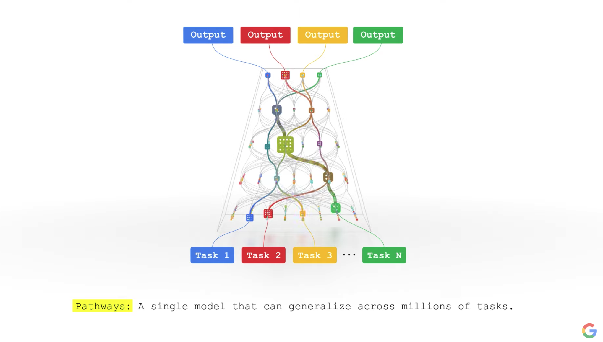

>ak님께서 공유해주신 글, 늘 좋은 지식을 공유해주셔서 감사합니다.

## 구글의 New AI Architecture Pathways
{: width="100%" height="100%"}

구글의 제프 딘이 3일 전 이런 글을 공유했다고 한다.

 https://blog.google/technology/ai/introducing-pathways-next-generation-ai-architecture/

결론적으로 요약해보자면, new AI architecture Pathways를 구축하겠다는 것이다. 기존에는 개별 과업에 최적화된 딥러닝 구조가 각각 있었던 반면, 앞으로는 거대한 레이어의 네트워크(그래프)를 구축하고 개별 과업이 무엇이냐에 따라 서로 다른 레이어 pathway를 가지도록 설계하겠다는 이야기이다.

**02pm:** AI는 세계에 공개된지 오래되었지만 아직까지 우리 일상에서 볼 수 있는 것들은 약한 인공지능인 경우가 많다. 하지만 구글이 이런 인프라의 방향성을 제시해준다면 앞으로는 더 많은 변화가 생기지 않을까 기대감이 든다.

