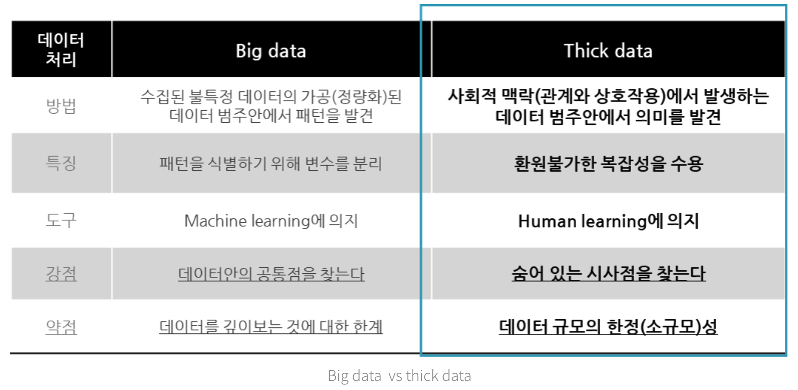

## 원티드랩 PO가 전하는 이야기
참고: [원티드랩 / 커리어 도약을 위한 허들을 넘다](https://www.wanted.co.kr/events/21_10_s01_b05)

모든 직무에서 공통되는 과정은 **문제 발견 > 가설 수립 > 결과도출**이라는 사이클이다.

이 글에 따르면, 프로덕트 디자이너는 PM이 제시한 제품의 방향성에 따라 이를 분석하고 디자인 개선안을 담아 구현하는 역할을 한다고 한다. 여기에 나의 생각을 더해보면 개선 뿐만 아니라 그 방향성을 어떻게 화면안에 녹여내는지까지가 프로덕트 디자이너의 역할이라고 생각한다. 

PO는 소위 mini-CEO라고 불리는데, 원티드랩은 '스쿼드(squad)' 조직으로 구성하여 일을 한다고 한다. 이 스쿼드를 총괄하는 역할을 PO가 담당하는데, 각 스쿼드는 세부 사업 전략과 제품 전략을 수립하고 실행하며 회사의 경영 전략을 서포트한다고 한다. 스쿼드를 책임지는 PO는 제품은 물론 조직운영, 비즈니스 전략까지 고민하며 사용자가 마주한 문제의 솔루션을 제공하고, 니즈를 충족하기 위해 고군분투한다고 한다.

문제를 발견하고 해결하는 세 가지 방법

### 1. 데이터를 늘 가까이 한다.

#### 정량적 데이터 (Quantitative Data)

: 전환율, 리텐션, 이탈률과 같이 숫자로 표현하는 데이터

#### 정성적 데이터 (Qualitative Data)

: FGI, UT, IN-Depth 인터뷰 등 상황묘사 또는 단어로 기술되는 데이터

**02pm:** 에피소드 중 재미있던 점은 쿠팡맨들이 실제로 어떻게 앱을 이용하는지 관찰하고 UI를 개선했던 것. 택배를 한 손에 들고있어서 나머지 한손으로만 핸드폰을 조작했고, 그에 따라 한 손으로 앱을 사용하는 것에 불편함이 없도록 제품을 개선한 것. (ethnography: field research, observational research, participant observation이라고도 불리며 사용자가 제품을 구매하고 사용하는 현장으로 찾아가 그들의 자연스러운 행동을 관찰하는 것)

### 2. 가설(Hypothesis)을 세운다.

원티드랩에서 세운 가설: '가입 직후, 리텐션에 긍정적인 영향을 주는 기능을 사용하도록 회원가입 미션을 주면 7일 내에 이 기능을 사용하는 유저가 증가할 것이고, 신규 유저의 1주 리텐션이 개선될 것이다'

이에 따라 신규 유저에게 액션을 수행하도록 미션을 주고, 미션을 수행할 경우 보상을 주는 프로젝트를 시행했다고 한다.

**02pm:**: 그 미션이 무엇이었을까? 실질적 앱의 기능 사용이 아닌 단순한 출석체크 이벤트 같은 리텐션만 높이는 미션이었다면 그것은 옳은 방향이었을까? 이건 늘 양날의 검 같은 문제라고 생각된다. 허수가 되는 리텐션은 오히려 독이 될 수도 있다. 하지만 여기서 자세히 생각해봐야 하는 점은  '출석체크해서 포인트만 받고 나가는 사람' vs '출석체크해서 포인트 받는 김에 채용공고라도 한번 보는 사람' 이다. 이런 점에서 수지타산이 맞는지를 확인하도록 도와주는 것도 데이터의 역할이 될 수 있다고 생각한다.
(물론 투자를 받는 입장이라면 단순한 유입량 및 DAU 높이더라도 그게 유의미한 수치가 될 수 있지 않을까? 라고 생각한다.)

이 글을 정리하던 중 데이터의 노이즈에 관한 관점을 찾아보았는데, [빅데이터에서 노이즈가 발생하는 경우](https://brunch.co.kr/@pibuchi/159) 글이 재미있는 사례와 함께 잘 쓰여있는 것 같다. 결론적으로는 bigdata 뿐만 아니라 Thick data(Human learning을 통한 데이터 추출)에서도 유의미한 데이터가 빨생할 수도 있다는 것이다.

{: width="100%" height="100%"}
이미지 제작: 브런치 '피부치'

   
### 3. 가설 검증을 위한 제품을 개발한다.

**02pm:**: MVP(Minimum Viable Product) 개발이 우선시 되고 그 제품이 유의미한 값을 도출해내는지를 평가해야 한다는 것은 아마 스타트업에 근무하는 사람이라면 익히 들어봤을 것이다. 나의 경험을 토대로 보면 사실 가장 어려운 부분은 그래서 MVP가 어디까진데? 이다. 왜냐하면 정말 작지만 필요한 기능만 만들어서 제품을 출시했다가 활용성이 낮아서 브랜드 이미지를 안좋게 인식하고 이탈할 수도 있기 때문이다. 

이 글에서 좀 더 있었으면 하는 내용은, 그래서 어떤 데이터를 토대로 그 결과를 내렸는가에 대한 것이다. 원인을 분석해보니 꼭 입력해야 하는 정보와 불필요한 정보가 혼재되어 있어서 개선을 했다는데, 그런 이유 도출은 어떻게 했을까?

### 이외의 이야기

PO라면 겪을 문제점이 첫 번째로는 '소통해야 할 대상이 많다'는 점이고, 두 번째로는 '설득을 해야한다'이라는 점이라고 정리한다. 

원티드랩에서는 유저의 '마케팅 푸시 수신'의 수치를 높이기 위해 팝업을 띄우는 프로젝트를 기획했는데, 그에 앞서 '왜 이 프로젝트를 해야만 하는지', '만약 실행한다면 이 팝업을 어떤 페이지에 띄워야 하는지'를 설득했다. 그래서 팝업을 띄울 후보 페이지를 4~5개 정도 정하고, 각 페이지에 월별로 유입되는 마케팅 푸시 비동의 유저수를 뽑았다. 이 유저 중에 몇 퍼센트가 동의로 전환할지 해당 페이지와 유사한 기능에서 예상 전환율을 산정했다. 그 유저 중 몇 퍼센트가 동의로 전환할지 해당 페이지와 유사한 기능에서 예상 전환율을 산정했다. 그리고, 유저 수를 금액적 가치로 매겨보았다. 이런 방식으로 프로젝트 후보마다 임팩트를 예상할 수 있다면, 우선순위를 판단하는 데 도움이 된다. 

**02pm:**: 팝업을 어디에 띄울지를 통계적으로 예측한 부분이 재미있었다. 이런 예측을 이용해서 다른 이해관계자들을 설득하고 함께 해결해 나갈 수 있는게 진정한 PO이지 않을까. ~~물론 내 생각이 틀릴 수도 있지만~~. 모든 문제에는 정해진 답이 없다. 각자의 상황 속에서 각자의 정의를 내리고 해결책을 제시해야 한다. 그렇기 때문에 나의 설명을 늘 돌아볼 줄 알고 그것에 대한 뒷받침을 마련할 줄 아는 능력이 필요하다고 생각한다. 늘 꾸준히 배워야겠다.