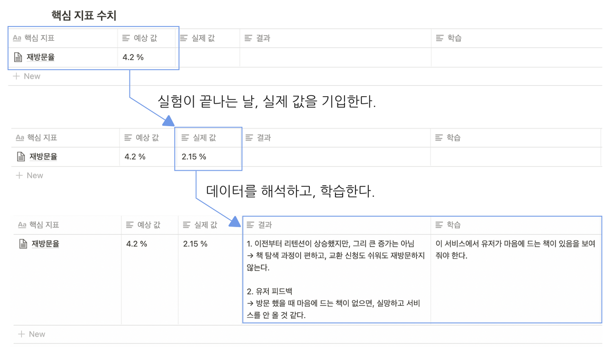
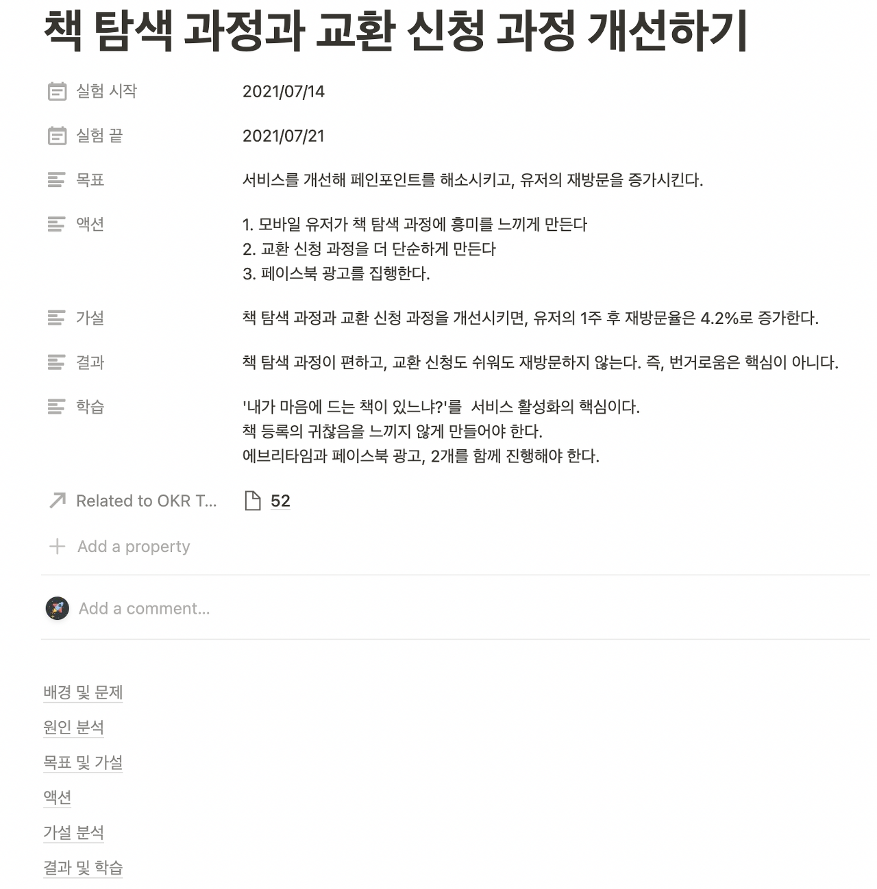

참고: [실험 조직으로 거듭나기: 실험에서 학습하는 법](https://yozm.wishket.com/magazine/detail/1142/?utm_source=facebook&utm_medium=social&utm_campaign=ggultip&fbclid=IwAR0EpiWPZbBhPtGSgkQP7f6g4TwlQ1xCFwyQcJ6VCFAWt71HGvxuxkAgWzI)

## 중요포인트
### 가설검 검증의 조건
가설 검증은 '가설 변수'와 '핵심 지표' 사이의 관계를 알아내는 것이다. 따라서 가설 외 변수는 철저한 환경에서 통제되어야 한다.

### 데이터 해석

{: width="100%" height="100%"}

데이터 해석은 단순 대소 비교 뿐 아니라 '해석'을 해야 한다. 목표 수치보다 높거나 낮다고 그 기준에 맞추어 해석하면, 목표 수치가 잘못 설정도었을 오류가 있기 때문이다.
> 처음에 설정한 목표 수치가 적절한지 평가한 후, 수치를 비교 분석해야 한다. 

### 실험 노트 만들기

{: width="100%" height="100%"}

실험 노트는 실험 목표, 실험 가설, 실험 기간과 함께 실험이 끝난 후 결과와 학습한 점을 적는다.

> 우리 회사에서도 위의 이미지를 참고해서 다음 실험부터는 기록을 잘 남겨둬야겠다는 반성.. 또 반성....

아래의 이미지는 본 아티클에서 가져온 이미지인데, 참고해서 유용한 가설 검증을 해봐야겠다.. 제일 위의 본문 링크로 들어가면 글의 시리즈가 1탄부터 더 많으니, 필요한 사람들은 본문 링크로 들어가서 보면 좋을 것 같다!

{: width="100%" height="100%"}

> 출처: [위시켓 yozm - FameLee](https://yozm.wishket.com/magazine/detail/1142/)

이 글은 '프로덕트 오너-김성한(세종서적)'을 참고한 글이라고 한다. 늘 읽어봐야지 했는데, 이번 기회에 제대로 읽어봐야겠다.

프랙티스만이 살길!!

{: width="100%" height="100%"}