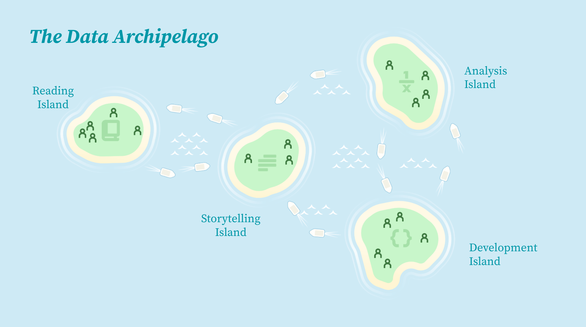
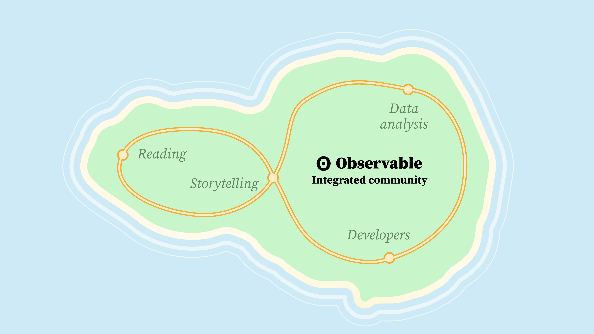
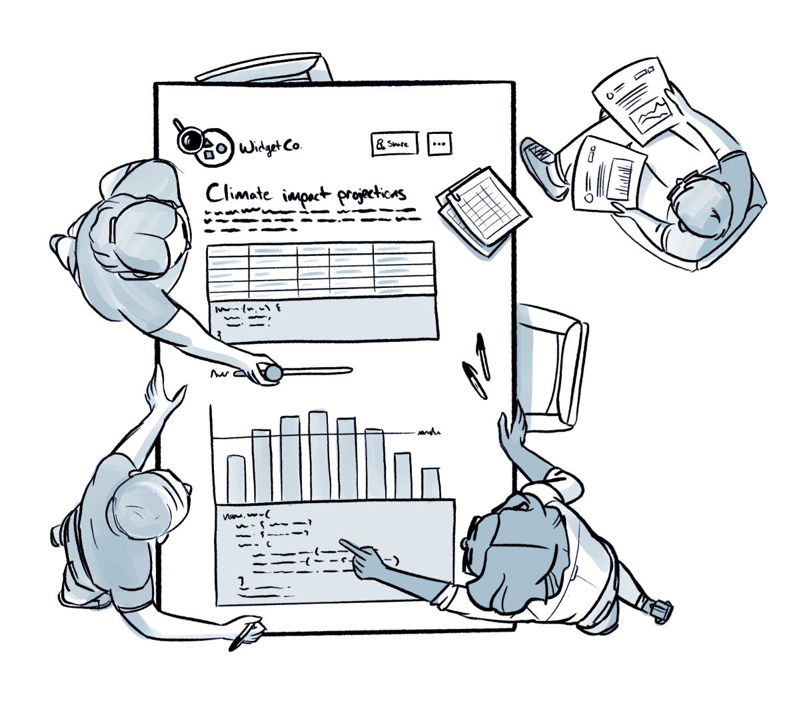

{: width="100%" height="100%"}

## 팀마다 다른 데이터 주관

각 팀의 사람들은 각각 데이터에 대한 탐색과 분석 방법이 다르다. 이런 사람들은 어떻게 보면 위의 이미지와 같이 따로 떨어진 섬에서 다른 도구를 가지고 다르게 살고 있는 사람들이라고 봐도 무방하다.

그들은 공통의 언어가 없어서 서로에 대해 회의적이게 되고 신뢰가 부족하게 된다. 역할이나 전문성과 상관 없이 모든 사람들은 회사의 데이터에 대하여 같은 언어를 말할 필요가 있다. (그게 유창하든 그냥 구문을 만드는 수준이든..)

~~약간의 공감 포인트.. 나는 늘 GA에서 사람들이 어디를 많이 방문하는지 어떤 기능을 많이 사용하는지를 더 관심있게 본다면, 다른 분은 오늘은 제품을 몇명이나 구매했는지를 보는.. 그런 느낌..?~~

한 회사의 데이터 작업 flow는 효율적인 의사결정 과정의 중요한 기여 요인이다.

{: width="100%" height="100%"}

Observable을 이용하면 위의 이미지처럼 흩어져있는 사람들을 한 곳으로 모을 수 있다. ~~나는 아직 Observable을 다룰 수 있는 수준은 아니지만, 다른 분들께서 작업물을 본 경험상 많은 공감이 가는 포인트라고 생각한다. 단순한 통계치 뿐 아니라 코드에 기반한 조작이 다양한 수준에서 가능하다.~~

그렇다면 어떤 방법으로 각자 다른 생각을 하는 사람들을 한 곳으로 모을 수 있을까?

## 효율적인 팀을 만들기 위해 중요한 두 가지

<ol>
  <li>스스로의 작업흐름을 유지하고 함꼐 다른 동료와의 흐름을 유지하는 것이 생산성을 위한 혁신적 방향이다. 작업 흐름을 유지하면 작업 순환이 빨라지고, 더 사고적이게 되고, 창의적으로 탐색하게 되고, 어쩌면 약간의 기쁨까지 느끼게 된다.
  <li>데이터가 잘 풀리지 않더라도 "심술 부리지 않는 사람들"로 구성된 집단이 효율적이다. 행복하고 생산적인 팀이 협업의 정신이다.
</ol>

## Observable의 collaborative data canvas

{: width="100%" height="100%"}

Observable의 collaborative data canvas는 생각을 적을 수 있도록 텍스트를 이용할 수도 있고, 그 외에도 엑셀의 데이터 테이블, 상호작용적인 바차트, 움직이는 뷰어의 시각물 등 아주 많은 것을 다룰 수 있도록 해준다. 

> 참고 
> [Observable](https://observablehq.com/@observablehq/future-of-data-work-collaboration-and-no-limits)