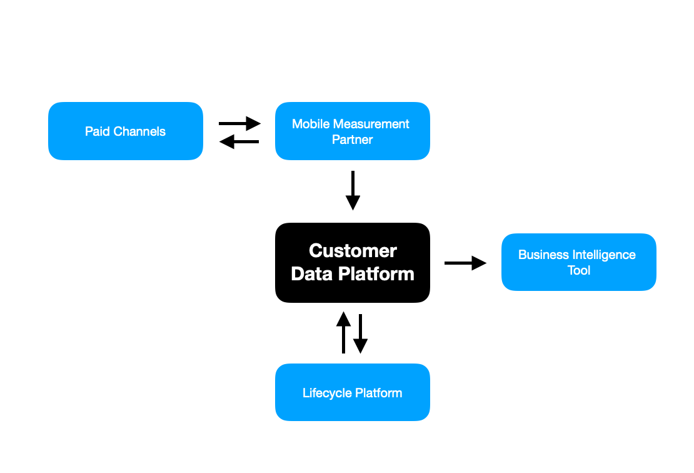

## Growth marketing(그로스 마케팅)이란?

그로스 마케팅(그로스 해킹)은 한 마디로 쉽게 이야기하자면 사업(비즈니스) 성장에 초점을 맞추어 마케팅 데이터를 다루는 것이다. 기존의 마케팅은 AARRR(Acquisition-Activation-Revenue-Retention-Referral)에서 Acquisition에서 사용자의 관심이나 인지도 같은 것에 가장 초점을 맞춘다면, 그로스 마케팅은 AARRR 전반에 걸쳐서 사업을 키우기 위한 마케팅에 관심을 갖는다는 것이다.

## 그렇다면 Growth Stack이란?

그로스 스택은 아래의 것들을 포함한다:
<ul>
	<li>Customer data platform (CDP): 예를 들어 세그먼트 같은 데이터</li>
	<li>Mobile measurement partner (MMP): 모바일 앱에만 필요하고 결제 사용자를 획득하는 모바일 앱 설치 캠페인을 할 때 사용</li>
	<li>Data warehouse: Redshift 같은 데이터를 기업 내부에 저장하는 것.</li>
	<li>Business intelligence tool (BI):  사실 기업의 초기에는 Data warehouse를 다로 둘 필요 없이, 비즈니스 인텔리전트 도구(Amplitude 같은)를 사용하면 됨.</li>
	</ul>

#### Customer engagement tools
<ul>
	<li>A/B testing/experimentation tools: 구글 Optimize 같은 도구를 이용해서 프로덕트에 차이를 준 것이 유의미한지 확인하는 것.</li>
	<li>Acquisition mediums: 고객을 어디서 획득했나</li>
	</ul>

## Growth stacks가 왜 필요한가? 그로스 해킹은 왜 필요한가?
<ol>
	<li>Source of truth</li>
  <li>Clear attribution</li>
  <li>Actionable data</li>
</ol>

{: width="100%" height="100%"}
	
> 출처: [Jonathan Martinez](https://techcrunch.com/2021/11/16/a-lean-startups-growth-marketing-tech-stack/)

위의 그림에서 Paid Channels와 Lifecycle platform은 고객을 획득하는 도구이고, 이로부터 데이터가 만들어져 중앙의 고객 데이터 플랫폼으로 들어간다. 그렇게 들어온 데이터는 BI(Business Intelligence) 도구를 통해 시각화 된다.

만약 초기의 스타트업이라면, Acquisition medium이면 충분하다. 
어쩌면 그냥 뻔할 수도 있는 데이터에 대한 이야기지만, 초기 단계의 스타트업이라면 유저 분석 같은 딥한 단계 전에 Acquisition을 하라는 점은 새로 접한 내용이었다. 내 관점에서는 사용자만 엄청 유입시키는데, 서비스가 제대로 작동하지 않거나 PMF가 확인되지 않은 상태라면 너무 거대한 Acquisition은 독이 될 수도 있겠다고 생각했는데, 양날의 검이라고 생각한다. 모든 것에는 운과 타이밍도 중요하다. 

> 참고 
> [TechCrunch-Jonathan Martinez](https://techcrunch.com/2021/11/16/a-lean-startups-growth-marketing-tech-stack/), [Brunch-김민우](https://publy.co/content/4620)