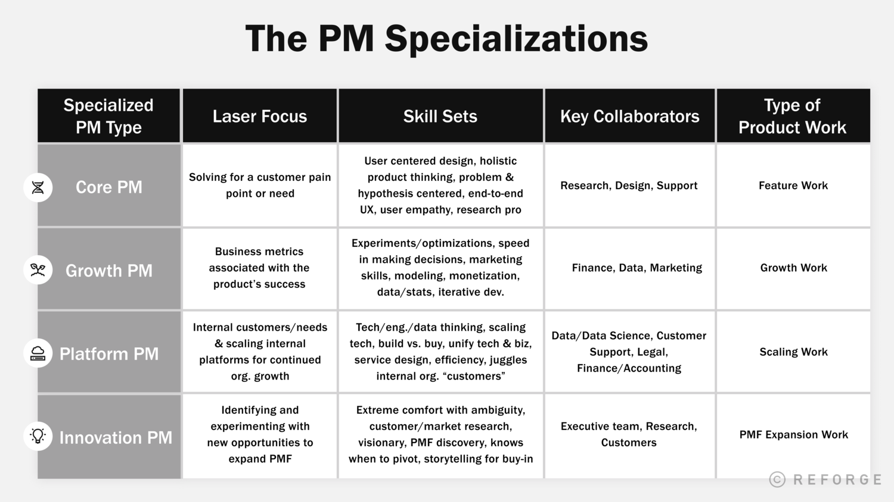
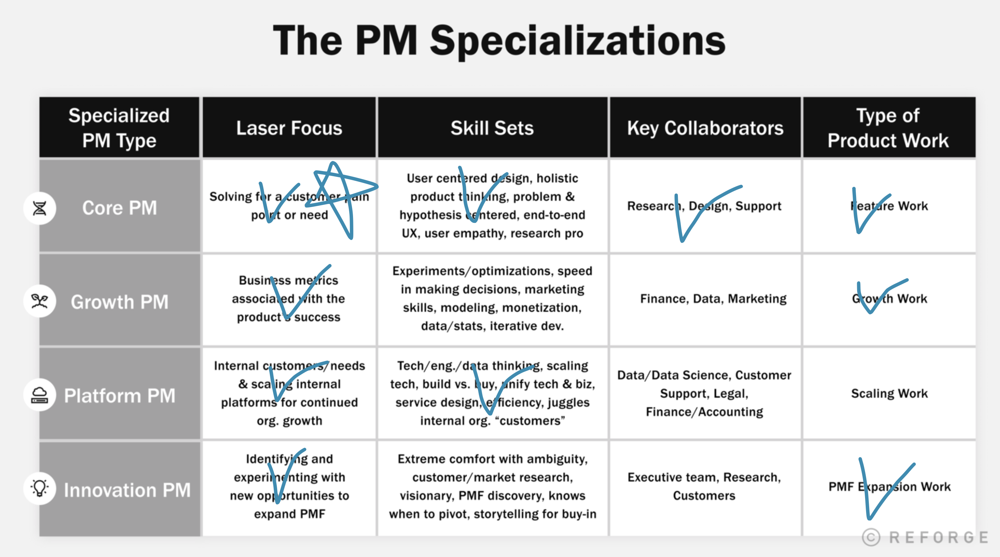

 
{: width="100%" height="100%"}

PM은 전문성에 따라 4가지 유형으로 정의될 수 있다.

## PM의 유형 4가지

1.  **코어 PM:** ‘기능 관련 업무’로 고객의 니즈와 페인포인트를 해결하는데 집중하는 PM
2.  **그로스 PM:** ‘비즈니스 지표를 향상’시킨다는 관점으로 고객의 경험을 분석하는 PM
3.  **플랫폼 PM:** 비즈니스 규모를 효율적으로 확장시키는 ‘스케일링’ 업무에 집중하는 PM
4.  **혁신 PM:** ‘새로운 기회를 발굴’하고 PMF를 확장시키는데 집중하는 PM

이렇게 나누어서 생각하는 것이 중요한 이유는 **어느 분야를 깊게 파고들어야 하는지, 언제/어느 방향으로 폭을 넓힐지** 등을 능동적으로 선택할 수 있게되기 때문이다.

## 당신의 PM 전문성은 무엇인가요?

**02pm:** 위의 유형 중 나의 전문성은 코어 PM인 듯싶다. 객관적으로 돌아봤을 때, 지금까지는 코어, 그로스, 플랫폼, 혁신 모두를 생각해왔는데, 그러다 보니 전문성이 확보되기 어렵지 않았나 싶다. 계속 내가 좋아하고 잘 하는 것을 명확하게 정의하고 추구해나갈 수 있도록 해야겠다.

스스로의 PM 유형을 알고 싶다면 아래의 질문들에 대답을 해 볼 수 있다.
- 당신은 어떤 종류의 프로덕트 업무에 매일 집중하고 있나요?
- 당신이 지적 호기심을 느끼는 분야는 무엇인가요?
- 당신은 어떤 고유의 능력을 가지고 있고, 그 능력이 어떻게 다양한 유형의 프로덕트 업무들과 일치될 수 있나요?
- 팀원을 제외하고 누구와 가장 많은 이야기를 하면서 보내나요?
- 당신의 조직이나 프로덕트는 어느 단계에 속하나요? (단계 예시: PMF 찾기 전, 기능 업무, 그로스 업무, 스케일링 업무, PMF 확장)

혹은 제일 상단의 그림에서 자신이(같이 일하는 동료의 영역 포함) 해당하는 칸에 색칠을 하라. 

**02pm:** 나의 경우엔 아래와 같이 나왔다.

{: width="100%" height="100%"}

**02pm:** 역시 예상대로 코어 PM을 가장 많이 담당하고 있다. 다른 영역들은 체크를 하면서 긴가민가한 것들은 체크를 하지 않았다.
 
 
## PM의 유형별 커리어패스
-   **코어 PM으로의 커리어패스**
    -   **테크 직군**: <u>유저 리서치, 디자인, 서포트, 마케팅/PR, CEO 스태프, 콘텐츠/커뮤니티 운영자, 파트너십</u>
    -   **비 테크 직군**: 컨설팅, 교육자, VC, 심리학자, 군인, 사회학자, 브랜드 관리자
-   **그로스 PM으로의 커리어패스**
    -   **테크 직군**: 데이터, 파이낸스, 세일즈, 퍼포먼스 마케팅/SEO, 비즈옵스
    -   **비 테크 직군**: 학문 연구자, 수리/논리 백그라운드 소유자, 행동 심리학자, 분석가, 특정 상황에서 빠른 결정을 내리는 역할, 전략 컨설팅
-   **플랫폼 PM으로의 커리어패스**
    -   **테크 직군**: 데이터, 엔지니어링, 법률, 보안
    -   **비 테크 직군**: 엔지니어링, 시스템/인프라 설계자, 오퍼레이터, 물류, 제조, 정보 과학, 문서화를 좋아하는 사람
-   **혁신 PM으로의 커리어패스**
    -   **테크 직군**: 창업자, 스타트업에서 5~10번째 직원, CEO 스태프, 비즈옵스, 임원, 유저 리서치
    -   **비 테크 직군**: 리서치, 디자인, R&D, 기업가, 남는 시간에 생각하길 좋아하고 아이디어를 만들고, 테스트하고, 입증하는 것을 사랑하는 사람들

## PM의 전문성은 언제 바꿀 수 있을까?
1. 스스로의 역량이나 흥미를 찾았을 때
2. 어느 정도 깊이있게 파고든 후, 업무의 폭을 넓힐 때
3. 새롭게 떠오르는 전문 분야에 베팅할 때

## PM의 전문성을 바꾸면 안 될 때!
1. 혁신 신드롬: 단순히 "멋있게" 보이는 뭔가 "새로운" 것을 하고 싶을 때
2. 임팩트를 만들기가 갈수록 어려워질 때: 전문 분야가 깊어질수록 문제의 범위가 커지고 복잡해지며 임팩트를 만들어내기가 어려워지지만, 그 때가 성장할 수 있는 때다.
 
 
 

## PM으로서 성장하기
1. 한 가지 유형의 업무를 깊이 있게, 그 후 다양한 업무로 폭 넓히기
2. 주어진 일 잘하기, 그 다음 다른 사람을 성장시키기
3. 당신이 가진 리소스로 해결해보기, 후 리소스를 분배하고 다른 사람을 통해 해결하기
4. 개개인을 잘 살피기, 그 후 조직 단위까지 생각하기

**02pm:** 가장 중요한 것은 깊게 먼저 파는 것. 하지만 그와 함께 다른 유형의 PM 업무에 대한 지식을 함께 쌓을 것.

> 참고 
> [GROW&BETTER](https://growandbetter.com/2021/12/23/how-to-navigate-product-management-specializations/?fbclid=IwAR0q3ZhUIFu5D8ifyVmmEKJQCAFSywQW_B6T16lhel55OVIOJeJioDTGEKI)
