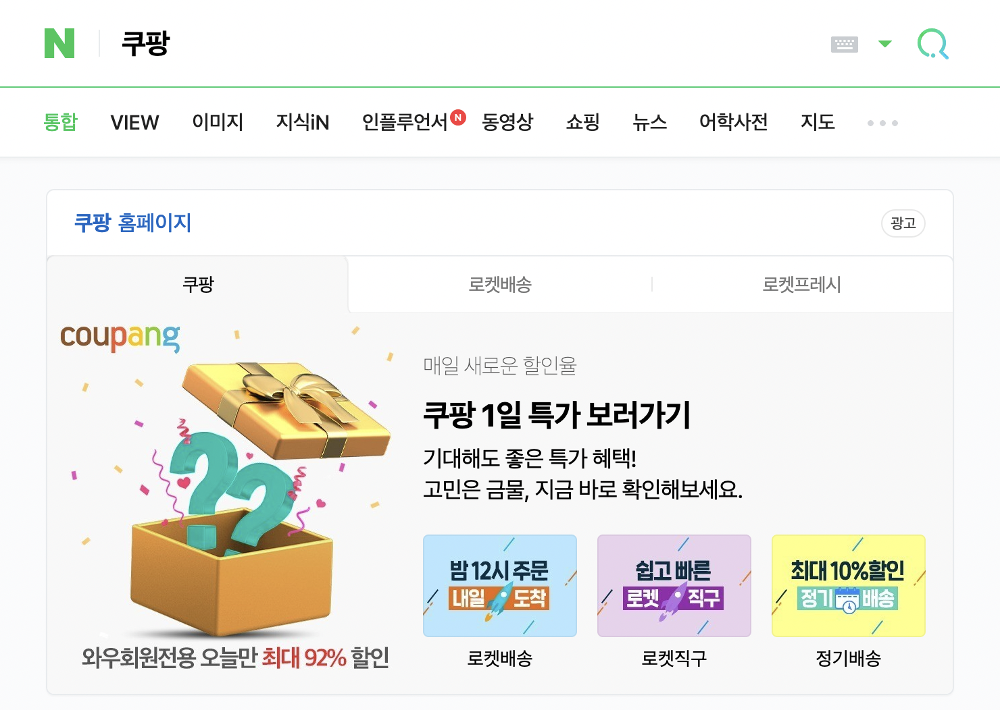

이 아티클은 우선 완전한 SEO보다, 네이버 SEO 그 중에서도 광고에 초점이 맞추어져있다. 

### 네이버 브랜드 검색
네이버 브랜드 검색은 사람들이 그 브랜드를 검색했을 때 최상단에 노출이 바로 되며 직접적인 유입을 도와줄 수 있는 수단이다. 아래의 이미지와 같은 형태라고 할 수 있다. 그 브랜드를 검색하는 사람은 목적이 있기 때문에 직접 브랜드를 검색할 것이므로 브랜드 검색 내에 버튼들을 어떻게 구성하느냐가 많은 영향을 줄 수 있다. 예를 들어 브랜드의 이벤트 기간을 활용하여 엄청난 성과를 얻고 싶다면 아래의 이미지에서 보이는 세가지 섹션을 이벤트 관련 내용으로 채울 수도 있다. 

{: width="100%" height="100%"}

과금 방식은 검색에 적용된 키워드들의 쿼리량(검색량) 합계롤 통해 매월 금액을 추산하는 방식인데, 검색량과 관계없이 1개월 최소 50만 원에서 시작헤서 검색량이 많아질수록 광고비도 높아진다. 팁은 브랜드 검색은 최대 3개월까지 한번에 계약이 가능하니, 유명해지기 전 3개월을 먼저 결제하면 그나마 적은 비용으로 광고를 할 수 있다.

### 네이버 쇼핑검색 & 파워링크
쇼핑검색과 파워링크의 과금 방식은 비딩(입찰) 방식을 취한다. 즉, 특정 키워드마다 CPC(Cost Per Click) 단가를 높게 책정할수록 상단에 노출되는 방식이다. 무조건 위에 노출되는게 좋은 것은 아닌게, 그만큼 비싼 비용을 지불해야 한다. 특히 그렇게 비싼 비용을 지불하고 들어온 고객이 구경만 하고 이탏나다면, 광고비만 날린 것이다. 그러니 비용을 계산할 때 구매율과 제품의 판매당 마진 등을 함께 고려해야 한다.

마진이 2만원이 남고, 클릭 한 번당 700원을 지불해야 한다면 최소 29번의 클릭 중 1번의 판매가 성사되어야 손익분기점을 넘긴다. 고객의 구매 전환율이 최소한 약 3.44%는 되어야 한다. ~~ROAS(Return On Ad Spend) 관점에서는 2만 300원을 사용해서 4만 원의 매출을 달성했기 때문에 200%에 가까운 성적이라고 할 수는 있지만, 이건 단지 매출에 비교했을 때이다.~~

### 지식iN과 블로그
의 방법도 있지만, 지식인을 마케팅 수단으로 활용하는 건 편법에 가깝다. 블로그는 아직까진 활용할만 하다. 몰랐던 것은 파워 컨테츠라고 해서 자사 사이트라고 확인된 블로그는 원하는 포스팅을 키워드 상단에 노출할 수 있도록 하는 기능이 생겼다. 과금 방식은 CPC 비딩 방식을 취하며, 평균적으로 요구되는 CPC가 파워링크나 쇼핑 검색에 비해 낮다. 하나의 키워드에 여러 개의 포스팅을 노출시키긴 어렵다.
이 외에도 파워블로거를 통해 우리 제품에 대한 포스팅을 할 수도 있다.

> 참고 
> [요즘 IT-옆집아저씨](https://yozm.wishket.com/magazine/detail/1247/?fbclid=IwAR2uq-HzXIAjNdUuvRTF8JZq9u5bEPiCD9zn3tMhQ6i5Qj9oEqA5bThkY60)