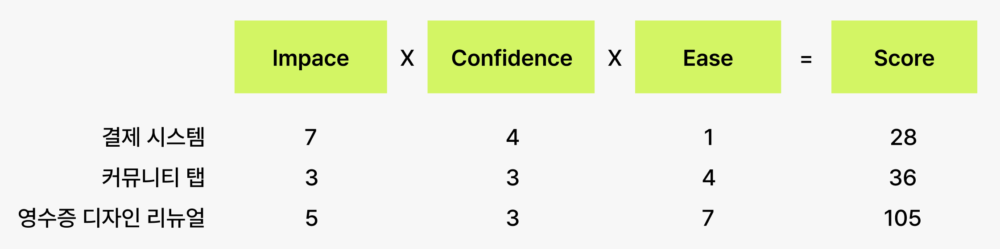
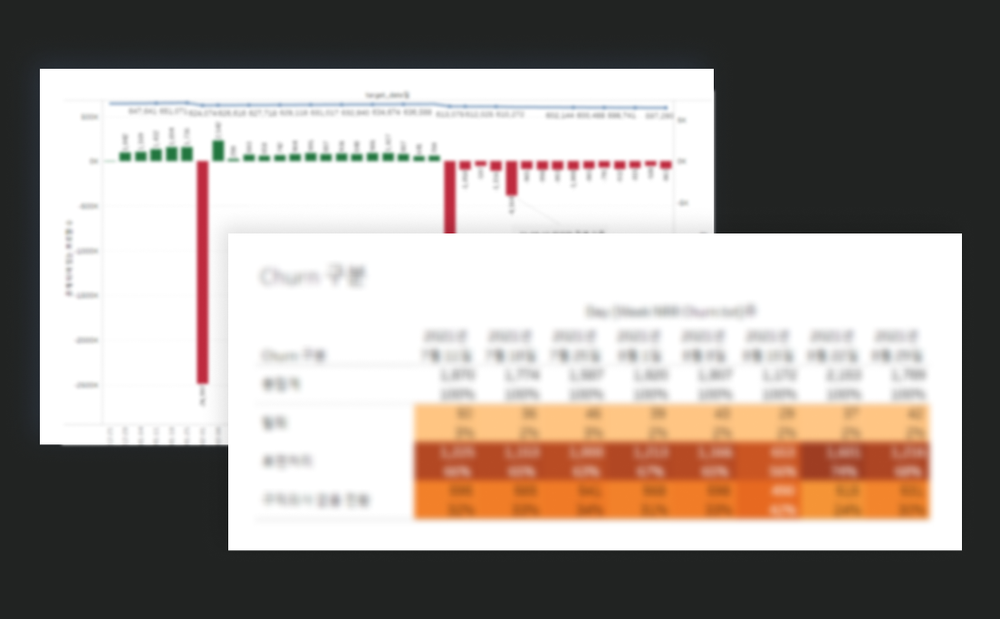

 
> 참고:
> [REMEMBER-문 지선](https://blog.dramancompany.com/2021/12/__trashed-3/?fbclid=IwAR0AjerdqtO6B8XbFqtWGj_aMUSsTxp6wpwZ80e_J8IgeRQZsLbCLrAfQ74)

### OKR이 실패한 이유
> 2주에 한번씩 팀원들의 상태를 점검하기 위해 Health Check를 하는 것이 신선했다. (이를 통해 미션, 재미, 학습, 자기 주도, 속도 등의 다면 평가 항목을 바탕으로 스스로의 한 주를 돌아본다고 한다.)

Health Check를 통해 무언가 잘못되고 있음을 인지하였고, 그 결과 구체적인 성과 지표와 수치들의 나열인 '목표'가 Too much를 만들어냈다는 이야기인 것 같다. 목표는 정했지만 그 방향성이 잘못되었다고 해야할까나.  

> 결국 OKR은 좋은 대안을 제안해주긴 하지만, 그를 큰 그림에서 묶어 볼 수 있는 개괄적인 시선이 필요하다고 생각된다.

리멤버 팀에서 문제로 삼은 것은 아래와 같다.
<ol>
  <li> 전략에 선행하여 세팅된 목표 </li>
  <li> 제품 사이클에 대한 고려 없이 일률적으로 할당된 타임라인 </li>
</ol>

그 결과 OKR을 지우고 해결해야하는 문제에 다시 집중하기로 했다고 한다.

> 이 아티클에서 개밥먹기(Eating Your Own Dog Food)의 개념을 처음 접했는데, 문맥상 보았을 때 사용자의 경험을 내가 직접 느껴보고 불편한 점을 A부터 Z까지 나열해본다는 개념인 것 같다. 

### 리멤버의 새 방향성

#### 1. 목표 달성을 위한 핸들 잡기
<ol>
  <li> 설정된 시나리오를 바탕으로 이해관계자들 모두가 각자가 생각하는 문제 적기 </li>
  <li> 발의자는 5분 이내로 작성한 내용 공유 </li>
  <li> 문제들을 범주화하여 묶기 </li>
  <li> 참여자들이 중요하다고 생각되는 문제에 투표 (*투표자는 최대 3개의 문제에 투표)</li>
  <li> 모든 참여자는 투표의 이유를 간략히 설명한 후, 가장 많은 표를 얻은 문제부터 해결 방법 논의</li>
</ol>

#### 2. 데이터를 통한 문제 분석
프로필 크루는 수집된 문제에 대한 데이터를 수집하여 문제의 원인을 분석하였다. DI 팀을 통해 각각의 퍼널별 전환율과 기존 액션들의 전환율 등의 데이터를 요청하여 확인한 결과 해결 방안 8가지를 도출했다. 그 해결 방안들을 두고 ICE 프레임 워크를 통해 우선 순위를 정했다고 한다. 

**ICE FRAMEWORK**

{: width="100%" height="100%"}

Impact: 이 기능이 얼마나 영향을 미칠 것으로 예상되는지
Confidence: 이 기능이 우리의 가설을 검증할 수 있을 것이라고 얼마나 확신되는지
Ease: 이 기능을 얼마나 쉽게 출시할 수 있는지

#### 3. 해결 방안 구체화 하기
구체화 하는 과정에서 가설을 검증하는데에 있어 필요한 최소 스펙들을 여러번 재검토하고, 오버 스펙이라 분류된 스펙은 과감히 범위(scope)에서 제외했다고 한다. 

#### 4. 가설 검증을 위한 로드맵
가설의 빠른 검증을 위해 하나의 액션에 대한 배포 주기는 4주를 넘기지 않는다. 주 1회 주간회의에서 진행했던 액션들에 대한 결과를 리뷰하는 시간을 가지며 가설이 잘 동작하지 않는다고 판단되면, 기존에 기획중이던걸 과감히 버리고 우선순위를 재검토한다. 아예 빼는 것은 조심스러운 결정이기 때문에, 현재 수치를 떨어뜨리지 않되 유효하지 않다고 판단되는 액션은 재배치를 하고 로드맵을 세팅한다.

#### 5. 투명한 지표 공유
KR은 핵심 목표에서는 제외되었지만 고객의 동향을 파악하는 것에는 매우 중요하다. 이를 위해 모니터링 지표들을 태블로에 대쉬보드로 만들어서 누구든 언제나 쉽게 확인이 가능하도록 했다. 

> 여기서 첨부된 이미지를 보고 생각한건데, 사내 전용 히트맵을 만들어도 될 것 같다. 어느 부분을 비교하고 싶은지 우리가 아니까.. 그걸 반영한 히트맵을 직접 만들어볼까나...

{: width="100%" height="100%"}
