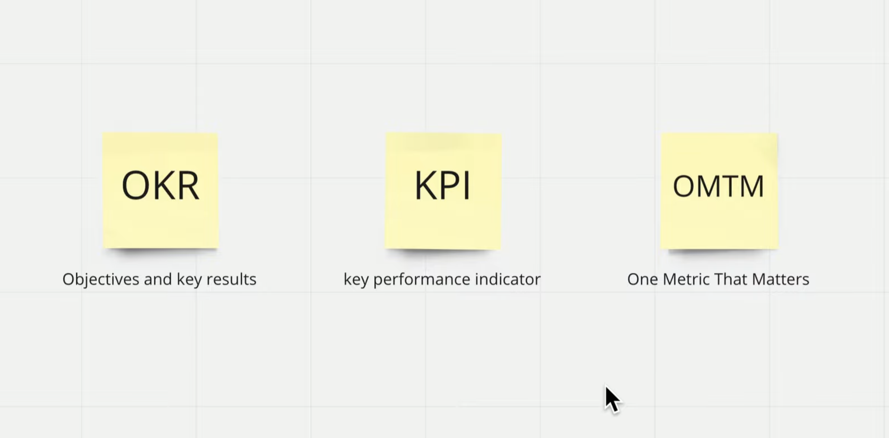
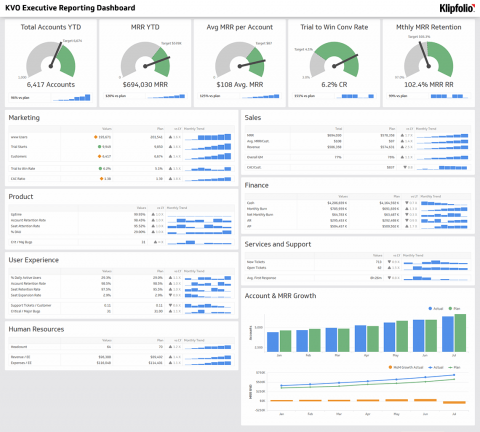
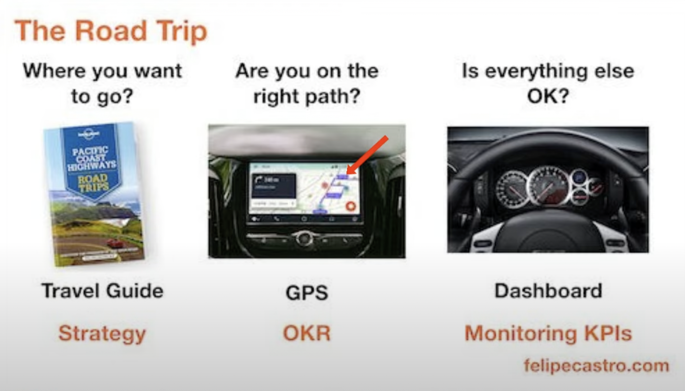

드디어 기나긴 대학원 졸업의 길을 끝냈다. 6개월 동안 거의 졸업논문과 회사일 밖에 한게 없다.. 개인적인 공부는 커녕 친구들 조차도 만나지 못했다...

다시 원래의 라이프사이클로 돌아가서 살아봐야겠다....!

  
# KPI, OKR, OSTM 차이점

{: width="100%" height="100%"}

## KPI란?
KPI는 Key performance indicator의 약자로 중요한 경영지표이다. 스프레드시트로 관리하거나 대시보드로 관리하기도 한다.

항목 예시: [KPI 항목 예시](https://www.ycombinator.com/library/1y-key-metrics)

각 산업군 별로 확이하는 KPI의 예를 확인하자면,

E-commerce 같은 경우는 총 이익, 고객의 리텐션, 고객의 생애가치(LTV)/고객 획득 배용(paid CAC) 등을 확인할 수 있다.

Advertising 같은 경우는 전체 방문자수, 페이지 뷰, UV(Unique visitors), DAU, MAU, 매출, 리텐션 등을 확인할 수 있다. 여기서 Advertising 기업은 트위터 같이 sns 기반으로 광고 수익을 버는 형태를 칭한다. KPI는 평가를 위해 관리하고 그러다보니 팀별로 경쟁을 하게 될 수도 있다는 위험이 있다.
\*데일리로 KPI를 슬랙에 push하여 관리하는 회사도 있다. 유용할 듯 싶다.

{: width="100%" height="100%"}
이미지 출처: [Klipfolio](https://www.klipfolio.com/resources/dashboard-examples/executive/reporting-dashboard)

하지만, KPI는 부서, 산업별로 서로 다를 수 있다는 이슈가 있고 각 부서별로 충돌하는 경우가 있다. 예를 들어, Sales 팀은 거래량을 높이는 것이 목표인데 Finance 팀은 마진율을 높이는게 목표면 서로 다른 행동을 할테니... 그러다보면 서로 공유가 안되고 잘못 설정되었을 때 전사적인 관점에서는 장애물이 될 수도 있다. 

그래서 이를 보완하기 위한게 OKR, OSTM이다.

## OKR이란?
OKR에서 가장 중요한 것은 Objectives...! Objectives는 전사적으로 가장 중요한 목표가 무엇이냐에 관한 것이다.

아래의 이미지를 보면, OKR과 KPI의 명확한 비교를 알 수 있는데,

{: width="100%" height="100%"}

KPI는 자동차의 계기판처럼 이동을 하는 과정에서의 자동차의 문제를 확인할 수 있도록 해주는 지표들을 관리하게 해주는 반면, OKR은 네비게이션처럼 어디를 갈 건지에 관한 목표를 이야기한다.

Objectives에 해당하는 목표를 세웠으면, 그 목표를 달성하기 위해 Key results가 필요하다. 예를 들어, 축구팀 감독이 "구단주에게 돈을 벌어다 주기"를 목표로 세웠으면, "슈퍼볼 우승", "홈경기 관중석 90% 넘게 채우기"의 핵심 결과(Key results)를 정할 수 있는 것이다. 여기서 Key results를 달성하는 것을 각 팀이나 인원은 목표로 설정하여 또 다시 Key results를 어떻게 설정할지 타고타고 내려갈 수 있다. 

Key results는 수치화하기 때문에 상세하게 적는게 좋다. 최선을 다했을 때 달성할 수 있는 수치를 적고 그를 위해 노력하는 과정. 

## OMTM이란?
OMTM은 One metric that matters의 약자로, 북극성 지표(North Star Metric)을 뜻한다. 어느 곳에서도 길잡이가 되어주는 지표를 말한다. "One metric"이 가장 중요한 것. 실제로 많은 미국의 스타트업들이 OMTM으로 비즈니스 지표를 관리한다. 예를 들어, 에어비앤비는 예약된 숙박 일수, 페이스북은 MAU(Monthly Active Users), 스포티파이는 음악 총 청취 시간, 미디엄은 사용자의 주별/월별 총 읽기 시간으로 관리를 한다.

지금 시점에서 가장 중요한게 뭐느냐, 이걸 올리면 나머지는 자연스럽게 따라온다..가 되는 것! 스포티파이가 만약 OMTM을 음악 총 청취 시간이라고 설정했다면, 그 지표를 위해서 사용자를 많이 돌아오게 하고, 세션당 이용 시간을 늘려야 할 것이다. 또 이것들을 위해 뭘 해야하느냐... 처럼 꼬리에 꼬리를 물어 북극성 지표에 기여를 하는 것이다. OMTM과 그를 위한 KPI가 붙을 수 있다.

한 마디로 정리하자면,
**OKR**과 **OMTM**은 비즈니스의 **성장**을 위한 **공동의 목표**를 설정하는 것이고, **KPI**는 그 모든 과정에서 확인하는 지표이다. 

> 참고  
> [기획자 데이먼 유튜브](https://youtu.be/MlTQKCPFv6Q)
> [존 도어, 래리 페이지 - OKR 전설적인 벤처투자자가 구글에 전해준 성공 방식]