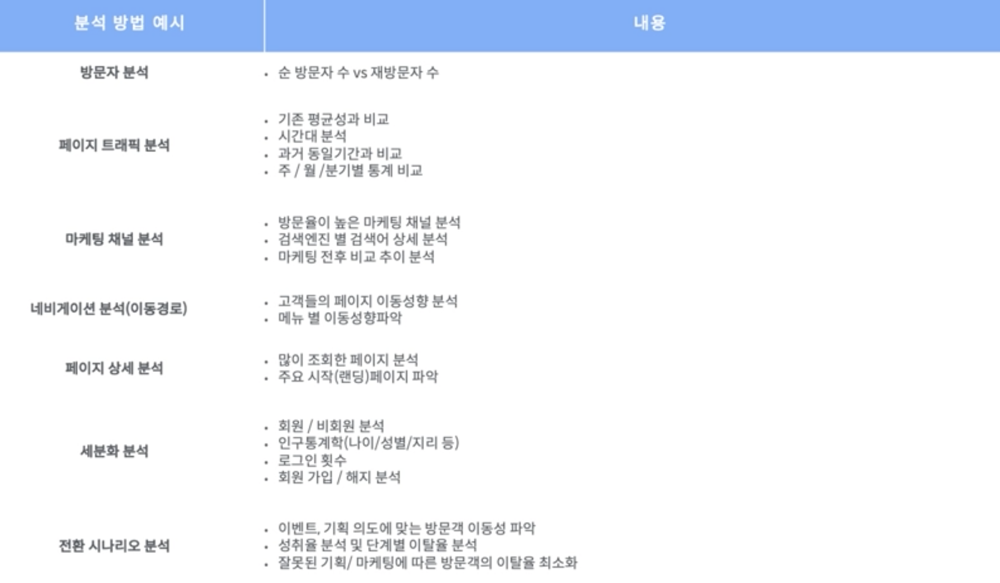
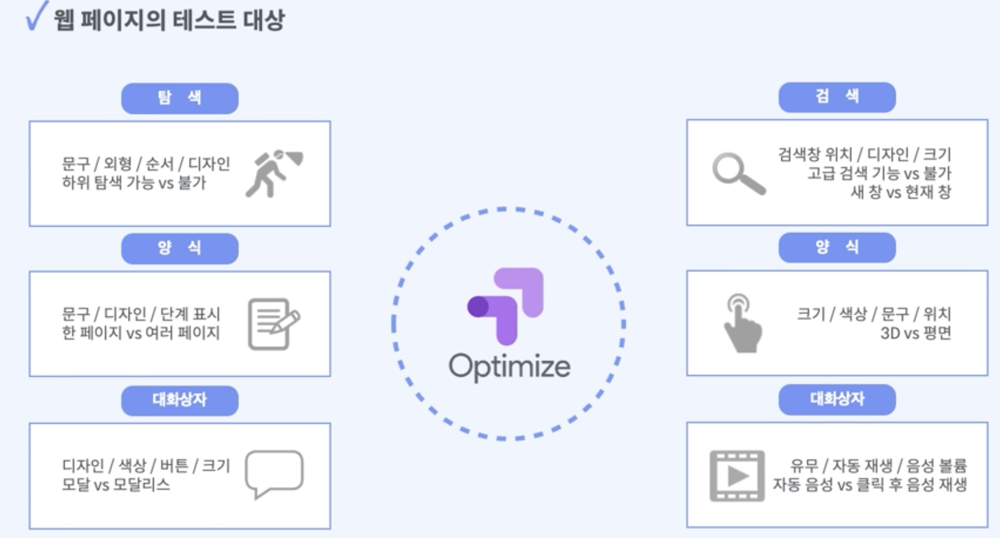

패스트캠퍼스의 GA4강의를 들으며 내용들을 나의 지식과 함께 간략하게 정리해두고자 한다. 아래는 Part03. 구글옵티마이즈(UA)를 통한 테스트의 3강 내용의 개괄적 정리다.
"02pm:" 은 나의 의견이다.

# AB 테스트

{: width="100%" height="100%"}

AB 테스트는 최적화 관점에서 A안과 B안에서 뭐가 가장 좋을지 테스트를 빠른 프로토타입으로 가설 검증을 진행하는 것

### AB 테스트를 진행하게 되는 상황
<ol>
  <li> 문제는 알지만 최적의 개선안은 알지 못하겠을 때 </li>
  <li> 최적의 안을 찾기 위해 시간이 오래 걸릴 때 (오랜 분석이 필요할 때) </li>
  <li> 감으로는 알 것 같지만 수치로 증명을 못하겠을 때 </li>
</ol>

뭔가 전환이라는 관점을 놓고 보았을 때, 큰 흐름에서 사용자가 이탈하는 부분이 높은 곳이 있다면 그 부분에서 AB 테스트를 진행할 수 있음.

**02pm**: 나는 우리 프로덕트의 버전업데이트를 진행하며 AB테스트를 해야하나 싶었는데, 사실 이런 경우는 AB테스트는 적절하지 않은 것 같다.

**02pm**: 왜냐하면 기본적으로 AB테스트는 하나의 요소를 바꿔서 비교하는 테스트를 많이 하기 때문이다.

**02pm**: 사실 여러 요소를 바꾸고 실험을 진행하는 multi variate test도 있지만, 어쨌든 이 경우에도 테스트 할 수 있는 요소의 개수는 한정적이다. 예를 들어, 제목이랑 버튼을 동시에 바꾸는데 제목이 두 버전, 버튼이 3 버전일 경우 2x3=6개 버전을 동시에 비교하는 경우가 될 수 있다. 

{: width="100%" height="100%"}

구글 옵티마이즈는 이런 모든 테스트들을 코딩없이 가능하게 해 줌

> 참고 
> [패스트캠퍼스-2023년 구글 애널리틱스 완전 정복 초격차 패키지 Online-Part 03. 구글옵티마이즈(UA)를 통한 테스트](https://fastcampus.co.kr/mktg_online_gafour)