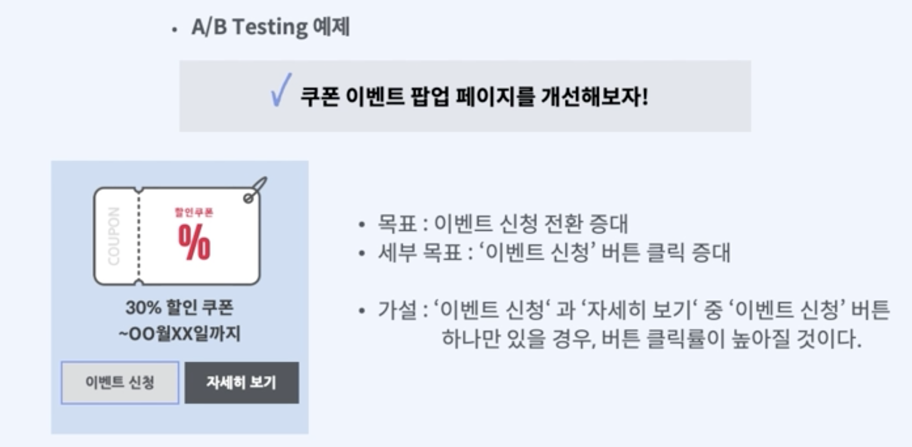

패스트캠퍼스의 GA4강의를 들으며 내용들을 나의 지식과 함께 간략하게 정리해두고자 한다. 아래는 Part03. 구글옵티마이즈(UA)를 통한 테스트의 3강 내용의 개괄적 정리다.
"02pm:" 은 나의 의견이다.

# A/B 테스트 사례 및 실험 전 확인사항

{: width="100%" height="100%"}

<ol>
	<li> 가설 예시: '이벤트 신청'과 '자세히 보기' 중 '이벤트 신청'만 있을 때 전환률이 더 높을 것이다.</li>
	<li> 가설 예시: PC에 비해 모바일의 유입률이 낮았고, GA로 퍼널 분석을 하여 문제가 되는 단계를 파악. 그 후, Add to cart를 제품 하단에 버튼으로 추가하였더니 수익과 목표 전환이 향상되었음(장바구니에 추가하는 사용자 49% 증가)</li>
	<li> 가설 예시: 롯데호텔은 방문 규모는 확대했으나 매출이 기대에 미치지 못하는 문제가 있었음. 따라서 경쟁사와 사이트 비교를 통해 문제를 파악했고, 다변수 테스트를 통해 최적화된 사이트 인터페이스를 만들었음(예약률 1% 증가).</li>
	</ol>
		
		
참고하기 좋은 사이트: [구글 마케팅 플랫폼](https://marketingplatform.google.com/about/)

# A/B 테스트 실험 계획
**데이터 분석 - 가설 설정 - 대안 생성 - 테스트 진행 - 런칭**

여기서, 실험 시나리오 설정이 가장 중요!
AB테스트 기획안은 테스트 가설, 테스트 목표(주요목표, 측정항목), 테스트 설정(As-Is, To-Be), 테스트 기간(시작일, 마감일), 타겟 URL(페이지 제목, URL), 테스트 종류(예. A/B 테스트), 타겟 고객, 테스트 이름, 테스트 시나리오(1, 2, 3···), 이미지 참고 등을 포함할 수 있음. 

> 참고 
>[패스트캠퍼스-2023년 구글 애널리틱스 완전 정복 초격차 패키지 Online-Part 03. 구글옵티마이즈(UA)를 통한 테스트](https://fastcampus.co.kr/mktg_online_gafour)