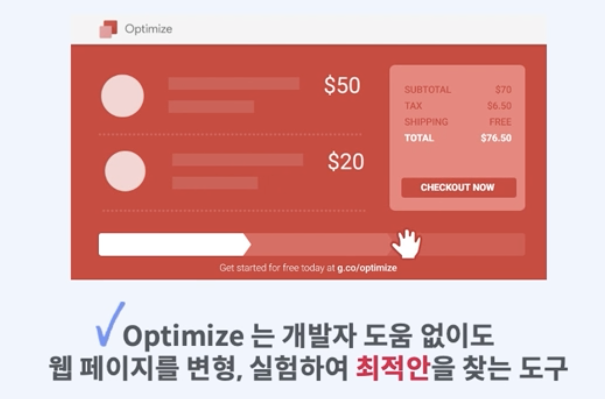
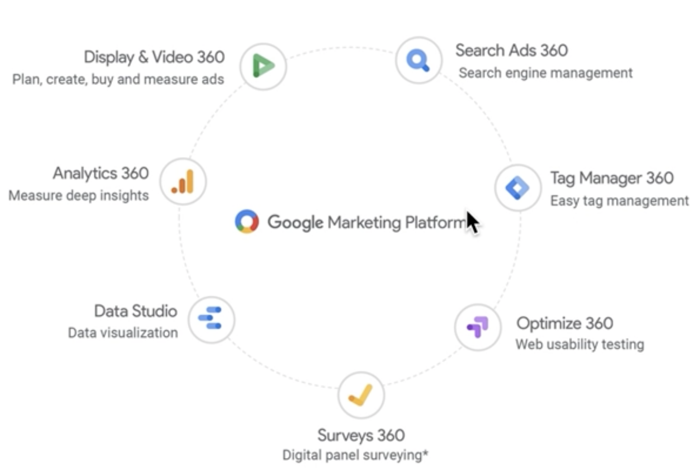

패스트캠퍼스의 GA4강의를 들으며 내용들을 나의 지식과 함께 간략하게 정리해두고자 한다. 아래는 Part03. 구글옵티마이즈(UA)를 통한 테스트의 3, 4강 내용의 개괄적 정리다.
"02pm:" 은 나의 의견이다.

# Optimize 개요 및 특징

{: width="100%" height="100%"}

구글 Optimize는 특별한 코딩의 과정이 없이 웹페이지를 변경하고 실험하여 최적안을 찾을 수 있도록 도와주는 도구로 A/B 테스트 외에도 다변수 테스트, 리디렉션 테스트, 맞춤 설정의 4가지 유형의 테스트 기능을 이용할 수 있다. 이를 통해 전환율 최적화(CRO)와 웹사이트 개선에 사용
> CRO: Conversion Rate Optimization

{: width="100%" height="100%"}

**02pm**: 위의 이미지에서 볼 수 있듯이, 데이터 분석을 하는 과정은 Google Marketing Platform을 통해 통합으로 가능하다. 하지만 나는 아직까지 Google Analytics랑 Google Tag Manager 밖에 할 줄 몰랐다. 이 강의를 통해 옵티마이저도 잘 활용하게 될 수 있었으면..하는 기대...!

Analytics로 분석한 데이터를 토대로 Optimize나 Google Ads로  다시 한 번 최적화를 할 수 있는데, Optimize는 약간 내부의 고객 최적화라고 친다면, Google Ads는 외부 고객 최적화라고 할 수 있다.

이 데이터를 다시 Analytics로 분석하고 다시 최적화하고 하는 것을 사이클로 돌리는 것.

# Optimize 무료 버전, 유료 버전 차이점

구글옵티마이즈는 유료 버전을 Optimize 360이라고 칭함. 우선 회사 규모가 클 수록 360으로 전환을 하는 경우가 많다.

<ul>
	<li>잠재고객타겟팅: 기본(불가능), 360(가능)</li>
	<li>다변수 테스트(MVT): 기본(16개 조합), 360(36개 조합)</li>
	<li>실험 목표: 기본(최대 3개 사전 구성 가능), 360(최대 10개 사전 구성 가능하며 시작 후 추가 제공 가능)</li>
	<li>동시 실험: 기본(최대 5개), 360(100개 이상)</li>
	<li>관리: 기본(기본 관리로 사용자 무제한), 360(Google Marketing Platform 관리)</li>
	<li>지원 및 서비스: 기본(셀프서비스 고객센터 및 커뮤니티 포럼 인증 파트너), 360(엔터프라이즈급 서비스, 지원 및 SLA)</li>
	<li>결제 옵션: 기본(무료), 360(매월 인보이스 발행)</li>
	</ul>

실험 계획은 **문제 인식 - 행동 분석 - 전환 확인**로 진행할 수 있다!
중요한 것은 빠른 시간 내에 검증하는 것! 따라서 쉽게 적용할 수 있는 부분부터 실행해 볼 것!
> 여기서 말하는 쉽게 적용할 수 있는 부분이라는 것은 뭔가 이벤트 페이지의 버튼 차이 같은 작은 단위의 실험을 말하는 것.

> 참고 
> [패스트캠퍼스-2023년 구글 애널리틱스 완전 정복 초격차 패키지 Online-Part 03. 구글옵티마이즈(UA)를 통한 테스트](https://fastcampus.co.kr/mktg_online_gafour)