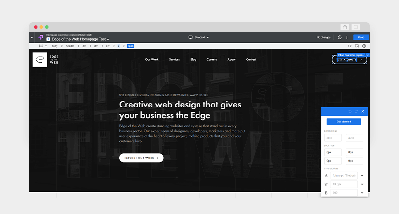
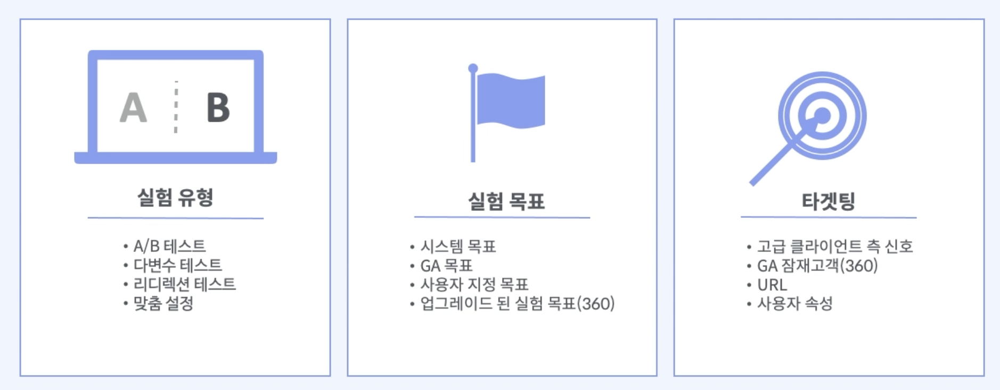
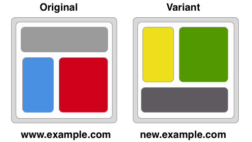
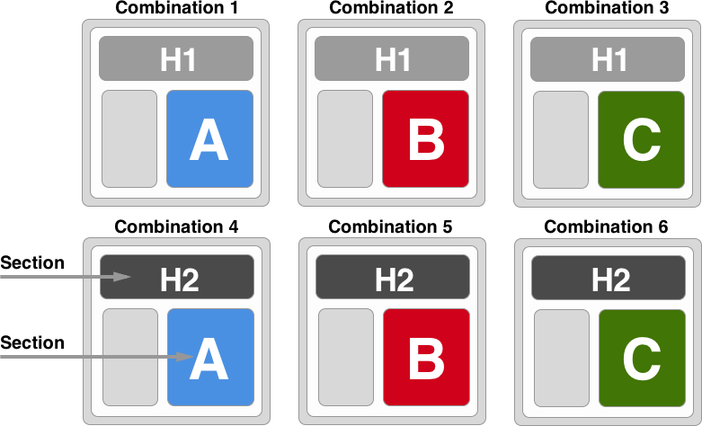

패스트캠퍼스의 GA4강의를 들으며 내용들을 나의 지식과 함께 간략하게 정리해두고자 한다. 아래는 Part03. 구글옵티마이즈(UA)를 통한 테스트의 5강 내용의 개괄적 정리다.
"02pm:" 은 나의 의견이다.

# Optimize 개요 및 특징

## Visual Editor

{: width="100%" height="100%"}

구글 옵티마이즈는 비주얼 편집기를 통해 손쉽게 편집을 할 수 있음

### Visual Editor에서 가능한 기능
<ul>
	<li> 쉬운 편집: 단순 편집 버튼 클릭만으로 편집 진행 </li>
	<li> 유용한 진단: 비주얼 편집기가 실험 시작 전 잠재적인 문제를 경고하여 실험의 성공을 도움 </li>
	<li> 반응형 비주얼 편집기: 미리보기를 통해 더욱 더 직관적으로 확인 가능 </li> 
	<li> 정교한 코드 편집: 원본 HTML을 편집하거나 편집기에서 JavaScript 또는 CSS 규칙을 직접 추가</li>
	</ul>

{: width="100%" height="100%"}

Google analytics, Google Ads, Google BigQuery, Google Firebase 등과의 유연한 연동으로 통합적인 사용자 데이터 관리 가능

1. Google Analytics: GA 데이터를 사용, 사이트의 개선 위치를 파악하고 변경을 통해 고객 행동에 어떤 영향을 미치는지 확인할 수 있다.
2. Google Ads: 단순 계정 연결 만으로 광고 계정, 캠페인, 광고 그룹 또는 키워드에 대한 실험 진행이 가능.
3. Google BigQuery: 데이터를 BigQuery로 내보내고 분석을 통해 인사이트 확보.
4. Google Firebase: 앱 환경에서 A/B 테스트 - Firebase remote config 및 cloud messaging에서 실행 가능

**02pm:** Google analytics 4에서는 앱도 가능하도록 바뀐 것으로 아는데, 그럼 Google optimize로 앱도 가능한 것인지 궁금..

## Optimize의 기능
1. 실험 유형: A/B 테스트, 다변수 테스트, 리디렉션 테스트, 맞춤 설정
2. 실험 목표: 시스템 목표, GA 목표, 사용자 지정 목표, 업그레이드 된 실험 목표(360)
3. 타켓팅: 고급 클라이언트 측 신호, GA 잠재고객(360), URL, 사용자 속성

### A/B 테스트란?
: 둘 이상의 대안 페이지를 테스트 하는 방법으로 원본 웹 페이지 A와 그 대안이 될 수 있는 B~N의 페이지들을 비교하는 것.

{: width="100%" height="100%"}

### 리디텍션 테스트란?
: 특정한 페이지로 바로 이동 시키는 것을 바꾸는 개념. 즉 요소의 형태를 바꾸는 것이 아니라, 특정 요소를 눌렀을 때 이동하게 되는 페이지를 바꾼 다음 그 영향을 확인하는 것. 

{: width="100%" height="100%"}

### 다변수 테스트
: 두 개 이상의 요소의 변형을 동시에 확인하는 것. 예를 들어 광고 제목 두 개(H1, H2)와 이미지 세 개(A, B, C )를 동시에 테스트 하는 것.
: 무료 버전에서는 16개, 유료버전(360 버전)에서는 36개까지 가능 

{: width="100%" height="100%"}

## 맞춤 설정
: 다양한 타겟팅을 통해 개인화 된 콘텐츠를 사용자에게 제공할 수 있는 것.

## 실험 목적
1. 시스템 목표: Optimize 실험에서 자주 사용되는 일반적인 목표(페이지 뷰, 세션 시간, 이탈율 등)
2. Analytics 목표: Analytics 목표를 Optimize로 적용하여 목표로 사용
3. 맞춤 목표: Optimize에서 직접 맞춤 목표 설정 가능. 실험 목표가 시스템 목표에 해당하지 않은 경우 유용하게 사용(이벤틑 목표, 페이지 뷰 목표 등)
4. 양식 변경: 기본 버전에서는 목표를 설정하고 나면 변경이 불가능하지만 Optimize 360 사용시 변경 가능.

## 타겟팅
:특정 대상에게만 노출되도록 설정할 수 있는 것

1. Google Ads 타겟팅: Optimize 실험을 Google Ads 계정, 캠페인, 광고 그룹, 키워드에 타겟팅
2. 지역 타겟팅: 특정 도시 방문자에게만 대안 실험 페이지 표시
3. 행동 타겟팅: 특정 SNS를 통해 유입된 방문자에게만 대안 실험 페이지 표시
4. 기술 타겟팅: 특정 브라우저, 운영체제, 기기에서 방문하는 사용자를 타겟팅
5. UTM 타겟팅: UTM 룰을 통하여 특정 캠페인을 통해 들어온 사용자들을 타겟팅
6. 잠재고객 타겟팅(360): Analytics에서 생성하는 잠재고객을 타겟팅하여 실험페이지 표시

**02pm:** 본인은 이미  GA, GTM을 할 줄 알아서 그런지 구글옵티마이즈는 쉽게 설치하고 이용할 수 있었다. 하지만 굳이 GA, GTM을 할 줄 모르더라도 설치의 과정만 잘 한다면 쉽게 A/B 테스트를 할 수 있을 것이다.

> 참고:[패스트캠퍼스-2023년 구글 애널리틱스 완전 정복 초격차 패키지 Online-Part 03. 구글옵티마이즈(UA)를 통한 테스트](https://fastcampus.co.kr/mktg_online_gafour)