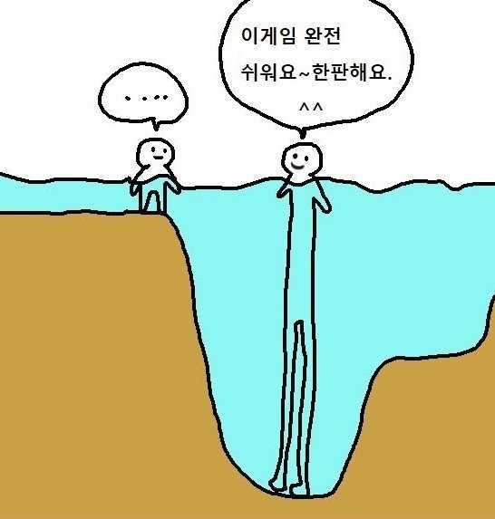

> 데일리아티클은 매일 1개 혹은 2개의 아티클을 읽고 나만의 정리를 남긴 것이다. "**02pm:**" 의 내용은 그 아티클들을 읽으며 내가 한 생각들을 정리한 것이다.

# 토스의 사내문화

최근 토스의 컨퍼런스 Simplicy를 다시 보고 있는데, 보던 중 개발자도 자유롭게 디자인에 대한 의견 혹은 방법론을 제안하는 것이 흥미로워 토스팀 개발자의 글을 찾아 읽어보게 되었다.

토스는 사실 좋지 않은 측면으로는 토양어선(토스 원양어선)이라는 말이 돌아다니기도 하지만, 나는 본래가 그렇게 주인의식을 가지고 노력하는 것을 좋아하는 사람이기 때문에 이런 문화를 좋게 생각한다. 왜냐하면 어짜피 토스 직원들도 나 같은 사람들일 것이고, 그들이 그게 싫었다면 이미 이직했을 문제이기 때문에...? 본 글을 쓴 저자분도 일을 빠르게 잘 하는 것에 초점을 맞추어 글을 작성하셨다.

## DRI
토스는 스티브 잡스가 애플에서 사용했던 개념인 DRI(Directly Responsible Individual)을 차용하여 사용한다. DRI는 즉, 내가 하는 일은 내가 책임이 있다는 것이다. 

**02pm:** 이는 토스의 CEO의 강연에서도 많이 나왔던 이야기인데, CEO가 어떤 의견에 반대하더라도 누구든 그 반대에 다시 반발하여 주장할 수 있는 자유로운 조직체계도의 느낌이다. 이승건 대표님께서 기존의 금융권 문화에서 이런 점(엄청 딥한 조직도 안에서 계속 윗선에 확인되어야하는 구조)을 답습하지 않아야 한다고 했는데, 그와도 일맥상통 한다.

**02pm:** 나는 이런 권한의 위임이 되는 자유로운 구조의 중심에는 과정에 대한 보고나 확인 체계가 어떻게 되어있는지도 중요하다고 생각한다. 물론 처음부터 주인의식 가득한 사람을 뽑을 수도 있겠지만, 모두가 그렇지는 않기 때문이다. 자유를 주면 그만큼의 자유가 당연한 것처럼 오히려 악용하는 사람들도 존재한다. 이는 사내문화에 좋지 않은 영향을 줄 수 있다. 따라서 어떻게 이를 투명하게 확인할 것인지가 관건이지 않을까 생각한다.

## 실패에 대한 관대함
**02pm:** 실패 사례를 공유하는 Failure Party가 좀 신선한 충격이었다. 이런 문화 덕분에 실패도 자유롭게 할 수 있게 된 것이 아닐까? 누구나 실패에 대한 두려움, 책임에 대한 두려움이 있지만 최선을 다했다면 오히려 실패하더라도 칭찬할 수 있는 관대함. 진심으로 누구나 본받아야 할 자세다.

물리학자 사피 바칼의 룬샷(Loon Shots)에서 성공의 방정식 중 하나가 대다수가 무시하고 홀대하는 프로젝트를 빠르게 자주 시도해야 한다고 이야기한다. 이런 시도들이 쌓이다 보면 어느 순간 임계점을 넘어서게 되고, 그때 비로소 문샷(Moon Shots)을 쏠 수 있게 된다고 이 글의 저자는 덧붙였다.

## CEO의 문화
**02pm:** 대표의 권한은 어느선까지 영향을 미치는 것이 좋을까. 본인은 이에 대하여 정말 답이 없는 문제라고 생각해왔다. 예를 들어, 스티브 잡스처럼 정말 통찰이 있는 사람이라면 디자이너가 만드는 폰트의 정렬까지도 마이크로매니징 할 자격이 주어지는가? 누구든 이것에 대해 쉽게 답하긴 어려울 것이다. 하지만, 본 글을 읽은 후에는 어쩌면 권한을 일임하는 것이 큰 그림에서는 더 긍정적일 수도 있다는 생각이 들었다. 본인의 권한이 침해 받았다는 느낌을 한 번이라도 받은 직원은 '어짜피 바뀔텐데'하며 대충할 수도 있게되기 때문이다. 사업이 실패할 수도 있다는 두려움을 이기고 팀원을 온전히 신뢰할 수 있는 그 마음. 대단하신 분이다. 이승건 대표님.

> CEO가 마이크로매니징을 할 수 밖에 없었던 이유(쉽고 재밌는 내용을 잘 정리해주심)
: 일반적으로 스타트업은 투자를 받을 때 투자자로부터 회사의 가치를 평가받고 그 평가된 가치로 주식 1주의 가격을 계산해서 주식을 넘겨주는 형태로 투자를 받는데, 이렇게 투자자들이 스타트업에 투자하는 과정은 우리가 일반적으로 주식을 사고 파는 행위와는 약간 차이가 있다.
> 
> 투자자들은 투자에 대한 리스크를 최대한 줄이기 위해 기업이 발행한 채권을 사서 돈을 빌려주고 나중에 채권을 주식으로 바꾸는 방법(CB, 전환사채)을 사용하거나 자신이 원할 때 기업이 주식을 무조건 사줘야하는 조건 또는 꾸준히 배당금을 받겠다는 조건(RCPS, 상환전환우선주)을 걸기도 하고, 지배주주가 지분을 매각할 때 투자자의 주식도 함께 팔아달라고 요구할 수 있는 조항(Tag-along) 등을 적극적으로 사용하기도 하면서 안전장치를 걸어둔다.
> 
> 특히 RCPS 같은 우선주를 가진 투자자들은 보통주를 가진 일반주주들보다 여러가지 권리에 대해 우선권을 가지게 되는데, 문제는 CEO도 보통주를 가지고 있다는 것이다.
> 
> 그렇기 떄문에 우선주를 가지고 있는 투자자가 기업이 망해서 청산당했을 경우 보통주를 가진 주주들보다 잔여재산을 먼저 분배받을 수 있는 권리나 투자자가 계약기간 중 원하는 시점에 기업에게 강제로 주식을 팔 수 있는 권리 등을 행사할 경우에는 기업이 손해를 보더라도 이 권리를 지켜줘야 하는 경우도 발생할 수 있다.
> 
> 즉, 스타트업이 받는 투자는 절대 공짜가 아니며, 사업이 잘 안되었을 경우에는 CEO가 보는 금전적 손해 또한 충분히 발생할 수 있다는 것이다. 그리고 다들 아시다시피 이 금액은 한 두푼이 아니다.
> 
> 솔직히 이런 상황에서 직원들에게 제품 방향성에 대한 모든 의사결정권을 위임하거나 실패를 용인한다는 결정을 실천하는 것은 결코 쉽지 않다. 아무리 자신의 손으로 뽑은 직원이라고 해도 이 직원이 자신처럼 “내 사업이다”라고 생각할거라는 신뢰를 가지기가 어렵기 때문이다.

## 그 밖의 직원들 사이의 문화 형성

**02pm:** ㅋㅋㅋ 본 글에서 사내의 스터디가 레벨을 맞추기 어려웠던 것을 설명하는 짤이 웃겨서 남겨놓는다.

{: width="100%" height="100%"}

> 토스는 처음에는 비슷한 수준의 개발자가 많았지만, 점차 인원이 확대되며 실력 혹은 자신감의 차이가 있는 직원들이 들어오게 되었다고 한다. 문제는 이렇게 자신감의 차이는 오히려 자신의 성장에 악영향을 미칠 수 있다. 필자는 “내가 이런 이야기를 하면 내가 못 하는 사람으로 보이지는 않을까?”, “내가 지금 이런 이야기를 하는게 맞을까?”와 같은 걱정들도 자연스럽게 생겨버렸을 것이라 말한다. 이런 것을 해결하기 위하여 F-Evangelist라는 문화를 도입하였다고 한다.

**02pm:** 나는 이런 토스가 인원구조를 확장하는 과정에서의 문제가 어디서든 발생할 수 있다고 생각한다. 나 또한 자신감이 없을 땐 이렇게 생각한 적이 있었고. 그러니까 내가 무엇을 모르는지에 대한 발언을 하는 것이 두려워지는 것이다. 이는 나의 성장에 엄청난 악영향을 미친다. 궁극적으로는 상호간의 신뢰와 그 신뢰를 형성하기 위한 소통이 중요한 것일까? 

> 토스에는 작은 목적조직인 사일로들이 모여서 형성된 트라이브라는 조직이 있는데, 원래 이 트라이브에는 개발자들을 규합하는 T-Lead라는 역할이 한 명씩 존재한다. 하지만 T-Lead는 백엔드 분들이 주로 맡으시다보니 아무래도 자신들의 전문 분야가 아닌 프론트엔드 쪽에 대해서 적극적으로 방향성을 제시해주고 이끌어주는 것을 기대하기 어려운 상황이었다. 따라서 프론트엔드 챕처의 인원들이 빠르게 성장할 수 있게 도와줌으로써 챕터 전체의 하드스킬과 소프트스킬을 상향평준화시키는 일종의 도우미 역할을 위한 F-Evangelist를 만들게 되었다고 한다. 
> 

### 똥 자랑 대회
> 똥 자랑 대회라는 네이밍은 거리감이나 위계감을 완화하기 위한 이름.

**02pm:** 똥 자랑 대회..ㅎ 부채 공유하기나 회고 같은 이름보다 훨씬 부담감이 덜어질 수 있는 네이밍 인 것 같다. 이런 세심한 디테일.. WoW 이 글에서 느껴졌던 사고과정의 긍정적 측면은 000해서 000했다. 만 생각하지 않고 000해서 000했는데, 이것 또한 000의 문제가 있었다. 라는 반성적 측면까지 있어서 좋았다.

**02pm:** 참 신기한게, 요새 내가 느끼고 있던 감정 및 생각을 이 글에서 해결책을 제안해 주었다. 토스의 디자인 챕터에서 진행했던 "강점찾기"라는 것이다. 뭐랄까 타인과 굳이 비교하지 않더라도 내 스스로 자신감이 너무 하락되어있는 상태였다. 그래서 본 아티클에서 설명한 "갤럽 프레스의 위대한 나의 발견 강점혁명"을 읽어볼까 한다.

> 그래서 필자는 강점찾기라는 테스트를 통해서 사람들이 스스로 “자신이 잘 하는 것이 무엇인지”를 알 수 있도록 메타인지를 심어주면, 자신의 약점에만 집중하는 것이 아닌 강점과 약점을 모두 알게 되면서 스스로에 대한 자신감도 생기지 않을까하는 생각을 했던 것이다.

> 강점찾기 프로그램을 진행하는 방법은 굉장히 심플했는데, 그냥 회사에 요청을 해서 책을 구매한 뒤 각자 테스트를 진행하고 PDF로 나온 테스트 결과지를 다시 강점찾기 슬랙 채널에 공유하면, 이후 오프라인으로 모여서 진행자가 각자의 결과지를 해설해주는 것이다.

**02pm:** 내가 정의한 나의 강점은 부지런함, 성실함이다. 나는 성실한 사람이라고 스스로 느낄 때 성과가 좋았고 스스로에 대한 만족도도 높았다. 하지만 대학원 졸업을 준비하며 약간은 루틴에서 벗어난 생활을 근 6개월간 해왔다. 계속 하던 영어, 운동, 관심사 공부를 놓고 대학원 석사 졸업에만 몰두했던 것이다. 그러다보니 스스로 자신감이 하락한 것 같다. 그러던 중 내 주변의 뛰어난 사람들과 이야기를 하며 그런 사람들은 뭔가에 몰두할 때 빡! 하는 것을 보았는데, 나는 그런 사람이 못 될 것 같은 두려움도 느껴 자신감이 더욱 하락한 것이다. 

오늘의 레퍼런스: [쿼타북-본 저자가 이직한 곳](https://www.quotabook.com/ko)

> 참고:[토스에서의 시간을 돌아보며-Evans library](https://evan-moon.github.io/2022/05/07/toss-retrospective/?fbclid=IwAR3DJ0wBbzHswvNcyK_wgW9RMIVcilzyJjySK-jU_0_vxeZdkBCABoE3r7M)