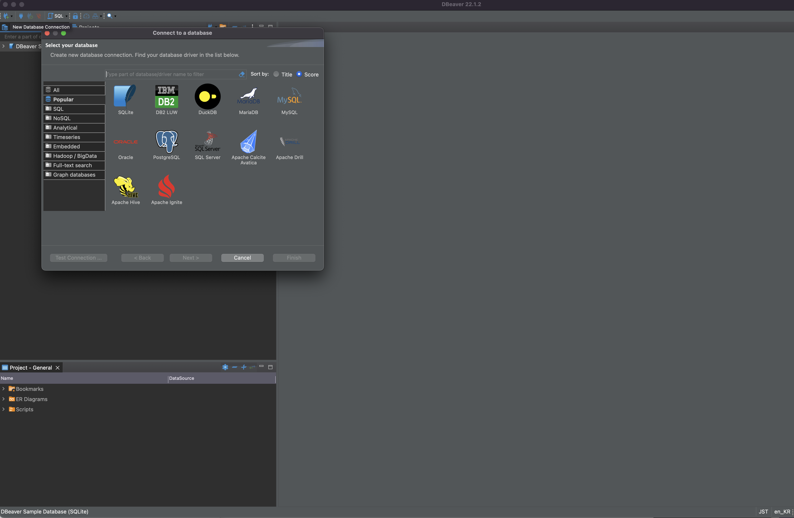
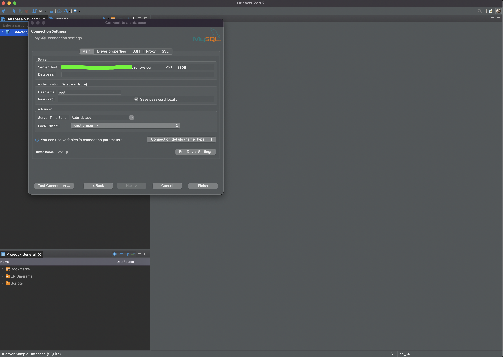

SQL 관련 몇 가지 개념만 정리해두는 용도의 블로깅입니다.

나는 데이터베이스를 다루며 몇 가지 쿼리만 정리해두고, 그 쿼리만 복사/붙여넣기 해서 써 왔었다. 사실 그렇다보니 내가 사용하는 용도에만 사용을 하고, 좀 더 활용을 하지 못했었다. 스파르타코딩클럽의 SQL 강의를 보며, 기본 개념을 다시 정리해보고자 한다. 그리고 더 유용한 쿼리의 사용을 알 게 될 수 있으면 한다.

**데이터베이스:** 데이터를 잘 꺼내오기 위해 사용!
**CRUD:** Create, Read, Update, Delete

이 중에서, 우선은 Read의 개념으로 접근하여 SQL을 다루고자 한다.

## DBeaver 설치하기

SQL을 제대로 다루기 위해선, 기본 프로그램으로 [DBeaver](https://dbeaver.io/download/)을 설치한다.

{: width="100%" height="100%"}

그 후엔 좌측 상단의 플러그 버튼을 눌러 튼 창에서 SQL을 선택하면 된다.

{: width="100%" height="100%"}

다음으로는 서버 호스트(Server Host)를 입력하면 된다. 나의 경우엔 스파르타코딩클럽의 강의에서 제공해주신 서버 호스트를 입력하였다.

{: width="100%" height="100%"}

그 아래에 있는 데이터베이스(database), 사용자이름(username), 비밀번호(password)도 입력한 후, 좌측 하단의 Test Connection을 눌러서 뜬 창 내에서 Download 버튼을 누르면 된다.

**02pm:** 기존엔 그냥 주먹구구 식으로 그냥 phpMyAdmin에서 SQL 탭을 활용했었는데, 뭔가 제대로 하는 것 같은 느낌이 든다.

## 쿼리문(Query)을 시작하기 전, 필드(field)와 테이블(table) 개념 익히기
