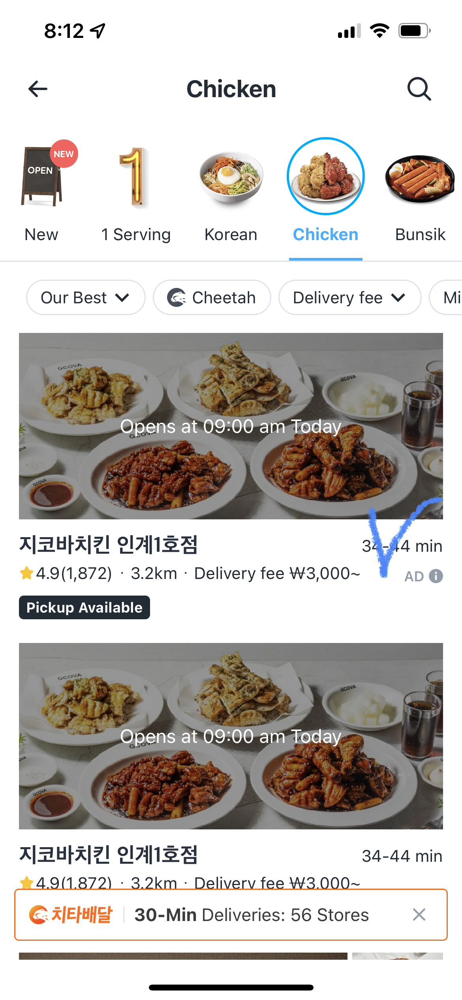

본 글에 따르면 쿠팡이츠는 2019년 5월 강남의 일부 지역에서 시작해서 2020년 코로나 팬데믹의 상황을 타고 빠르게 성장했다고 합니다. MAU(Monthly Active Users)가 34만 명에서 185만 명으로, 1년 만에 약 5.4배나 끌어올렸다고 합니다. 

이에 대한 이유로 아래의 다섯 가지를 제안한다.

-   **단건 배달 원칙: 배송은 속도다!**
-   **치타배달: 배달 출발을 더욱 빠르게**
-   **실시간 위치 확인 서비**
-   **식당 셀렉션 차별화**
-   **고객 경험을 중시하는 수수료 모델**

개인적으로 배송이 속도 싸움이라는건 모두가 고객이 되어봤기 때문에 쉽게 발견할 수 있는 니즈인 반면, 음식점에 라이더가 빨리 도착하는 것은 음식점 사장님이 아니라면 간과할 수 있었다고 생각합니다. 아마 사장님들의 요구가 있었거나, 정성적 리서치를 통해 발견했겠죠?

라이더가 도착하는 시간에 맞춰 음식 조리를 일부러 늦게 시작했던 사장님들의 불편을 해결했다는 점이 흥미로운 이야기입니다.

하지만, 위의 MAU가 사장님의 B2B 서비스를 포함한 값인지, 애매한 부분이 있는 것 같습니다.
   
이 글에서는 쿠팡이츠는 배달의 민족과 다르게 광고 모델 대신 수수료 모델을 사용한다고 설명했는데, 쿠팡이츠 앱을 켜보니 그렇지는 않은 것 같습니다. (배민의 영역보다는 적은 영역을 소모하여 노출한다)

{: width="50%" height="50%"}

   
사실 이 글에서 언급하지 않은 MAU의 큰 부분은 쿠팡이츠의 쿠폰 프로모션 덕분도 있다고 생각합니다. 실제로 한동안 쿠팡이츠는 엄청난 양의 쿠폰을 제공했고, 그로 인해 배달의 민족 대신 쿠팡이츠를 사용한 적이 많습니다.   또한 주변 사람들의 이야기를 토대로 하면 식당 셀렉션의 차별화도 큰 몫을 했습니다. 지인분께서는 배달의 민족에는 없는 곳이니 쿠팡이츠를 사용할 수 밖에 없었다고 했습니다.
  
이 글 덕분에 새롭게 안 점은 배달대행 사무소가 딜리버리 플랫폼을 통해 배달 요청들을 관제한다는 점이었습니다. 또한 이런배달대행 사무소들이 딜리버리 플랫폼 서비스를 유료로 사용한다는 것입니다. 즉, 라이더들이 각 동네의 배달 대행 사무소에 소속되고, 배달 대행 사무소는 플랫폼 서비스를 통해 배달 요청을 관리하는 구조라는 것입니다.

>참고 
>[Publy-배달의민족VS쿠팡이츠, 배달 시장의 승자는?](https://publy.co/content/5444?fr=home&c_id=featured)