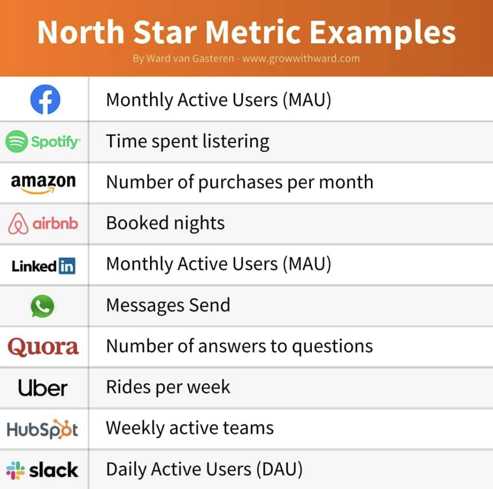

# 쏘카의 고객 정의-1
## 비즈니스 목표

### 비즈니스 목표 설정 (feat. 북극성지표)
고객을 정하려면 궁극적인 목표 설정을 먼저 해야한다. 이 때 목표는 '북극성지표(NPS)'라고 칭하기도 한다.

북극성지표란 제품이 고객에게 전달하고자 하는 가장 핵심적인 가치가 반영된 단 하나의 핵심 지표이며 관점이다.

- 실제 고객에게 실현된 가치를 반영해야 하며 액션을 통해 정량적인 임팩트로 산출할 수 있어야 합니다.
- 우리가 행하는 각 액션의 최종 목표로 귀결될 수 있어야 합니다.
- ‘매출’과 같이 통제 불가한 후행지표가 아닌 **액션을 통해 판단하고 조정할 수 있는 선행 지표**여야 합니다.

### 다른 비즈니스의 북극성 지표 예시
{: width="50%" height="50%"}

*위 그림의 예시를 보면 에어비앤비는 '예약된 숙박 일수', 스포티파이는 '음악의 재생 시간'을 북극성 지표로 설정하였는데, 이처럼 비즈니스에 영향을 줄 수 있는 가장 중요한 단 하나의 수치를 찾아 북극성 지표로 선정하면 좋을 듯 하다.*

### 쏘카 비즈니스 목표 설정 예시
본 글은 북극성 지표를 도출하기 위해 아래와 같은 기준들을 세웠다.
1. 고객의 성공 순간을 반영했는가?
2. 모든 고객이 ‘가치’를 얻는 내용인가?
3. 측정 가능한가?
4. 투입 지표를 통해 통제 가능한 요인인가?
5. 비즈니스 관점에서 성장을 직접 반영하는가?
6. 빠르게 판단할 수 있는가?

위의 여섯가지 기준에 따라 '월 반납 건수 증분'을 북극성 지표로 설정해보았다고 한다.

## 누가 고객이 될 상인가?
고객을 선정하기 위해선 '제품 시각'으로 사고하고 고민해야 하는데, 이 때 '제품 시각'이란 '고객 관점'과 '비즈니스 관점'을 함께 고려해야 하는 것을 말한다.

1. (-)비즈니스 관점만 고려한 고객 선정 
   예: 오직 '많은 수의' 신규 사용자 유치만을 위해 이벤트, 프로모션을 상시 진행하고 이후 사용자 행동 패턴 분석 및 후속 조치는 고려하지 않음 
   예: 오직 '매출'만을 위해 지역별 수요는 고려하지 않고 모든 차량에 대한 가격 인상을 단행함.
2. (-)오직 고객 관점만 고려한 고객 선정 
   예: 특정 지역에 '쏘카 존이 부족하다'는 의견만 반영하여 해당 지역에만 쏘카 존을 증설함 
   예: '특정 차량을 타고 싶다'는 의견만 반영하여 해당 차량을 구매 및 제공함
3. (+)비즈니스 관점과 고객 관점 모두를 고려한 교집합에 있는 고객 선정 = 중요한 고객! 
   예: 고객 관점에서 **주중에 쏘카를 사용하는 고객들이 ‘쿠폰’사용에 어려움**을 겪고 있다는 것을 발견하고 비즈니스 관점에서 **‘쿠폰’ 사용이 가장 저조한 지역/차종 등을 고려**하여 새로운 쿠폰 기획을 통해 ‘쿠폰 사용성’ 측면에서 효과를 검증함 → 사용성 증대 시 이후 전 지역, 전 차종으로 영향 범위 확대함 
   예: 고객 관점에서 **‘여행지에선 조금 더 많은 인원이 탑승 가능한 차량’을 원한다**는 니즈를 발견하고 비즈니스 관점에서 **가장 대여가 활발한 여행 지역을 선정**하여 차종을 다양화한 후 ‘대여 기준’에서 효과를 검증함 → 효과를 입증한 후 ‘여행지’라는 지역의 특수성을 고려하여 [여름맞이 캠핑카 프로모션] 등 차종 다양화, 마케팅 전략으로 영향 범위 확대함

> 참고 
> [SOCAR Tech Blog의 버키-주니어 PM의 '중요한 고객' 발굴하기](https://tech.socarcorp.kr/product/2022/08/26/important-customer.html)
