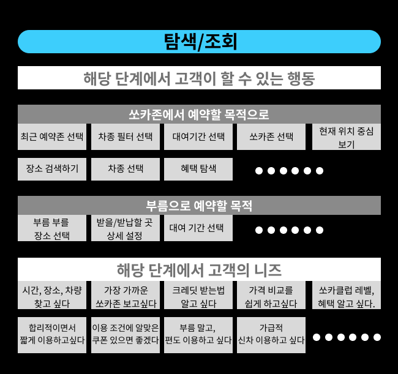
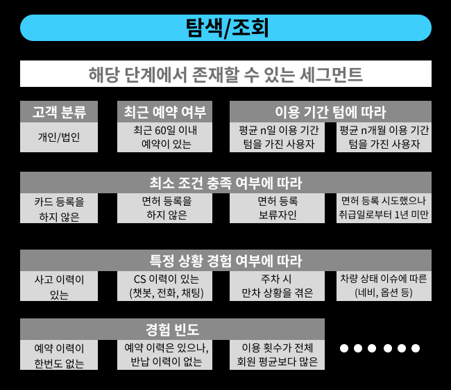
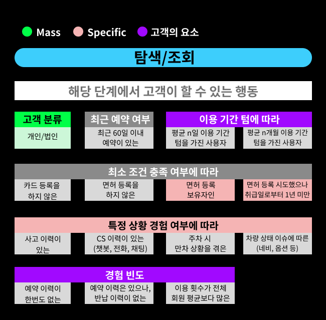
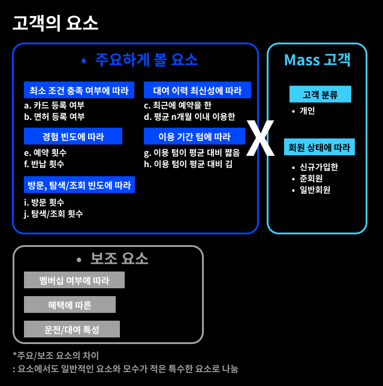
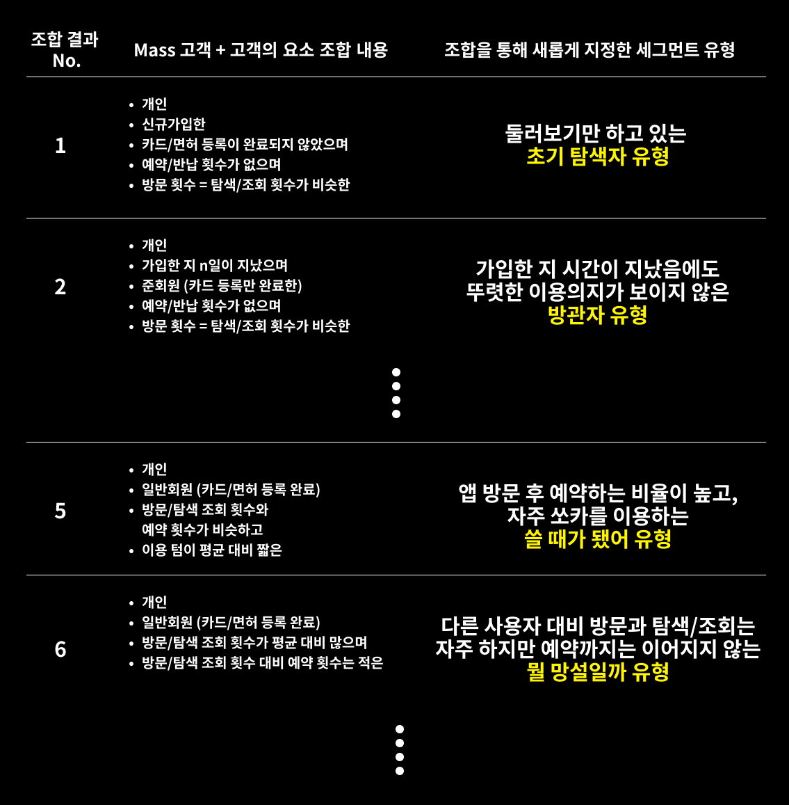
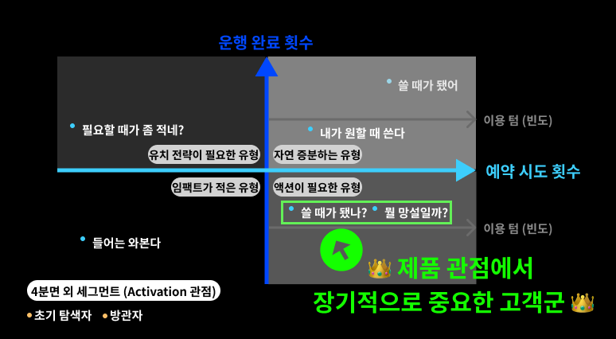

# 쏘카의 고객 정의-2

## 장기적으로 중요한 고객

### 중요한 고객을 찾기 위한 단계
1. 고객여정지도 퍼널 세분화
2. 고객의 행동, 니즈 나열
3. 니즈를 가질 수 있는 세그먼트 나열
4. 세그먼트 분류(북극성 지표, 모수 기준)
5. 세그먼트 재조합 및 사분면으로 중요 고객군 도출

### 해적지표(AARRR)란?
사용자 행동 지표인 획득(Acquisition), 활성화(Activation), 유지(Retention), 추천(Referral), 수익(Revenue)의 이니셜을 딴 약자.

예를 들어, '탐색/조회'에 쏘카의 퍼널을 집중하여 본다면,
- 고객이 할 수 있는 행동: 고객이 최종 결정을 위해 '할 수 있는' 행동들을 아이데이션 한다.
- 해당 단계에서 고객의 니즈: 고객이 최종 결정 과정에서 가질 수 있는 니즈를 앱 리뷰, CS 내용, 동료 인터뷰 내용을 참고하여 수정한다(실제 업무에선 고객 니즈를 발굴할 때 설문조사, 인터뷰, FGI, 데이터 분석 등을 활용하곤 한다).

아래는 예시 이미지.

{: width="50%" height="50%"}

이미지 출처: 쏘카 테크 블로그

이 카테고리 별로 세그먼트를 나눈다면 아래처럼 표현할 수 있다.

{: width="50%" height="50%"}

이미지 출처: 쏘카 테크 블로그
 
 
그 다음, 북극성 지표인 '월 반납 건 수'를 위해 규모 기준으로 세그먼트를 다시 분류한다. 
- 일반적인 경우: Mass 고객 (큰 임팩트)
- 특이한 경우: Specific 고객 (작은 임팩트)
- 분류 과정 중 고객이 가질 수 있는 '성격'으로 볼 수 있는 경우: 고객의 요소
  ex. 경험 빈도 (예약 경험이 전무한, 회원 평균 대비 많은 혹은 적은, 예약 경험은 있으나 반납 경험이 없는) 등..
  
{: width="50%" height="50%"}
이미지 출처: 쏘카 테크 블로그

마지막으로 최대한 다양하게 고객을 분류하기 위해 Mass 고객(일반적인 경우)와 고객의 요소를 조합하여 다양한 세그먼트를 고려한다.

{: width="50%" height="50%"}

이미지 출처: 쏘카 테크 블로그

{: width="50%" height="50%"}

이미지 출처: 쏘카 테크 블로그

이렇게 구성된 세그먼트들을 운행 완료 횟수와 예약 시도 횟수를 기준으로 사분면을 구성하여 장기적으로 중요한 고객을 살펴본다.

{: width="50%" height="50%"}

이미지 출처: 쏘카 테크 블로그

> 참고 
> [SOCAR Tech Blog의 버키-주니어 PM의 '중요한 고객' 발굴하기](https://tech.socarcorp.kr/product/2022/08/26/important-customer.html)

