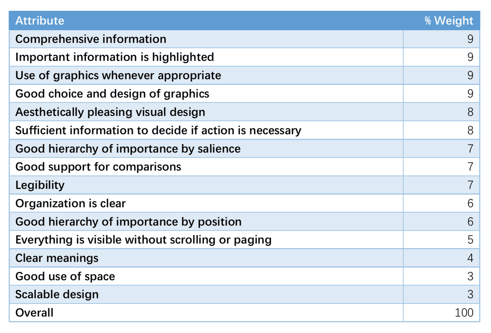

Last modified: {{page.last_modified_date}}

## 차이를 만드는 분석을 위한 체크리스트

> 참고 
> [브런치 Jin Young Kim - 차이를 만드는 분석을 위한 체크리스트](https://brunch.co.kr/@lifidea/53)

## Metrics & KPIs

> 참고 
> [Future - Metrics & KPIs](https://future.com/category/metrics-kpis/)

## 컨텍스트(Context)에 맞는 리서치 기법 찾기

### [UX 리서치] 기법을 분류하는 기준 3가지
- 태도에 관한 것인지 vs 행동에 관한 것인지 
- 정성적인 측정이 가능한지 vs 정량적인 측정이 가능한지 
- 이용 상황이 어떠한지
  
태도 vs 행동:
→ 태도’와 ‘행동’은 자칫 혼동이 될 수 있지만, 쉽게 설명하면 ‘사람들이 무슨 말을 했는지’는 태도와 관련이 있고,  ‘사람들이 무엇을 했는지’는 행동으로 구분할 수 있습니다.
 
정성 vs 정량:
→ 말 그대로 양적 데이터 vs 질적 데이터!
 
이용 상황 기준의 분류:
→ 실제로 제품이나 서비스를 사용하는 상황인지 (동그라미) – 실제는 아니지만 유사한 연출 상황인지 (네모) – 실제로 사용하지 않는 상황인지 (세모) – 혼합된 형태인지 (다이아몬드)

> 참고 
> [컨텍스트(Context)에 맞는 리서치 기법 찾기](https://blog.rightbrain.co.kr/?p=5048)

## 대시보드 & 대시보드 만들기 비법: 세련되고 직관적인 Dashboard
{: width="50%" height="50%"}
위의 이미지는 스티븐 리프먼트(Stephen Few)가 2012년 대시보드 그래픽 디자인 공모전에서 등한 우수한 대시보드의 특징이다.
- 포괄적인 정보
- 중요한 정보의 하이라이팅
- 필요한 부분에 좋은 그래픽 사용
- 그래픽의 좋은 선택과 디자인

대시보드를 시각화하기 위해선, ECharts, D3.js, Highcharts와 같은 그래픽 기법을 사용하여 히스토그램(histograms)이나 선형 차트 같은 차트를 제작할 수 있다.

> 참고
> [FineReport-대시보드: 세련되고 직관적인 Dashboard 만드는 비법 대공개!](https://www.finereport.com/kr/%EB%A6%AC%ED%8F%AC%ED%8C%85-%ED%88%B4%EB%A1%9C-%EC%84%B8%EB%A0%A8%ED%95%9C-%EB%8C%80%EC%8B%9C%EB%B3%B4%EB%93%9Cdashboard%EB%A5%BC-%EB%A7%8C%EB%93%A4%EA%B8%B0-feat-%ED%8C%8C%EC%9D%B8%EB%A6%AC/)