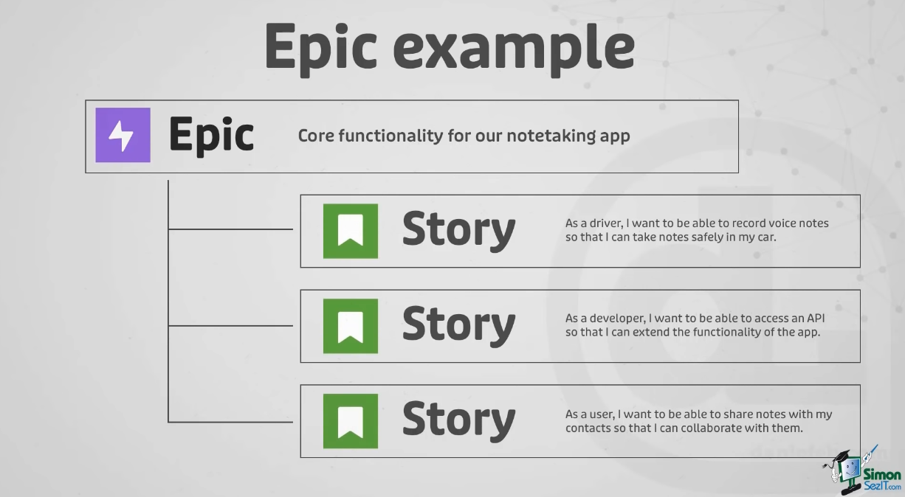

Last modified: {{page.last_modified_date}}

## Jira 사용법
지라는 프로젝트 관리 도구 중 하나로 크게 애자일 방법론 혹은 칸반 방법론에 따라 프로젝트를 관리할 수 있다. 

### Jira - User story

지라에서 사용되는 개념인 유저스토리는 아래와 같은 구조를 뜻한다.

<유저의 타입>으로서, 나는 <어떤 목표>를 성취하여, <무엇무엇>을 하고 싶다.

- 활용 예시 1: As a **web developer**, I want to **be able to add users to Jira** so that **my coworkers can report bugs**.
- 활용 예시 2: As a **cashier**. I want to **have the total calculated for me** so that I can **give the correct change back to the customer**.

### Jira - Epic

지라의 에픽은 하나의 스프린트로 다룰 수 없는 큰 스토리를 뜻한다. 아래의 그림처럼 하나의 에픽 아래에 여러 개의 유저스토리가 있다. 모든 유저스토리가 에픽 아래에 있어야하는 것은 아니다.

### Jira - Issue

이슈는 우리가 트래킹하는 것의 중심의 개념으로 아래와 같은 내용들을 포함한 개념이다.
- Description(설명)
- Summary(요약)
- Assignee(담당자)
- Due Date(기일)

> 참고 
> [Youtube - Jira Tutorial for Beginners: Jira Project Management](https://youtu.be/nHuhojfjeUY)

