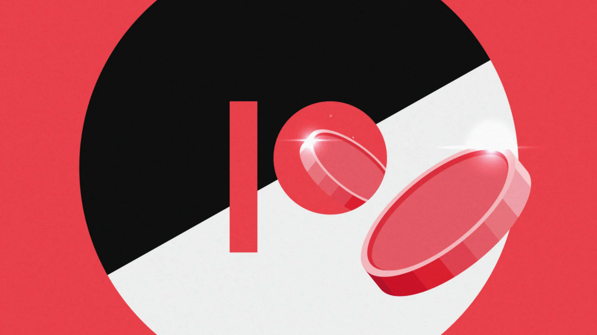
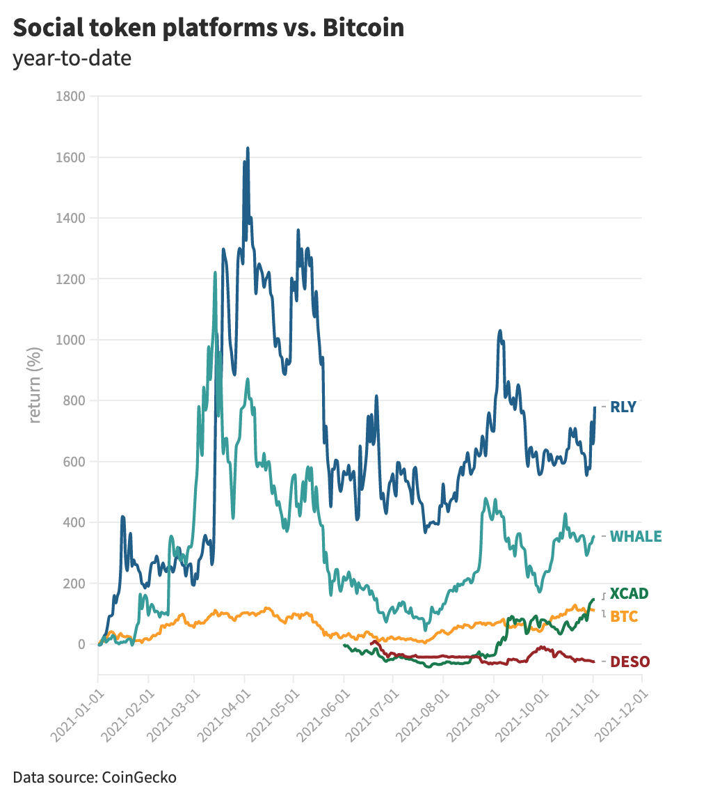

## Patreon, 크리에이터들이 직접 토큰을 발행할 수 있도록?!
참고: [Protos](https://protos.com/patreon-crypto-let-creators-sell-social-tokens-shilling-is-life/?fbclid=IwAR2q43HQJHITnjUT9r5D9k_yt4Dy5f6ndk21PifkJLQHr6zPqo_IJOr_m5w)

{: width="100%" height="100%"}

멤버쉽 플랫폼인 Patreon은 현재 200,000명의 아티스트가 활동중인데, Patreon에서 현재 artist들이 그들만의 암호화 토큰(Crypto Token)을 팬들에게 팔 수 있도록 할지 고려중이라고 한다. 기존에는 직접 Patreon의 멤버십을 통해 후원자에게 독점 콘텐츠, 커뮤니티, 창작 과정 공유 같은 것을 하고 그를 통해 소득을 창출 할 수 있었다. 하지만 이 기능들에서 부족함을 느낀 크리에이터들은 자신들만의 코인 같은 개념을 만들고 싶어했고, 그로 인한 타 서비스로의 이탈이 있었다. (예, [Rally](https://rally.io/), [XCAD](https://xcadnetwork.com/)) 아마 이것들이 미래엔 큰 사용자 이탈로 이루어 질 수 있는 사용자 행태로 파악되었고, 따라서 크리에이터들의 니즈를 충족시켜주고자 그륻이 직접 암호화 토큰을 발행 할 수 있는 기능을 제공하고자 했다고 생각한다.

Rally와 XCAD 같은 플랫폼에서 크리에이터가 발행한 토큰은 아티스트와 팬들 사이의 투자 계약을 형성해주는 가격 예측이나 본딩커브를 포함한다.
> 본딩커브란 토큰의 가격이 정해진 곡선에 따라 결정되는 방식

결론적으로 Patreon은 소셜 암호화폐의 밴드웨건을 노리고 있다는 것이다.

{: width="100%" height="100%"}

이 아티클에서 새로 알게 된 사실은 비트코인보다 Rally와 WHALE, XCAD가 벌써 return에서 앞서가고 있다는 것이다. (위 이미지 참고) ~~return은 수익률을 말하는 것인가?~~
