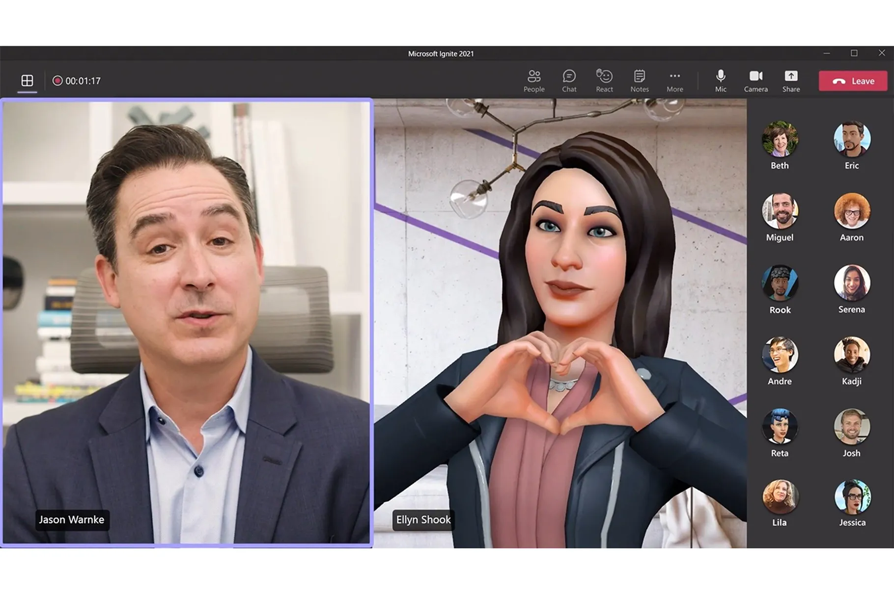

## 마이크로소프트의 '팀즈'와 '메시'
참고: [ZD Net Korea](https://zdnet.co.kr/view/?no=20211103160352&fbclid=IwAR1LtT32m_rxcdl9qheKzstSS2p_YKRHv-kbtZkD9KRv2-OwVb6uH5eT0zg#_enliple)

'팀즈'는 마이크로소프트(MS)가 만든 자사 협업툴로 혼합현실(XR) 플랫폼 '메시(Mesh)'가 결합되어 '팀즈용 메시'로 새롭게 등장하였다. 내년부터 마이크로소프트의 팀즈에 사용된다고 한다. 

팀즈용 메시(Mesh)는 배경화면을 가상 공간에서 여러 참여자가 함께 보여지는 '투게더 모드(하단 이미지 참고)', 참여자들과 발표 내용을 함께 감상하는 '프리젠터 뷰' 같은 협업 기능 들을 게공한다. 이 기능들을 활용하면 좀 더 협업적이고(collaborative), 몰입감(immersive)이 생길 수 있을 것이다. 특별한 점은 인공지능(AI)을 기반으로 사용자의 움직임이나 제스처 등을 보여분다는 것과, 나만의 3D 아바타를 만들 수 있다는 것이다.

{: width="100%" height="100%"}

나는 이 아티클을 읽으며 3D 아바타를 넣었을 때 렌더링 시간이 얼마나 걸릴지가 우선적으로 떠올랐다. 온라인 밋업 같은 공간에서 무엇보다도 중요한건 네트워크 상 딜레이가 없어서 상대방과 끊김이 없어야 몰입감(immersion)이 발생할 수 있기 때문이다. 그 외에도 표정을 얼마나 잘 캐치해 낼 수 있는지도 관건이 될 것 같다. 입꼬리가 살짝 올라간다든가, 고개를 살짝 꺄우뚱하는 등 사람이 보여주는 피드백이 잘 구현이 된다면 새로운 협업 도구로서 충분히 자리매김 할 수 있을거라고 생각한다. ~~특히 개인의 privacy를 보호하는 측면에서 상당한 역할을 할 수 있지 않을까 싶다~~ 

추가적으로 Ready Player One 영화를 아직 안 봤다면 한번 봐 보는 것을 추천한다.

