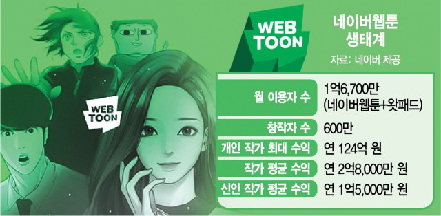

## 네이버 웹툰, 미국 이용자 중 70%가 Z세대!
참고: [news 1-송화연 기자의 글](https://n.news.naver.com/article/421/0005706147)

{: width="100%" height="100%"}

네이버웹툰이 미국 시장에서 큰 성과를 거두었다는 것은 이미 알고 있었는데, 사실 그것보다 더 중요한 이슈는 '슈퍼캐스팅' 프로젝트가 미국 시장을 시작으로 막을 올랐다는 점이다. 

미국 내에서 코믹스(만화) 시장 규모는 12억8000만달러(약 1조5187억원)이라고 한다. 그 뿐 아니라, 2019년 미국 내 네이버웹툰의 월간활성이용자수(MAU)는 1000만명을 돌파하고 현재는 1400만명의 MAU를 보유하고 있다고 한다. ~~이는 애플티비의 수치인 1030만명보다 높은 수치이다.~~

내가 기억하는 바로는, 네이버웹툰이 큰 성공을 거둔 이유는 콘텐츠의 다양성 때문이라고 했다. 기존의 미국 웹툰은 히어로 위주의 웹툰이 많았는데, 그걸 깨는 형식이 나오며 점유율이 높아졌다고 했다. 이런 기존 미국 유저의 니즈에 맞추고자 한 것인지 네이버웹툰은 '슈퍼캐스팅'의 첫 협업 작품으로 DC코믹스와 협업하여 '배트맨'시리즈를 출시했다.

네이버웹툰은 자신의 플랫폼 통해 창작자들이 자신이 직접 만든 웹툰, 웹소설이 비디오, 영화, 게임, 상품 등으로 확장되는 그림을 그리고 있다. 그에 따라 영화TV 콘텐츠 제작사 '버티고엔터테인먼트(Vertigo Entertainment)'와 애니메이션 스튜디오인 '루스터티스프로덕션(Rooster Teeth Stutios)', '바운드엔터테인먼트(Bound Entertainment)', '짐핸슨컴퍼니(The Jim Henson Company)' 와도 협업을 진행하고 있다.