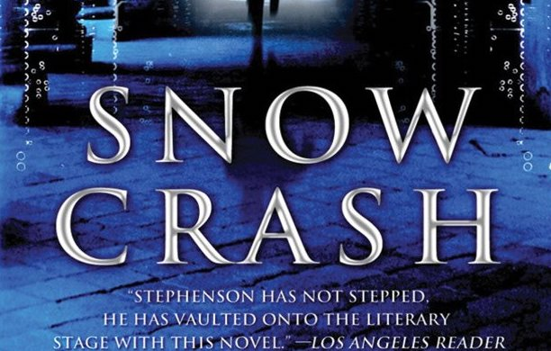

## 메타버스란?
참고: [Everything you wanted to know about the metaverse (but were afraid to ask)](https://thenextweb.com/news/everything-wanted-know-metaverse-but-afraid-ask-syndication?utm_source=feedburner&utm_medium=feed&utm_campaign=Feed%3A+TheNextWeb+%28The+Next+Web+All+Stories%29)

현재 메타버스에 크게 주목하고 있는 기업으로는 페이스북(현 Meta)과 마이크로소프트(Microsoft)를 꼽을 수 있다. 페이스북은 메타버스가 궁극적으로 교육, 업무, 사회적 상황 전반에 걸쳐 관여될 것이라고 한 반면 마이크로소프트는 가상 오피스에 우선 집중을 하는 양상으로 보인다. 

메타버스의 개념에 대한 정리를 살펴보자면, 메타버스는 아래의 요소들을 포함한다.
<ol>
  <li>가상세계(A virtual world): 3D 그래픽과 사운드를 함께 경험하는 것. 메타버스 안에 현존(present)하도록 느끼게 해주는 것인 동시에 실제 세계에 대해선 현존감이 덜 느껴지는 것.</li>
  <li>가상현실(Vritual reality): 가상세계에 몰입(immersed)되고 더 현존감(present)이 느껴지는 것 ~~가상세계는 물리적 공간을 뜻하고 가상현실은 개녕적인 현실을 뜻하는건가~~</li>
  <li>다른 사람들(Other people): 메타버스는 사회다. 그 속의 아바타들, 가상 에이전트, 인공지능의 산물들과 상호작용하는 것으로 비디오 컨프런스보다 소통이 더 자연스러울 수도 있다.(아바타를 이용해 어디를 쳐다보는지 같은 것을 보여줄 수 있기 때문)</li>
  <li>지속성(Persistence): 언제든지 방문할 수 있고 원한다면 변경하고 유지시킬 수도 있고 집을 소유할 수도 있는 것. </li>
  <li>실제 세계로의 연결(Connection to the real world): 몇몇 관점에서 메타버스는 실제 세계의 실제 사물을 닮아야 한다고 말한다. 예를 들어, 메타버스에서 가상 드론을 날려서 현실 세계에서 실제 드론을 조정하는 것처럼 말이다. 이런 것을 "digital twins"라고 한다.</li>
</ol>

{: width="100%" height="100%"}

### Metaverse(메타버스) 어원
'Metaverse'라는 개념은 사실 새로운 개념이 아니다. 1992년 사이버펑크 소설 'Snow Crash'를 쓴 Neal Stephenson 작가로부터 나온 개념이다. 그 내용은 3D 가상 세계에서 사람들(아바타)과 인공지능 에이전트와 상호작용하는 것으로 구성되어 있었다.

### 메타버스의 미래
현재는 다양한 기업에서 다양한 방식으로 메타버스를 만들고 있지만, 결국 인터넷이 그랬듯 나중엔 다 이어질 것이다. 메타(Meta)의 마크 주커버그(Mark Zuckerberg)가 언급한 바에 따르면, 우리가 현실에서 홀로그램으로 나타날 수도 있고, 혹은 현실에 나타난 체스판을 가상환경에서 전세계 사람들과 즐길 수도 있게 될 것이라고 한다. 

궁극적으로 메타버스가 우리의 삶에 줄 수 있는 영향이 막대하므로 메타버스를 어떻게 만들고 싶은지, 누가 만들어야 하는지, 규제해야하는지 등에 관심을 갖고 생각해봐야 한다.