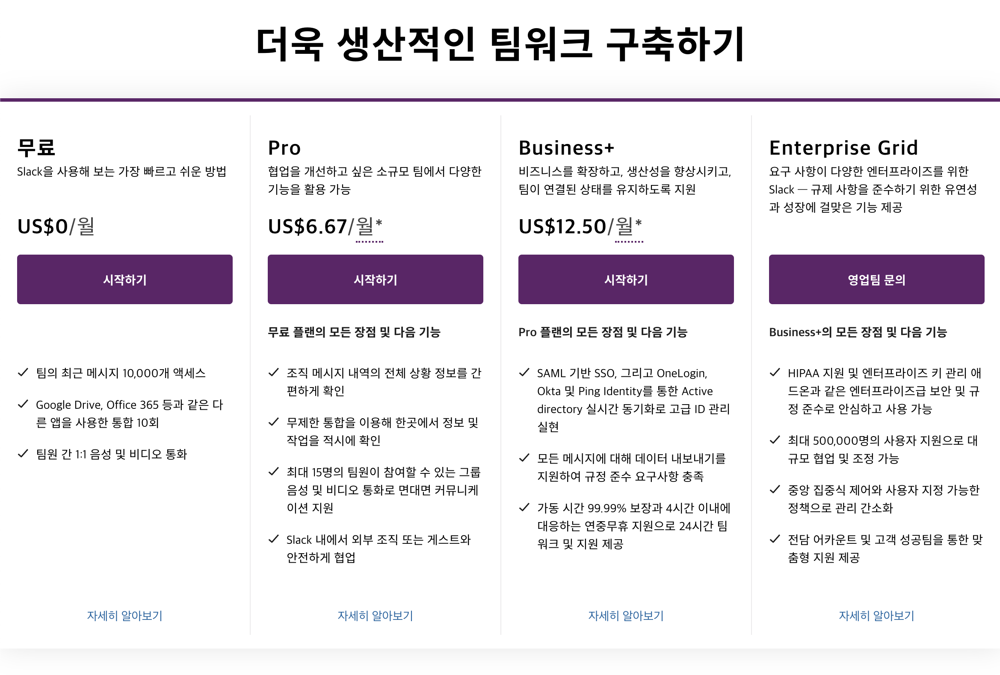
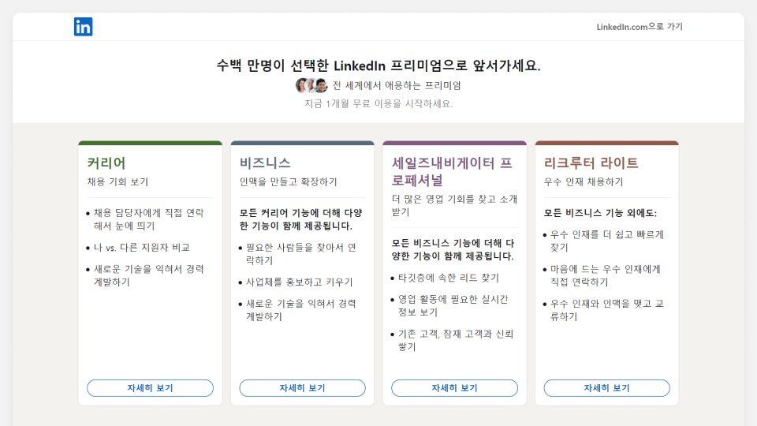
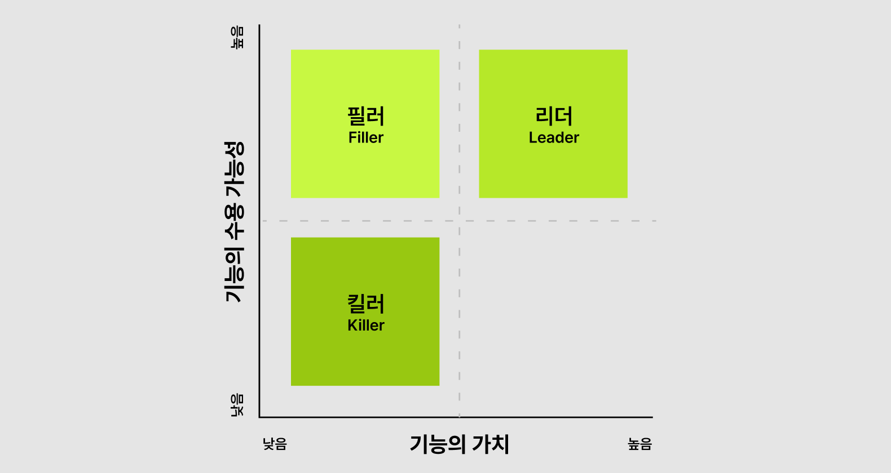
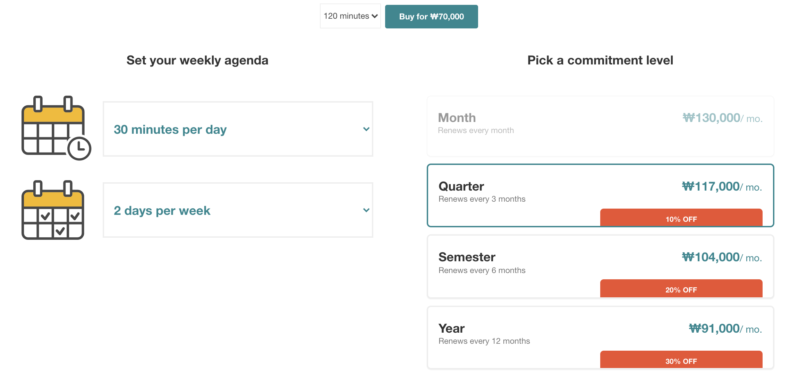

### 제품 가격은 어떻게 책정하는 것이 좋을까?

2,200개의 SaaS 기업을 대상으로 한 설문 조사에서 제품 가치 기반으로 가격 책정한 경우가 39%이고 최선책을 임의로 판단 내린 경우가 27%, 경쟁사를 참고한 경우가 24%이다. 하지만 이 설문조사에서 눈여겨 보아야 할 지점은 연평균 거래 규모가 5천 달러(한화 약 590만 원) 미만인 기업 중 제품 가치를 기반으로 가격 책정한 곳은 35%뿐이었지만, 10만 달러(한화 약 1억 1천만원)가 넘는 기업 중에서는 51%가 제품 가치 기반으로 가격을 책정했다. ~~5천 달러와 10만 달러는 갭이 너무 심한데.. 4천 달러 이상인 기업 중엔 몇 퍼센트인지?~~

뭐 어쨌든 그렇기 때문에 가격 책정이 제품 전략 중 영향력 있다는 이야기이다.

위의 요즘IT의 아티클에서는 사례로 넷플릭스를 드는데, 넷플릭스가 처음 가격정책(기존의 월 $9.99였던 스트리밍+DVD 1대 대여 서비스를 스트리밍과 DVD대여를 각각 $7.99로 따로 분리한 것)을 발표했을 때 80만명의 구독자를 잃고 계획이 철회되었다는 것이다. 그 후 스트리밍 시장도 확장되고 넷플릭스 제품도 안정된 후엔 가격을 올려서 경쟁사보다 20~30% 높은 가격이어도 수익 성장률이 35%에 달하고 주가도 막대하게 올랐다.

이런 사례만 보더라도 가격 책정은 제품의 가치에 막대한 영향을 준다는 것을 알 수 있다.

### 5가지 가격 책정 전략

#### 고객 유형 세분화
제품 사용자의 여러 유형의 고객에 따른 가격 책정
<ol>
  <li> 니즈, 환경, 문제에 따라 제품 고객 유형 세분화</li>
  <li> 고객 유형별로 제공할 가치,기능과 제공 비용 결정</li>
  <li> 지나친 세분화로 고객의 결정력이 떨어지지 않는 선에서 유형별 요금제 개설</li>
  </ol>

예를 들어, 슬랙은 고객의 유형별로 아래와 같은 세분화를 하여 가격을 제공한다. 비즈니스의 규모에 따라 맞는 크기의 요금제를 사용할 수 있도록 구성한 것이다.

{: width="100%" height="100%"}

이 외에도 링크드인 같은 경우는 고객, 대표, 직원, 투자자, 협력사와 같이 많은 이해 관계자가 얽혀있기 때문에, 이런 형태를 수용할 수 있는 가격 정책을 제시한다.

{: width="100%" height="100%"}

#### 요금제 구성: 리더, 필러, 킬러
요금제 구성의 핵심은 고객의 선택지를 제약하는 것이다. 젠데스크(Zendesk)의 초창기 마케터이자 피그마(Figma)의 현 CCO인 아만다 클레하(Amanda Kleha)는 효과적인 요금제를 만들기 위해 제공할 기능을 3가지로 분류하라고 이야기한다.

{: width="100%" height="100%"}

<ol>
  <li>리더: 높은 가치와 수용 가능성을 가진 기능. 해당 요금제를 구매할 주요 요인. 각 요금제에는 분명한 리더가 1개 이상 포함되어야 함</li>
  <li>필러: 수용 가능성은 있지만 리더에 비해 제공 가치가 떨어지는 기능. 리더 기능과 어울리는 필러는 해당 요금제의 가치를 높임</li>
  <li>킬러: 낮은 가치와 수용 가능성을 지닌, 구매 의지를 떨어뜨리는 기능. 킬러 기능이 포함된 요금제를 살 때, 불필요한 기능에도 비용을 들인다고 여기게 되기 때문에 해당 요금제를 구매하지 않을 것임</li>
  </ol>

채널톡의 사례를 살펴보면, 제품의 핵심 기능인 라이브 채팅과, 자주 쓰는 답변을 지정하는 등 상담에 필수적인 기능은 모두 무료로 제공하되 고객의 데이터에 접근하는 기능과 부가 서비스는 유료로 제공한다. 

#### 과금 기준 지표
비용을 청구하는 기준인 '사용 시간'은 각 제품 특성에 맞게 다양한 지표로 제시된다. 아래의 3가지 핵심 방향성을 고려하여 과금 기준 지표를 설정할 수 있다.

<ol>
  <li>연관성: 고객이 요구하고 제품이 제공하는 핵심 가치를 직접적으로 반영</li>
  <li>확장성: 고객의 필요에 맞춰 탄력적으로 늘릴 수 있는 지표</li>
  <li>투명·무결성: 고객이 비용과 결제 방식을 예측할 수 있어 결제 과정에 허들이 없도록. 또한 계정을 공유하는 등 변칙적 사용법으로 동일한 요금을 내는 고객 간에 제공받는 가치의 불평등이 생기지 않도록</li>
  </ol>

<예시>
<ul>
  <li>채널톡: MAU(월 활성화 사용자 수) 규모에 따라 5가지 유료 요금제 제공</li>
  <li>Zapier: 앱 연동 및 워크플로우 자동화 서비스로 워크플로우의 개수워 워크플로우로 수행한 작업 수에 따라 요금제 제공(제품의 핵심 기능 그대로 반영, 변칙적으로 사용하기 어려움)</li>
  <li>스티비: 이메일 뉴스레터 제작·발생 서비스로 구독자 수, 월 발송 횟수, 이메일 1개당 첨부 이미지 용량을 기준</li>
</ul>

#### 할인 시스템
제품이 많이 팔리고 규모가 커질수록 가격 할인이 빈번하지만 무조건적인 할인이 제품 성장을 보장하는 것은 아님. 

대부분의 제품은 구독 기간이 길수록 할인 폭이 큰데, 아래의 영어 화상 회의 서비스 Cambly의 가격정책에서도 그 예시를 확인할 수 있다. 

{: width="100%" height="100%"}

이렇게 가격 정책을 활용하면, 사용 기간은 늘고 이탈률이 줄어들어 전반적으로 더 큰 수익을 낼 수 있다.

#### 가격 제시 방법 실험
코드카데미(Codecademy)에서 한 실험 중, 100의 법칙(Rule of 100)이 있는데, 어떤 상품의 가격이 100달러 이상이라면 할인율보다 할인가를 보여주는게 혜택을 더 크게 실감한다는 것이다. 

위의 사례처럼 다양한 요소들을 가격 정책 페이지에서 변수로 활용할 수 있을 것 같다. 

 
> 참고 
> [요즘IT](https://yozm.wishket.com/magazine/detail/1234/)