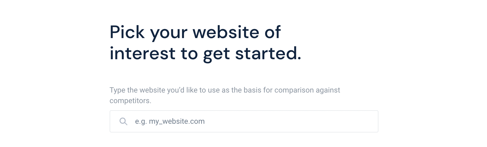
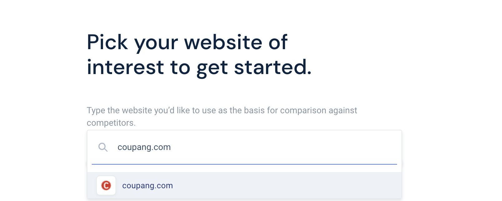
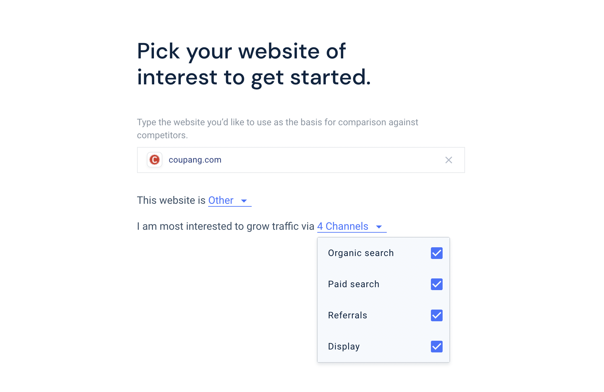
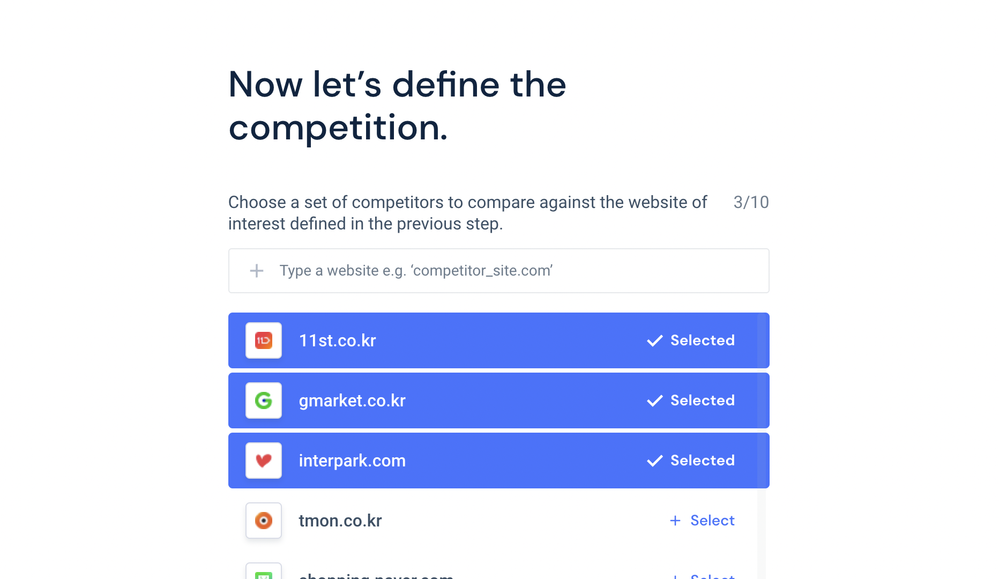
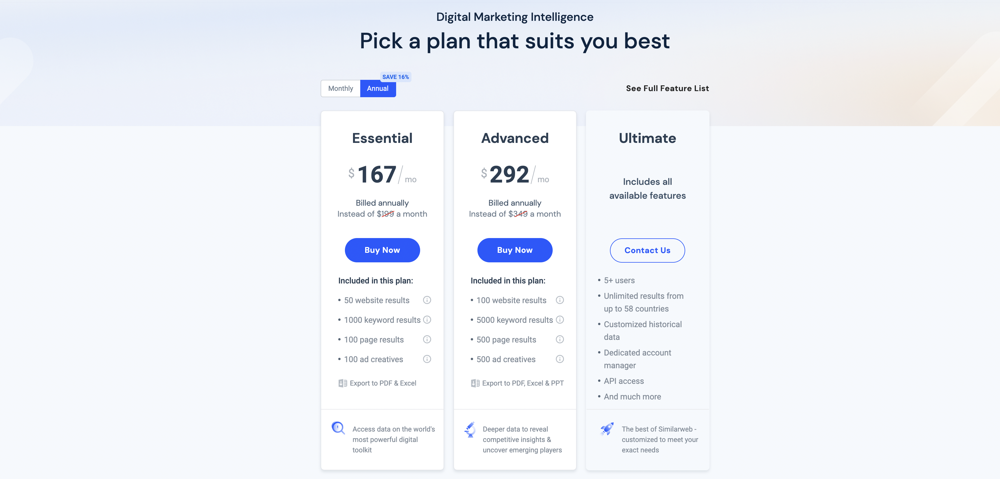

[similarweb (시밀러웹)]이라는 서비스는 우리 서비스 외의 타서비스의 지표들을 대략적으로 확인할 수 있는 곳으로, 마케터분들에는 이미 유명한 사이트이다.

특정 서비스의 시장 점유율이나, 방문자 분석을 할 수 있는 서비스를 제공한다. 다소 아쉬운 점은 가격대가 높아서 개인이 쓰기엔 무리가 될 수도 있다는 점이다. 하지만 그 가격만큼의 유용함은 가져다 준다. 이 글의 하단에 가격 정책을 공유하였다.

Similar web을 통해 타사의 비즈니스 지표를 확인하는 상황을 가정해보자.
예를 들어, 쿠팡이 요새 어떤지 확인하고 싶다면?

## 쿠팡의 비즈니스 지표 확인하기
1. Similar Web에 접속하여 회원가입을 진행한다.
2. 회원가입 후엔, 아래의 이미지와 같이 어떤 웹사이트를 분석하고 싶은지 URL 주소를 입력하는 단계가 나온다. 
   {: width="100%" height="100%"}  
3. 쿠팡의 URL 주소를 입력해준다. 
   {: width="100%" height="100%"}  
4. Organic search, Paid search, Referrals, Display 중 어떤 트래픽에 가장 관심이 있는지 선택한다. 모두 다 선택할 수도 있다. 
   {: width="100%" height="100%"}  
5. 그럼 트래픽이 충분히 많은 사이트라면 아래와 같이 경쟁사 리스트들을 보여준다 (충분히 많다는 기준이 무엇인지는 아직 잘 모르겠으나 similar web에서 데이터를 가져올 수 있는 경우 보여주는 것 같다). 
   {: width="100%" height="100%"}  

위의 단계들을 거친 후엔, 아래와 같은 엄청난 데이터들을 얻을 수 있다. 
 
{: width="100%" height="100%"}  

이 외에도, 아래의 이미지와 같이 경쟁사에서 어떤 키워드에 비딩하고 있는지를 확인할 수 있다.
 
{: width="100%" height="100%"}  

또한 광고 노출이 얼마나 되었는지도 확인할 수 있다.
 
{: width="100%" height="100%"}  

## Similar Web 가격대
우선 아래는 1년 결제로 사용할 경우의 월별 가격이다. 가장 저렴한 요금제가 대략 한화로 월 17만원 정도 선이라고 할 수 있다.
{: width="100%" height="100%"}  

가격은 월별 결제로 할 경우 월 20만원 이상으로 올라가게 된다. 또한 필수기능만 모아놓은 Essential과 심화된 기능도 이용이 가능한 Advanced로 가격대가 나뉜다.

