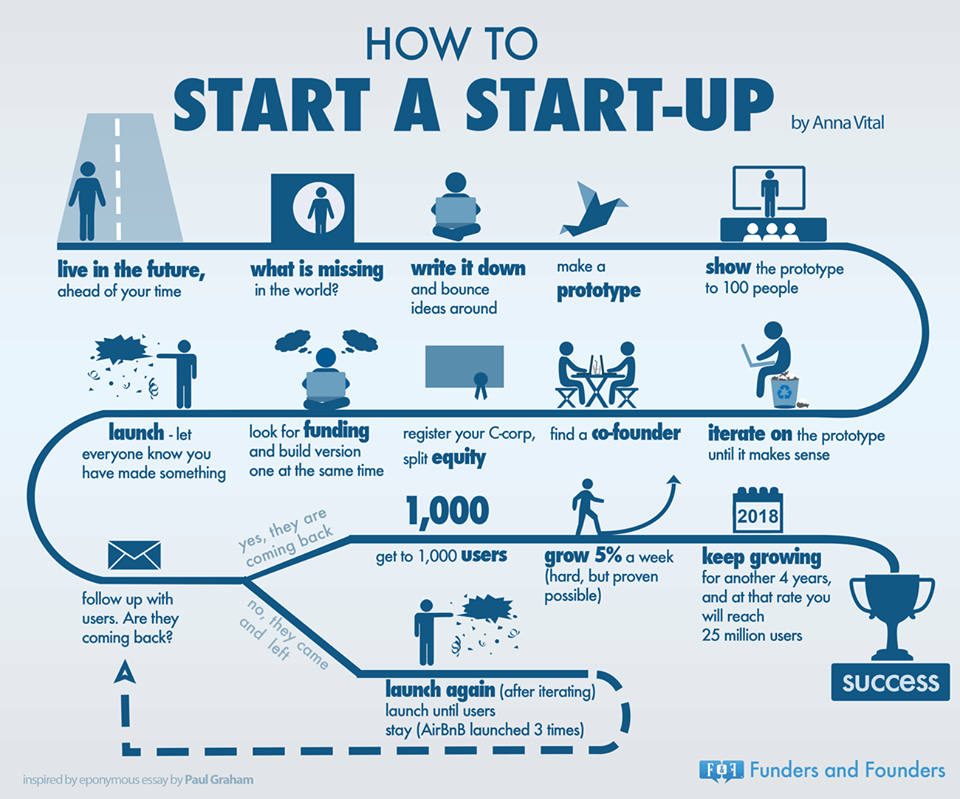
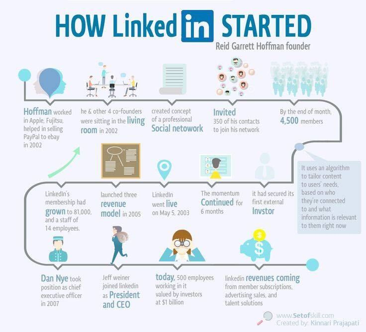
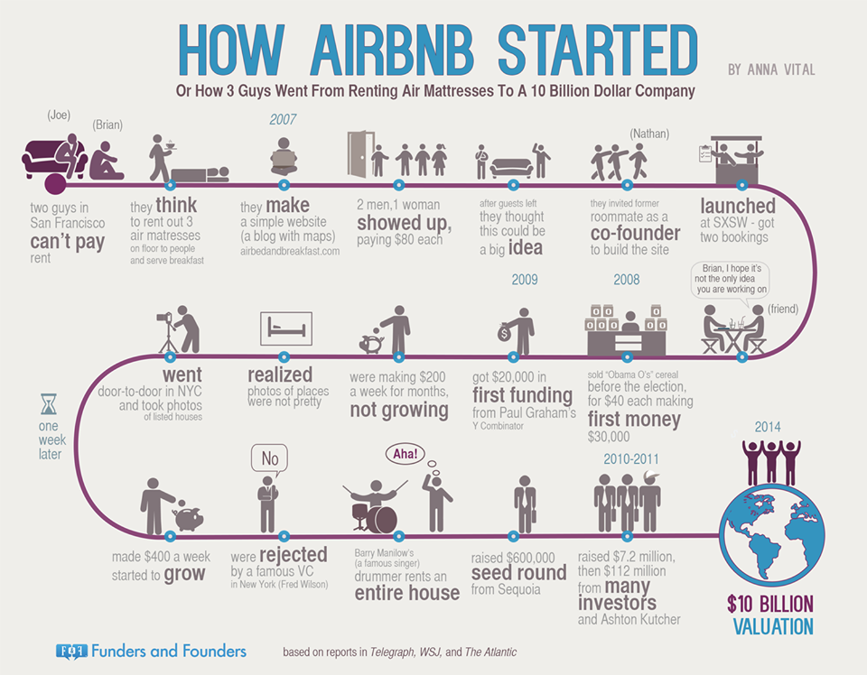
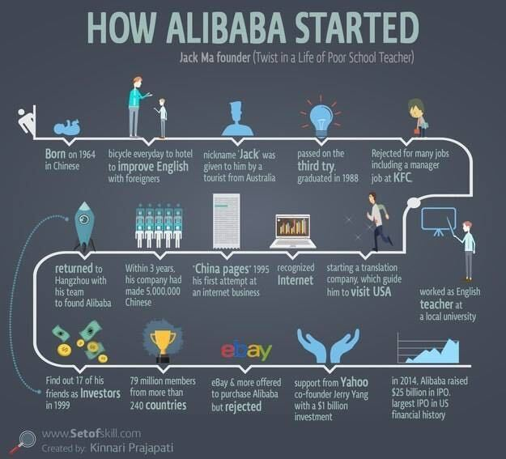
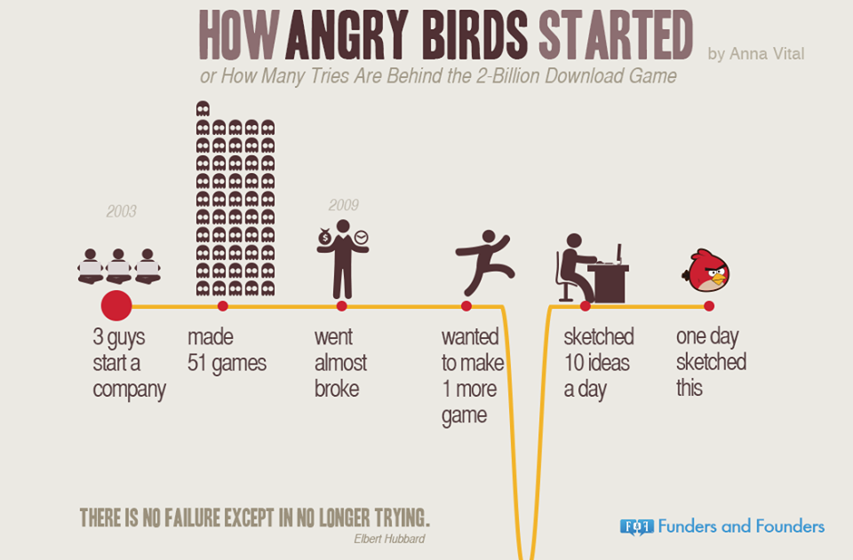
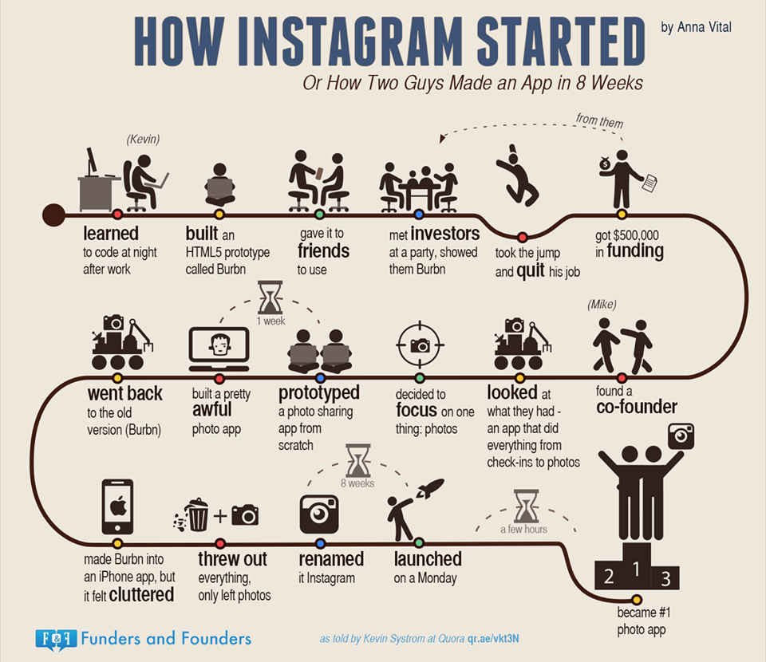
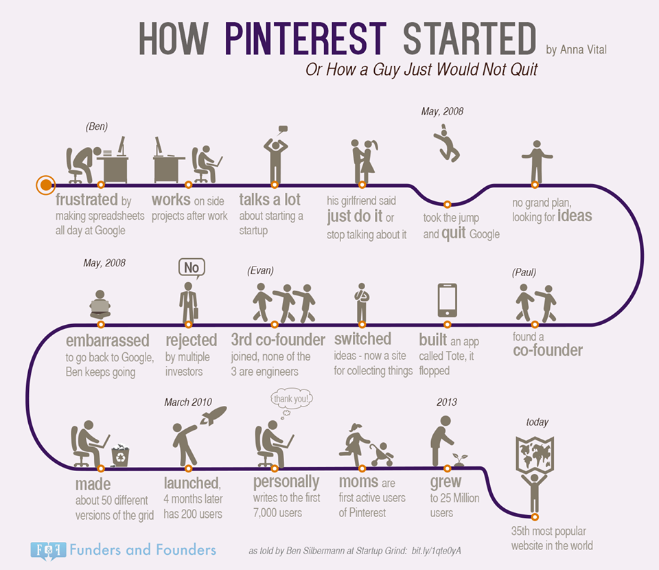
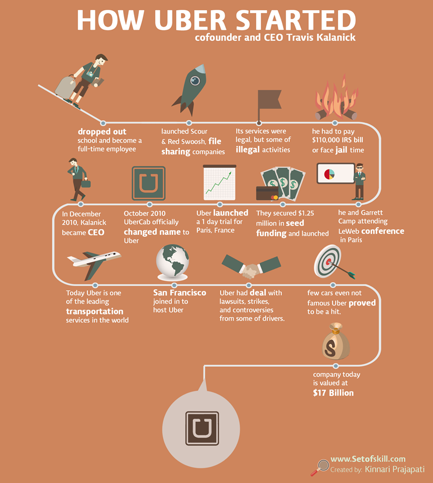

## 스타트업의 시작
{: width="100%" height="100%"}  
1. 미래에 살아라: 앞서 보아라
2. 무엇이 부족한가: 세계는 무엇을 필요로 하는가?
3. 적어라: 적고 아이디어를 발산하라
4. 프로토타입을 만들어라
5. 100명에게 프로토타입을 선보여라
6. 그게 말이 될 때까지 과정을 반복하여라
7. 동업자를 찾아라
8. 지분을 나누고 c-corp를 등록하라
9. 투자처를 찾으며 버전을 만들어라
10. 서비스를 런칭하여 뭔가 만들었다는 것을 알려라
11. 사용자를 추적하라: 그들이 돌아오는가?
12. 돌아온다면, 1000명의 사용자를 얻어라. 매 주 5% 성장하라(어렵더라도 가능하다고 증명되었다). 그렇게 4년을 계속 성장하면 2천 5백만 사용자를 얻을 것이다.
    돌아오지 않는다면, 다시 앞의 과정을 반복하고 새로 출시하여라(사용자가 머무를 때까지).
    -> 에어비엔비는 3번을 런칭하였다.

### 링크드인의 시작
{: width="100%" height="100%"}  

### 에어비앤비의 시작
{: width="100%" height="100%"}  

### 알리바바의 시작
{: width="100%" height="100%"}  

### 앵그리버드의 시작
{: width="100%" height="100%"}  

### 인스타그램의 시작
{: width="100%" height="100%"}  

### 핀터레스트의 시작
{: width="100%" height="100%"}  

### 우버의 시작
{: width="100%" height="100%"}  
