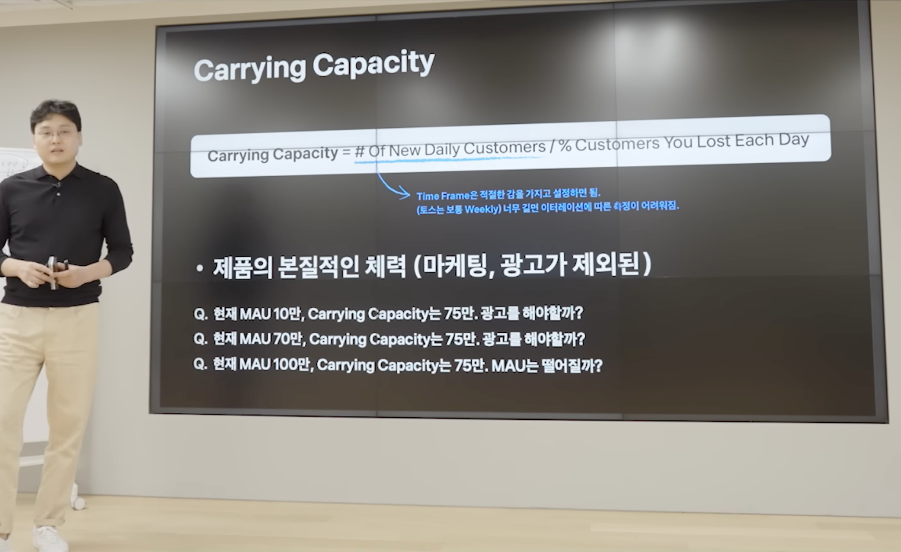

# 이승건 대표님 이의 있어요!
우선은 Carrying Capacity가 무엇이냐면, 마케팅 없이 매일 들어오는 신규 유저 수를 전체 MAU 중에 몇 %를 매일 잃고 있는지를 나누어 계산한 수치이다.

즉, Carrying Capacity에 대비하여 현재의 MAU의 상태를 확인하고 공격적인 마케팅을 해야할 지 아니면 그냥 자연스러운 유입으로 둬도 될지를 확인할 수 있는 것이다.

그런데, 이 개념을 두고 한 마케팅 관련 유명 블로거님께서 이의를 제기하셨다. *(당당하게 의견을 제시할 수 있는 마인드 리스펙합니다.)*그 이의의 포인트는 아래의 두 가지이다.

1. Total customer 수를 결정하는 것에 시장의 크기가 중요하다. 
   즉, 새로운 유저 수와 나간 유저 수만 고려하면 안된다.
2. 신규 유저 수(Inflow)와 이탈률(Churn)은 변수가 아니라 상수다. 
   즉, 늘 바뀌는 숫자이기 때문에 Carrying capacity(c.c)라는 중요한 개념이 변수가 되도록 설정할 수 없다는 이야기. = c.c는 계속 변할 수 밖에 없는 변수.
3. Paid marketing은 지속 가능한 고객 획득 방법인데(Customer Acquisition Cost가 Customer Lifetime Value보다 낮다면), 왜 제외해야 하느냐. 
   즉, 유료 고객을 통하면 carrying capacity 이상으로 유저 수를 끌어올릴 수 있는데, 왜 그런 수단을 제외해야 하느냐.

## 이의에 이의 있어요!
위의 의견에 대하여, TOSS의 이승건 대표님이 직접 유튜브 영상을 통해 답변을 해주셨다. *이런 건강한 토론 너무 부럽다.*

1. 번 이의에 대한 답변: 시장의 크기가 새로운 유저 수에 이미 반영이 된 결과이다.
2. 번 이의에 대한 답변: TOSS의 경험을 토대로 보았을 때 상수가 맞다. 토스는 매년 새로운 기능을 20개 내보내는데, 그렇다고 신규 유입(Inflow)이나 이탈률이 변하지는 않았다. (특별 프로모션 때를 제외하고)
3. 번 이의에 대한 답변: 우선은 이미 이탈한 고객한테 계속 돈을 사용해서 데리고 와봤자 나머지 인원들을 합친 고객획득비용(Acquisition cost)만 높아질 뿐, 그 이유 외에도 이미 이탈한 고객은 그 돈을 들이더라도 다시 돌아오지 않음. 결국에 LTV를 상회하게 됨.

### 이탈률(churn)의 반대는 리텐션(retention)이 아니다.
둘은 엄연히 다른 개념이다. 리텐션이 올라가도 이탈률이 낮아지지 않는 경우가 많다. 이탈률은 그대로인 경우가 훨씬 많다. 따라서 둘은 등치의 개념이거나 역의 개념이 아니다.

리텐션은 대개 월 단위로 보고, 이탈률은 한 달로 보지 않는 경우가 많음(보통 3개월로 봤음)

*개인 의견: 3번의 논점은 두 분의 얘기에서 신규고객획득과 이탈한 고객을 다시 돌아오게 하는 것에서의 의견 차이가 있었던 것 같다. 그 밖에 2번은 내가 직접 유저데이터에서 그런 상수의 개념을 확인해보지 못했기 때문에 어떤 것이 옳다 그르다는 판단하지 못하겠다. 1번은 이승건 대표님의 설명이 맞다는 것에 동의한다.*

{: width="100%" height="100%"}

> 참고 
> [Thinker-Practitioner 블로그-이승건 대표님의 Carrying Capacity 강의, 이의 있어요!](https://www.minwookim.kr/carrying-capacity-gaenyeom/)
> [토스 Youtube-토스 리더가 직접 답해드립니다](https://youtu.be/GFERag7kjFM?t=588)