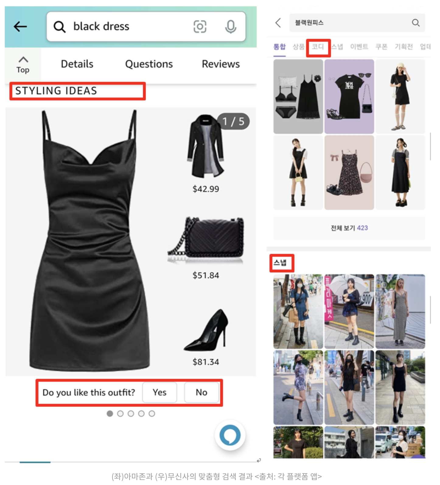

# 패션 이커머스에서의 검색

패션 이커머스에서는 검색도 중요하지만 '나'에게 얼마나 잘 어울리는 제품을 추천해 줄 수 있는가도 중요한 요소로 작동한다.

그런 것을 반영한 기능이 '맞춤형 갤러리', '해시태그 스타일링', '키워드 연관 테마 검색' 등이다.

## 맞춤형 갤러리 검색
검색 결과는 보통 1단, 2단, 3단 같은 방식으로 구현되는데, 이는 패션 이커머스의 문맥을 고려하였을 때 단순히 이유 없는 추천에 불과하다. 

그 보다, 하나의 제품을 추천하고 이것과 어울리는 다른 제품들을 같이 제공하면 사용자가 한 번에 세트로 구매하기도 쉽고 혹은 자신이 가지고 있는 다른 제품들과 어울릴지도 상상하기 쉬워진다.

*'패션'이라는 카테고리에 부합한 적절한 추천 방식이라고 생각된다.*

{: width="100%" height="100%"}  
이미지 출처: 글 하단의 링크

## 해시태그로 스타일링 검색
검색 결과를 구현할 때,  필터 기능을 제공하는 것을 흔히 볼 수 있다. 이는 특히 패션 관련 상품에서 더 유용하게 사용될 수 있는데, 예를 들어, 사이즈·색상·소재를 사용할 수 있기 때문이다.

*개인적으로는 이런 필터링은 공통의 규정이 잘 적용되면 좋겠다는 바람이 있다.*

하지만, 그 밖에도 옷을 입는 상황 같은 정서적 맥락도 중요하다. 즉, 시즌성·TPO(Time, Place, Occasion), OOTD(Outfit of the day) 같은 상황도 함께 중요하다는 것이다.

## 키워드와 연관된 테마 검색
검색 결과에서 키워드에 기반한 테마로 연결되는 방법들이 활용되고 있다. 예를 들어 '블랙원피스'라는 키워드를 검색하면 그와 맞는 테마관을 배너형태로 보여줄 수도 있는 것.

## 다양한 연결 기반의 추천
'자라'는 상품 제작부터 데이터를 분석하여 트렌디한 상품을 생산하고, '에이블리'는 실시간으로 선호도를 파악하여 타깃별 최신 라이프스타일을 반영하여 제품을 추천한다. 하지만, 이 밖에도 다양한 방식의 추천을 통해 지속적인 방문을 유도할 필요가 있다.

1. 적시에 즉각 반응하는 스타일 추천 
   : '쉬인'은 사용자가 장바구니에 담은 상품에 기반하여 즉각적인 연관 상품 제안을 제공한다.  
   : '멜리즈'는 상세페이지에서 좌우 플릭킹(화면을 터치하고 밀어내면서 상화자우로 움직이는 작업)을 하면 맨 마지막 이미지에서는 상품 특성에 맞는 비슷한 아이템을 추천하는 영역이 있다. 
2. 소통 기반 취향 저격 상품 추천 
   : '에이블리'는 앱을 다운받고 여는 순간 선호하는 스타일을 묻는다. 그에 기반하여 선호도 파악 및 추천, 제품을 구매한 후에도 연관 상품 소개.
3. 가상 피팅 
   : '무신사', '지킷'은 AR, VR을 활용하여 경험을 제공
   *개인적으로 가상 피팅은 '라운즈'가 잘 구현했다고 생각한다.*

> 참고 
> [요즘 IT 블로그의 그릇-패션 이커머스 구매 경험 향상을 위한 기획 요소](https://yozm.wishket.com/magazine/detail/1664/)