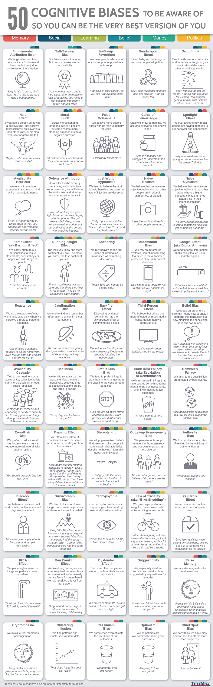

 
# 인지 편향의 종류 50가지

## 인지 편향이란?
인지 편향(Cognitive bias)은 개인이 판단을 할 때 규범이나 합리성에 맞지 않는 판단을 하는 패턴을 의미한다.

> A **cognitive bias** is a systematic pattern of deviation from [norm](https://en.wikipedia.org/wiki/Norm_(philosophy) "Norm (philosophy)") or rationality in judgment.

쉽게 설명하자면, 무언가를 보거나 듣거나 생각 혹은 감각할 때, 개인이 그에 대한 자신만의 "주관적 현실"을 만든다는 것이다. 이런 인지 편향은 지각 왜곡, 부정확한 판단, 비논리적인 해석, 또는 일반적으로 비합리적이라고 여겨지는 것을 이끌어 낼 수 있다.

사실 이렇게만 설명하면 무언가 좋지 않은 결과처럼 느껴질 수 있는데, 의외로 사람들이 삶의 흔한 상황들에서 방향을 찾는 것에 공유성과 편리성을 가져다 줄 수 있다. 

>Although it may seem like such misperceptions would be aberrations, biases can help humans find commonalities and shortcuts to assist in the navigation of common situations in life.

  
## 인지 편향의 종류 일부 정리
개인적으로 흥미롭거나 유명한 인지 편향의 종류를 몇 가지 정리해두고자 한다.
1. Halo effect(후광 효과): 어떤 사람이 특정한 긍정적 특성을 가지고 있으면, 그것에 대한 평가가 그 사람의 다른 특성에 대한 평가에도 영향을 미치는 것. 예) Taylor는 나쁠 수 없어. 너무 귀엽잖아!
2. False consensus(허위 합의 효과): 실제보다 더 많은 사람들이 나의 의견에 동의할 것이라고 생각하는 것.
3. Available heuristic(가용성 휴리스틱): 결정을 내릴 때 바로 떠오른 예시에 의존하는 것.
4. Dunning-Kruger effect(더닝-크루거 효과): 덜 알수록, 더 자신감 있는 것. 더 알수록, 더 자신감 없는 것.
5. Confirmation bias(확증 편향): 내가 지각한 것과 순응하는 정보를 더 찾고 기억하는 경향.
6. Gambler's Fallacy(도박사의 오류): 확률은 전의 사건과 관련이 없음에도 과거의 사건이 미래의 확률에 영향을 미칠 것이라고 생각하는 것.
7. Sunk cost fallacy(매몰 비용 오류): Escalation of commitment라고도 불리는데, 이미 지불을 한 것에 더 투자를 한다는 것. (심지어 부정적 결과를 봤음에도 다른 새로운 것에 투자하지 않고)
8. Framing effect(프레이밍 효과): 똑같은 것일지라도, 그것이 어떻게 나타나느냐에 따라 우리는 다른 결과를 도출해낸다는 것. 

아래로는 50가지의 인지 편향 종류를 나타내는 이미지를 첨부한다.

{: width="100%" height="100%"}

위의 내용은 아래와 같다.
1. Fundamental Attribution Error: We judge others on their personality or fundamental character, but we judge ourselves on the situation.

2. Self-Serving Bias: Our failures are situational, but our successes are our responsibility.

3. In-Group Favoritism: We favor people who are in our in-group as opposed to an out-group.

4. Bandwagon Effect: Ideas, fads and beliefs grow as more people adopt them.

5. Groupthink: Due to a desire for conformity and harmony in the group, we make irrational decisions, often to minimize conflict.

6. Halo Effect: If you see a person as having a positive trait, that positive impression will spill over into their other traits. (This also works for negative traits).

7. Moral Luck: Better moral standing happens due to a positive outcome; worse moral standing happens due to a negative outcome.

8. False Consensus: We believe more people agree with us than is actually the case.

9. Curse of Knowledge: Once we know something, we assume everyone else knows it, too.

10. Spotlight Effect: We overestimate how much people are paying attention to our behavior and appearance.

11. Availability Heuristic: We rely on immediate examples that come to mind while making judgments.

12. Defensive Attribution: As a witness who secretly fears being vulnerable to a serious mishap, we will blame the victim less and the attacker more if we relate to the victim.

13. Just-World Hypothesis: We tend to believe the world is just; therefore, we assume acts of injustice are deserved.

14. Naïve Realism: We believe that we observe objective reality and that others are irrational, uninformed, or biased.

15. Naïve Cynicism: We believe that we observe objective reality and that other people have a higher egocentric bias than they actually do in their intentions/actions.

16. Forer Effect (aka Barnum Effect): We easily attribute our personalities to vague statements, even if they can apply to a wide range of people.

17. Dunning-Kruger Effect: The less you know, the more confident you are. The more you know, the less confident you are.

18. Anchoring: We rely heavily on the first information introduced when making decisions.

19. Automation Bias: We rely on automated systems, sometimes trusting too much in the automated correction of the actually correct decisions.

20. Google effect (aka Digital Amnesia): We tend to forget information that's easily looked up in search engines.

21. Reactance: We do the opposite of what we're told, especially when we perceive threats to personal freedoms.

22. Confirmation Bias: We tend to find and remember information that confirms our perceptions.

23. Backfire Effect: Disproving evidence sometimes has the unwarranted effect of confirming our beliefs.

24. Third-Person Effect: We believe that others are more affected by mass media consumption than we ourselves are.

25. Belief Bias: We judge an argument's strength not by how strongly it supports the conclusion but how plausible the conclusion is in our own minds.

26. Availability Cascade: Tied to our need for social acceptance, collective beliefs gain more plausibility through public repetition.

27. Declinism: We tend to romanticize the past and view the future negatively, believing that societies/institutions are by and in large in decline.

28. Status Quo Bias: We tend to prefer things to stay the same; changes from the baseline are considered to be a loss.

29. Sunk Cost Fallacy (aka Escalation of Commitment): We invest more in things that have cost us something rather than altering our investments, even if we face negative outcomes.

30. Gambler's Fallacy: We think future possibilities are affected by past events.

31. Zero-Risk Bias: We prefer to reduce small risks to zero, even if we can reduce more risk overall with another option.

32. Framing Effect: We often draw different conclusions from the same information depending on how it's presented.

33. Stereotyping: We adopt generalized beliefs that members of a group will have certain characteristics, despite not having information about the individual.

34. Outgroup Homogeneity Bias: We perceive outgroup members as homogeneous and our own ingroups as more diverse.

35. Authority Bias: We trust and are more often influenced by the opinions of authority figures.

36. Placebo Effect*: If we believe a treatment will work, it often will have a small physiological effect.

37. Survivorship bias: We tend to focus on those things that survived a process and overlook ones that failed.

38. Tachypsychia: Our perceptions of time shift depending on trauma, drug use, and physical exertion.

39. Law of Triviality (aka "Bike-Shedding"): We give disproportionate weight to trivial issues, often while avoiding more complex issues.

40. Zeigarnik Effect: We remember incomplete tasks more than completed ones.

41. IKEA Effect: We place higher value on things we have partially created ourselves.

42. Ben Franklin Effect: We like doing favors; we are more likely to do another favor for someone if we've already done a favor for them than if we had received a favor from that person.

43. Bystander Effect: The more other people are around, the less likely we are to help a victim. (though this technically isn't a cognitive bias, it's another important form of bias, according to TitleMax).

44. Suggestibility: We, especially children, sometimes mistake ideas suggested by a questioner for memories.

45. False Memory: We mistake imagination for real memories.

46. Cryptomnesia: We mistake real memories for imagination.

47. Clustering Illusion: We find patterns and "clusters" in random data.

48. Pessimism Bias: We sometimes overestimate the likelihood of bad outcomes.

49. Optimism Bias: We sometimes are over-optimistic about good outcomes.

50. Blind Spot Bias: We don't think we have bias, and we see it in others more than ourselves.

> 참고 
> [Wikipedia-Cognitive bias](https://en.wikipedia.org/wiki/Cognitive_bias)
> [Twitter-Elon Musk](https://twitter.com/elonmusk/status/1472647410568642564?ref_src=twsrc%5Etfw%7Ctwcamp%5Etweetembed%7Ctwterm%5E1472647410568642564%7Ctwgr%5E%7Ctwcon%5Es1_&ref_url=https%3A%2F%2Fthebrag.com%2Fhere-are-the-50-cognitive-biases-elon-musk-thinks-every-child-should-know%2F)
