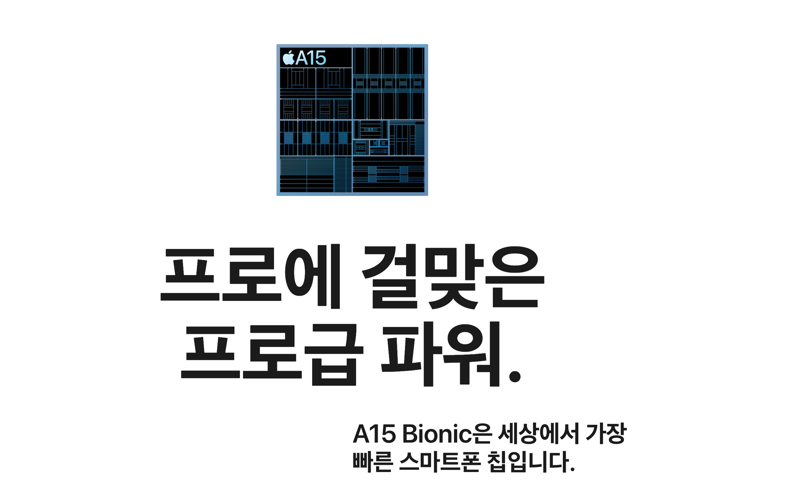
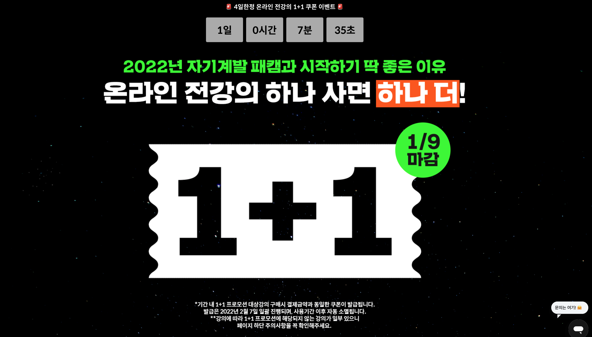

 
### 1. 카테고리 휴리스틱(Category Heuristics)
중요한 정보를 딱 집어서 단순화하면, 사용자의 즉각적인 결정을 도와준다.
e.g., 아래 이미지의 프로급 파워

{: width="100%" height="100%"}

> 우리가 팔려고 하는 제품의 키워드를 뽑아 강조하기.

### 2. 전문가 편향(Autority Bias)
전문가 편향은 실험 사례를 통해 다들 알고 있을 것이다. 의사가 시키는 행동이면 아무리 이상한 행동이라도 환자들이 따라했던 실험의 사례처럼.

이런 것처럼 누가 사용하는 제품이라는 문구로 제품을 강조시킬 수 있다.

### 3. 사회적 증명(Social Proof)
다른 사람들이 어떻게 행동했는지 보고 따라하려는 경향. 후기가 없는 제품은 쉽사리 주문하기 어렵듯..

### 4. 즉각성의 힘(Power of Now)
이건 특히 우리나라에 특화된 공식인데, '지금 바로 출발', '오늘 출발' 등의 문구의 힘을 뜻하는 것이다.

### 5. 희소성(Scarcity Bias)
이런 사례는 특히 강의나 이커머스에서 자주 보이는데, '00개 밖에 남지 않았습니다!' 같은 문구를 뜻한다. 갯수나 시간 등에 제한을 주었을 때, 구매 욕구가 올라간다는 것이다.

{: width="100%" height="100%"}

### 6. 공짜의 힘(Powe of Free)
이 사례는 처음 접해서 신기했는데, 아마존에서 진행한 실험에서 10달러짜리 선물카드를 무료로 받기 vs 20달러짜리 선물 카드를 7불에 사기 했을 때, 사람들은 후자가 더 이득임에도 불구하고 10달러 짜리 무료 카드를 선택했다는 것이다. 사람들은 무엇이 더 이득이냐 보다 결국 공짜를 더 좋아한다는 것이다. 

> 이런 경우를 토대로 보았을 때, pricing 페이지에서 실험해 볼 수 있는 가설이 아주 풍부하다...

참고: [퍼블리](https://publy.co/series/70?fr=chapter-bottom-series-list)