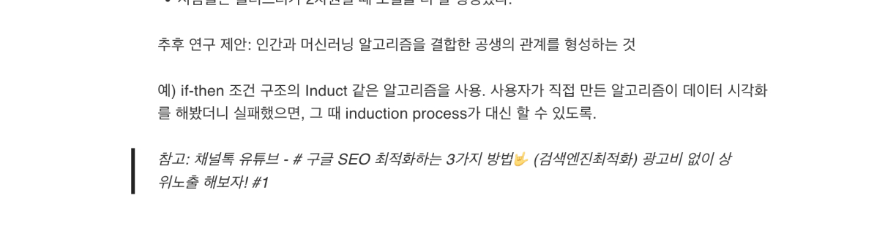
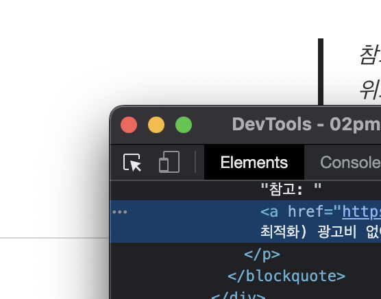
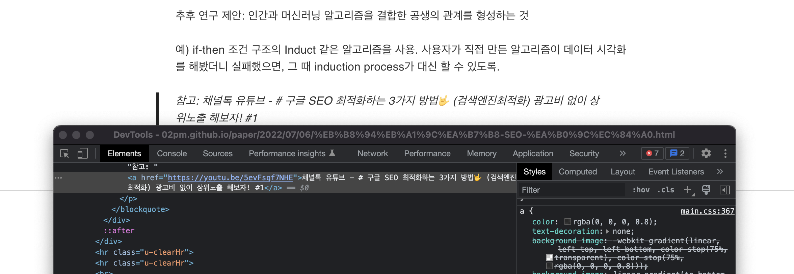
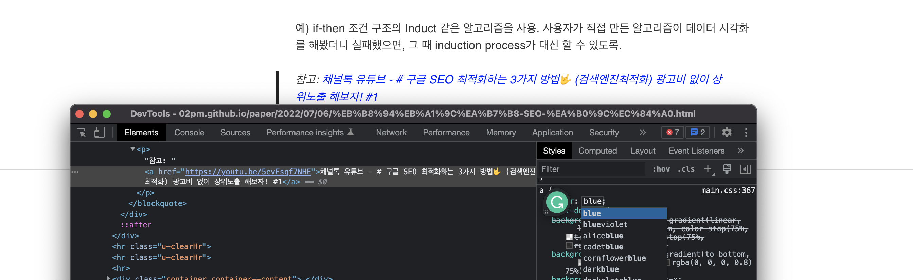
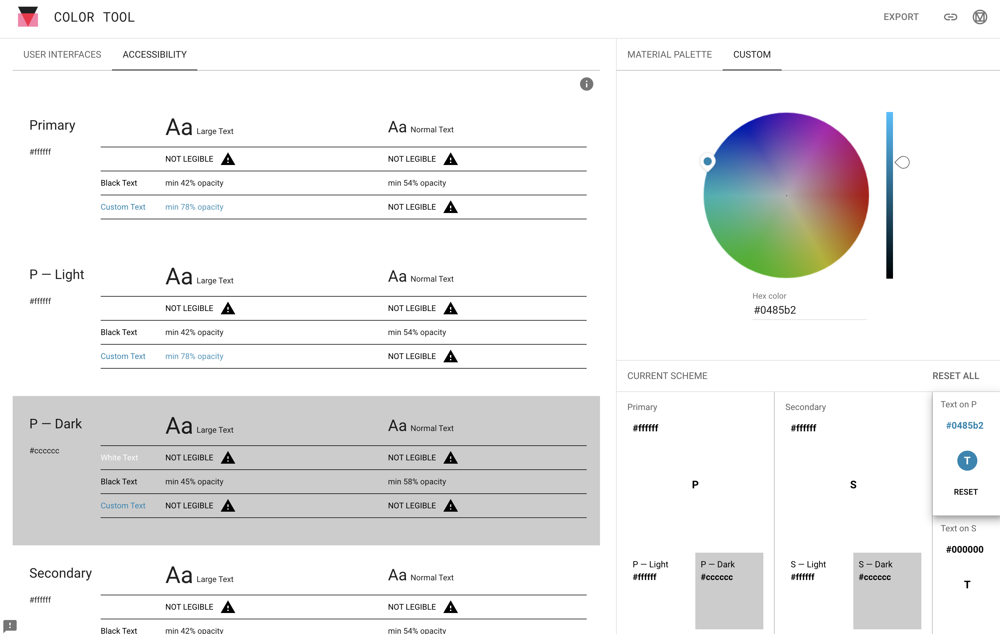
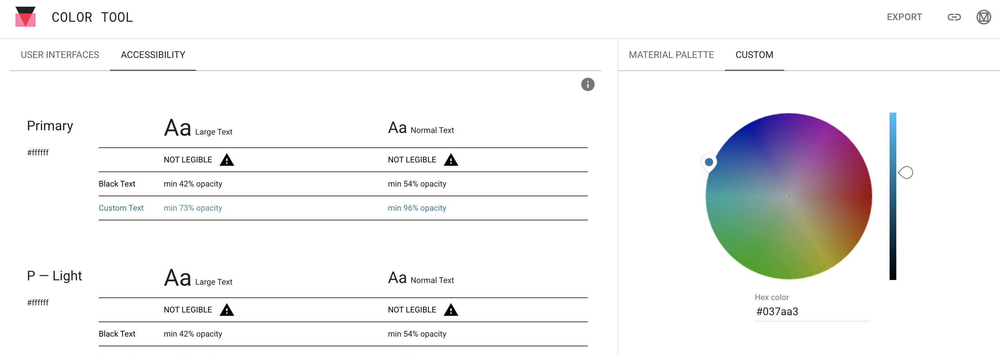
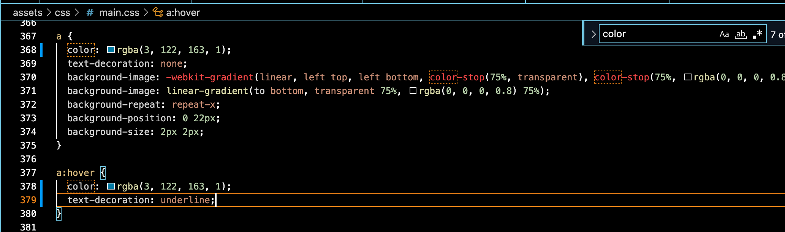

# 내 블로그를 점검하자
여유가 될 때마다 블로그 글을 써왔지만, 사실 대학원 시절 내내 관리가 안되고 있던 나의 블로그가 마음 한 구석에 불편함으로 남아있었다. 멘토링 후에 블로그를 다시 점검해보고자 이것저것 많이 정리를 하고 있다.

### 정리 중인 리스트들
1. Hero 이미지를 글의 내용과 일치하는 것으로 변경
2. 글 내의 이미지를 Markdown 형식으로 변경
\:내가 folk한 깃헙 repository가 css 방식으로 이미지 링크가 관리되었는데, 비개발자인 나의 입장에서는 보기도 불편했고 그 밖에도 블로그 모바일 최적화 테스트를 했더니 그런 형식이 별로라고 말해주었기 때문에 전체 다 변경하였다.
3. 한글로 되어있던 이미지 파일명들 전체 영어로 변경
4. URL의 어포던스 개선
\: 지금은 이게 누르는 링크인가? 싶은 느낌으로 기존 깃헙 repository 에서 만들어져 있었다.
5. 이 외에도 카테고리 정리 같은 기타 작업들···

만만치 않은 작업이다... 기간은 1주일로 잡고 진행해야겠다. 저번주 토요일부터 1,2,3을 완료했고, 이제 4번 5번 작업이 남았다.

사실 정리를 하면서 제일 답답했던 점은 파이썬으로 자동화해서 한번에 바꿀 수 있는 쉬운 방법이 있는데,, 파이썬을 아주 잘 하지는 못하는 나라서 그 과정을 검색해서 만드는 것이 오래 걸릴테니, 손수 하나하나 바꾸는게 은근 시간소모를 했다는 것이다. 뭐 다 일련의 성장하는 과정이니...! 최대한 집중이 안 되는 버려지는 시간에 하려고 애썼다.

이 과정에서 찾은 닐슨 노먼 그룹의 가이드라인을 적용하고자 하였다.

**요약: 텍스트에 색을 입히고 밑줄을 그어두어라! (색이 입혀있다면, 밑줄은 필수가 아니다. 있으면 좋은 느낌.)**

그 외의 포인트는 밑줄을 아무 곳에나 남발하지 말라는 것이다. 링크로 보여 헷갈림을 유발할 수 있으니...!

## 내가 folk한 깃헙 문서에서 URL 디자인 부분 찾기

우선, 아래의 이미지는 기존 나의 블로그 URL이다. 여기서 퀴즈! 어떤게 클릭하는 URL 부분일까요?! :)
{: width="100%" height="100%"}

두구두구,,,, 정답은,,,,! '참고:' 는 클릭이 안 되고 그 오른쪽의 채널톡 유튜브부터 다 클릭 가능한 링크다.

URL에 색을 넣기 위해 어떤 문서의 어떤 부분을 수정해야 할까?!를 확인하기 위해 아래와 같은 단계를 거쳤다.

1. cmd(control) + alt + i를 클릭해서 개발자 도구 열기
2. 좌측 상단의 화살표를 이용해서 내가 궁금한 부분 클릭하기
{: width="100%" height="100%"}
3. 클릭했더니 a 태그로 관리되고 있었고, main.css 파일 안에서 수정하면 되겠구나! 싶었다. 
{: width="100%" height="100%"}
4. 테스트해보기 위해 Styles 패널에서 색을 blue로 변경해보았다.
{: width="100%" height="100%"}
5. 결과는 성공적이었다. 이제 Visual Studio Code에서 main.css 파일을 열어 a 태그의 색을 바꾸고 배포만하면 끝!

## 근데 어떤 색으로 할건데?
흠.. 내 마음대로 색을 평가하고 선택할 수도 있겠지만(너무 밝아서 배경과 대비가 없지 않도록, 나의 멘탈모델 상 파란색 계열이 URL인 느낌), [Google material design](https://material.io/design/color/text-legibility.html#legibility-standards)에서는 어떻게 하도록 추천하는지 확인하기 위해 글을 찾아보았다. 

해당 내용에서 Google material design에서는 이를 Text legibility라는 주제로 다루고 있었다. 특히 색이 들어가는 텍스트는 배경에 대비하는지를 확인할 수 있도록 [Material color tool](https://material.io/resources/color/#!/?view.left=0&view.right=0)을 제공하고 있었다.

그래서 Primary를 내 블로그의 배경색인 흰색(#ffffff)으로 설정하고, Text on P의 색을 내가 생각했던 어두운 바다색(#0D93BD)로 설정했더니, 아래의 이미지에서 제일 윗 칸처럼 Custom Text의 Normal Text가 NOT LEGIBLE! 이라고 떴다.

{: width="100%" height="100%"}

그래서 오른쪽의 컬러파레트에서 명도를 조금 낮춰봤더니 아래의 이미지와 같이 NOT LEGIBLE이 없어졌다. 하지만 opacity를 최소 96%로 써야한다고 제안해주었다. 이런 좋은 도구가 있었다니.

{: width="100%" height="100%"}

그래서 구글 컬러 툴에 따라 나의 URL 링크 색은 hex \#037aa3(rgba(3, 122, 163, 1)) 로 결정되었다...! 밑줄은 너무 지저분한 느낌이 들어 넣지 않기로 했다. 대신 호버(마우스를 올린 상황)를 할 경우 밑줄이 들어갈 수 있도록 수정했다. 

{: width="100%" height="100%"}

결과는...! 

{: width="100%" height="100%"}

성공적! :) 꽤나 재밌고 유의미한 배움의 과정이었다.
하지만 업로드하고 보니 흰색의 이미지는 외곽 아웃라인이 필요할 것 같다. 다음 수정 때는 이것도 추가하는 것으로..

>참고: 
>[Nielsen Norman Group-Guidelines for Visualizing Links](https://youtu.be/5evFsqf7NHE) 
>[Google material design](https://material.io/design/color/text-legibility.html#legibility-standards)