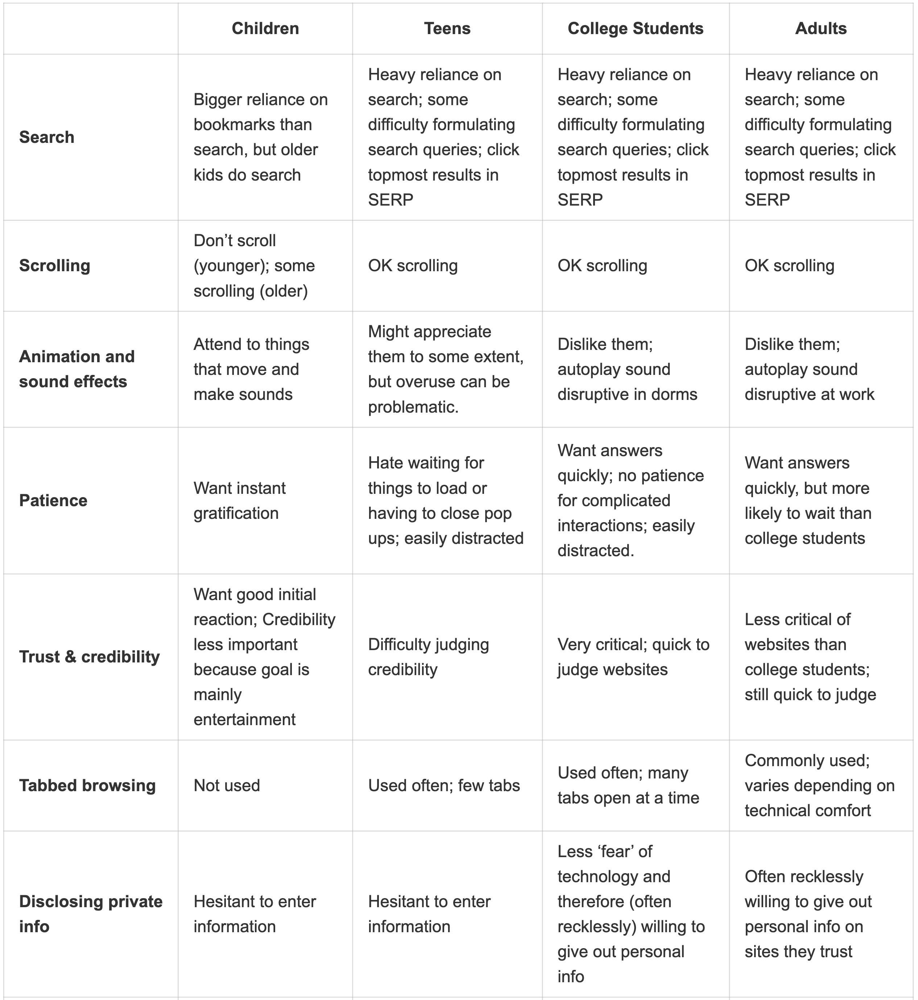
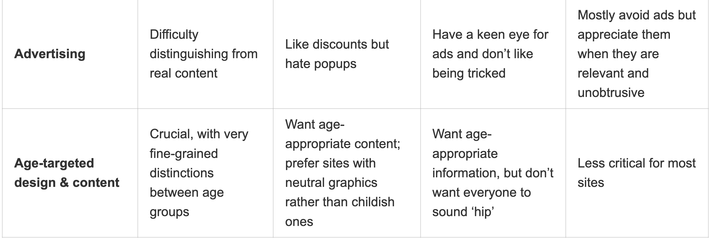

# 10대를 위한 프로그램 만들기

우리 서비스가 근래에 중고등학생을 위한 프로그램을 기획하고 있는데, 이를 활용하여 디자인에 반영할 수 있을까 하여 읽은 내용을 정리하고 공유하고자 한다.

나도 점점 나이가 든 만큼 어린 친구들의 관점에서 제품을 바라보는 게 힘들어졌다. 하지만, 가끔 어린이들도 하는 프로그램을 사용해 보면 뭔가 우리가 사용하는 제품과는 다른 과정들이 많았다. 예를 들어, 공공교육 사이트에서 애니메이션에 기반해서 교육을 시킨다든가 하는 과정... 하지만, 과연 이런 것들이 진정으로 중고등학생이 바라는 것일까?라는 생각이 들었다. 이에 관하여 다른 서비스나 연구에서는 어떻게 다루고 있는지 찾아보았다.

닐슨  노먼 그룹은 10대에 맞춘 UX 가이드라인을 제공하였다.

## 우리들의 10대들에 대한 고정관념

본 연구는 기존에 가지고 있던 고정관념을 벗어난 결과를 보여주었다고 한다.

고정관념의 예로는:
- 모바일 기기의 숙련도가 모든 기기에 영향을 미친다(Mobile proficiency transfers across all devices).
- 10대들은 온라인에서 그래픽과 멀티미디어를 통해 재미있기만을 바란다(Teens just want to be entertained online with graphics and multimedia).
- 10대들은 기술을 잘 다룬다(Teens are tech-savvy).
- 10대들은 모든 것들이 사교적이길 원한다(Teens want everything to be social)

## 10대를 위한 사용성 가이드라인: 우리 서비스에 그들이 남아있을 수 있도록 지켜야 하는 130가지
본 연구는 13살에서 17살 사이의 100명의 참여자를 기반으로 총 3단계에 걸쳐 진행되었다. 연구에 사용된 3가지 방법론은 사용성 테스트(Usabiliyt testing), 필드 스터디(Field studies), 인터뷰 & 포커스 그룹(Interviews & Focus groups)이다. 연구방법 관련 내용은 [여기](https://www.nngroup.com/articles/usability-of-websites-for-teenagers/)에서 읽을 수 있다. 

학생들은 자신이 좋아하는 주제에 관한 서비스를 테스트 할 수 있도록 진행되었다. 주제 목록은 학교 자원, 여행/예술/엔터테인먼트, 건강, 정보성, 뉴스, 게임, 이커머스 등등.. 으로 구성되어 있다.

## 10대들의 웹사이트 사용 이유
일반적으로는 특정한 목표가 있어서(그 목표가 단지 10분짜리 일지라도) 웹에 접근한다. 어른이든 어린이든 웹사이트가 쉽고 그들의 목표를 달성할 수 있도록 해주길 원한다. 어른들처럼 어린이들도 목적 없이 웹을 돌아다니지 않는다. 

그 목적들의 예시는 다음과 같다:
1. 학교 숙제
2. 취미 혹은 다른 특별한 흥미 (새로운 스킬 습득 혹은 재미있는 활동 찾기)
3. 엔터테인먼트(노래, 비디오, 게임 포함)
4. 뉴스(스포츠, 최근 사건, 예능)
5. 새로운 주제 배우기
6. 친구와 이야기하기
7. 쇼핑

본 연구에서는 시간의 흐름에 따라 아이들이 웹 서핑을 더 잘하게 되는 것을 알았다 (15년 이상 진행된 연구이기 때문에). 또한 기기를 사용하는 비중이 시간이 흐름에 따라 점점 높아졌다. 얼마나 오래 사용하느냐는 기술에 얼마나 영향을 미치느냐와 연관되어 있다. 물론 그와 함께 웹사이트 자체의 개선도 있었다 (하지만, 그와 관련 없이 여전히 나쁜 사용자 습관은 관찰되었다).

10대라고 천하무적은 아니다. 그들이 온라인 환경에 자신있을 수 있어도, 실수도 하고 포기도 빠르다. 

### 10대들이 어른보다 수행을 더 못하는 이유 3가지
1. 읽기 능력 부족
2. 덜 정교한 리서치 전략 
3. 아주 낮은 참을성 정도

## 그래서 10대들을 위한 사용성 개선, 어떻게 하는건데?

### 콘텐츠와 레이아웃의 중요성

당신의 사이트 사용성이 10대에게 편하게 만들기 위해선 3가지 요소를 고려해야 한다. 본 결과는 15년에 걸쳐 확인된 것이기 때문에, 앞으로도 이런 경향이 보여질 가능성이 높다.

 
우선 첫 번째로, 모든 종류의 웹사이트들 중에서 커머스 웹사이트에서의 성공률이 높았다. 커머스 웹사이트는 디자인 기준이 있고 읽을거리가 적다. 이에 비해, 콘텐츠가 많고 탐색 체계가 좋지 않은 정부, 비영리 단체, 학교 사이트 같은 곳에서는 사용성이 저하됐고 문제를 직면하였다.

= **읽을 것을 가능한 적게 구성하라.** 

두 번째로, 성격이 급한 사용자를 위해 글을 작성하라. 10대들은 웹상에서 많이 읽는 것을 싫어한다(이미 학교에서 많이 한다). 훑기 쉬운 웹사이트 혹은 시각적으로 잘 묘사해놓은 웹사이트가 더 선호된다. 적절한 [웹의 글 형식 스킬](https://www.nngroup.com/topic/writing-web/)이 10대에겐 아주 중요하다. 콘텐츠 [청크](https://www.nngroup.com/videos/chunking/)를 작게 나누어 보여주고 여백을 많이 제공하여라. 청크를 작게 제공할 수록 학생들은 정보를 쉽게 습득하게 해주고 그들이 다시 돌아오기 원활하게 된다.

= **구성  단위를 작게 작게 제공하라.** 

세 번째로, 단어를 적절하게 사용하라. 문장과 단락을 짧게 구성하라. 키 포인트를 형식화하거나 bullet points를 사용하여 단계에 따라 진행하여라. 특히! 폰트 크기를 크게 구성해라. 이는 어른들에게도 독이 될 뿐 아니라, 빨리 읽는 아이들에게도 집중력을 분산시킨다.

= **글자 크기를 적절하게 크게 제공하라.**

### 흥미로운 콘텐츠를 전문적으로 그리고 명료하게 전달

어린 청중을 위해 디자인한다고 인터랙티브한 기능이 남용되는 것을 주의하라. 멀티미디어가 유용하지 않을 경우, 10대들을  화나게 할 수 있다.

아래의 예시는 10대가 뭔가를 할 수 있게 해준 좋게 작동한 예시이다:

1. 온라인 퀴즈들
2. 피드백을 제공하거나 질문을 할 수 있는 설문지
3. 온라인 투표
4. 게임
5. 사진이나 스토리를 공유하는 기능
6. 콘텐츠를 만들거나 수정하는 기능

물론 이런 인터랙션은 사이트의 종류에 따라 다르게 나타나야 한다. 

### 스피드가 생명

무슨 일이 있어도, 당신의 웹사이트가 빨리 로딩되도록 만들어라. 느린 웹사이트는 모두를 화나게 하지만, 특히 즉각적인 만족을 바라는 어린 청중에게는 최악이다. 멋진 위젯이나 4K 비디오 같은 것은 심사숙고하여 넣어라. 특히 오래된 기기나 느린 인터넷을 사용할 수도 있기 때문에 이는 더욱이 중요하다.

### 10대를 얕보지 말아라

그들은 자기 친구들이 만든 콘텐츠에 관심이 있다. 다른 십대의 실제 이야기, 이미지 및 예시로 콘텐츠를 보완하라. 하지만, 이 때 다른 '"어린이"'들은 ~했어요. 하는 말투는 금물이다. 그들은 유치한 콘텐츠를 원하지 않는다. 이는 무거운 애니메이션이나 화려한 색상 구성표를 줄여야 하는 또 다른 이유다. 어린이 및 청소년을 위한 별도의 세션을 각각 "Kids" 및 "Teens"로 표시하는 것이 좋다.

### 소셜 측면은 그들이 다루도록 해라

공유를 원활하게 할 수 있도록 하지만, 강요하지 말아라. 그들은 항상 그런 기능을 원하는 것이 아니다. 그들은 스스로 무엇을 공유할지 그리고 어떻게 공유할지 정하고 싶어한다. 

**02pm:** 예시로 Zenly를 들 수 있을 듯 싶다. Z세대를 위한 위치공유 기반 채팅 어플이지만, 누구한테 내 위치를 공유할지, 언제 공유할지 등을 선택할 수 있는 자유를 준다.

공유 옵션을 제공할 때, 웹주소 복사하기 기능을 넣어라. 그들은 핸드폰으로 하고 있었을 가능성이 높으므로 친구에게 바로 전달하고 싶을 것이다. 본 연구의 참가자들은 스냅챗 같은 소셜미디어 앱을 선호하였다. 따라서 Copy Link 옵션은 모든 플랫폼에 있는 친구에게 직접적으로 전달할 수 있도록 하여라.

### 모바일 뷰를 위해 디자인하여라
근래의 연구에 참여한 모든 10대들이 핸드폰은 있었지만, 노트북이나 컴퓨터는 모두가 가지고 있지는 않았다.

복잡한 마우스 기반 행동은 모바일에 잘 적용되지 않는다. 핸드폰에 맞춘 웹사이트를 잘 디자인해야 사용성을 해치지 않는다. 10대들은 종종 터치가 가능한 기기를 만드는데, 이런 경우 정확도를 요구하는 인터랙션(예, 드롭다운 메뉴, 드래그 앤 드롭, 작은 버튼)이 어렵다. rollover effects나 작은 클릭 영역의 디자인 요소 또한 문제가 많다. 작거나 밀도 높은 글자들도 읽는 것을 어렵게 만든다.

한 마디로 정리하자면, 미디어들은 10대들을 컴퓨터 고수인 듯 묘사하지만, 실제로 그들은 자신의 발달하는 인지 능력을 과신하여 너무 빨리 포기하거나 웹사이트의 디자인을 욕한다. 그들은 스스로를 욕하지 않는다, 당신을 욕한다.

## 연령별 차이점
{: width="100%" height="100%"}
{: width="100%" height="100%"}

본 연구의 나이 분류는 Children: 3~12세, Teens: 13~17세, College Students: 18~25세, Adults: 그 위의 사람들로 구분한다.

위의 이미지에서 10대의 내용만 정리해보자면:

1. Search: 검색에 크게 의존한다. 복잡한 검색 쿼리도 사용한다. SERP 결과에서 가장 위의 결과들을 클릭한다. \*SERP: Search Engine Results Page
2. Scrolling: 할 줄 안다.
3. Animation and sound effects: 어느 정도는 좋아하지만, 너무 많이 사용하면 문제가 된다.
4. Patience: **로딩, 팝업 닫는 것을 너무 싫어한다.** 집중력 분산이 잘 된다.
5. Trust & Credibility: 신뢰성 판단에 어려움이 있었다.
6. Tabbed browsing: (일부 탭) 자주 사용 되었다.
7. Disclosing private info: 정보를 입력하는 것을 망설였다.
8. Advertising: 할인은 좋아했지만 팝업은 싫어했다.
9. Age-targeted design & content: **연령 맞춤 콘텐츠를 원했다; neutral graphics 의 사이트를 선호했다(아이 같은 것 말고).**

10대는 아이들과 어른과 다른 자신들의 니즈와 행동을 위한 것에서 사용성을 가장 좋게 느꼈다. 

참고로 10대들을 위한 UX 디자인 가이드라인의 완료판은 닐슨 노먼 그룹이 [이곳](https://www.nngroup.com/reports/teenagers-on-the-web/)에서 책으로 판매하고 있다.

>참고: 
>[Nielsen Norman Group-Teenager’s UX: Designing for Teens](https://www.nngroup.com/articles/usability-of-websites-for-teenagers/) 