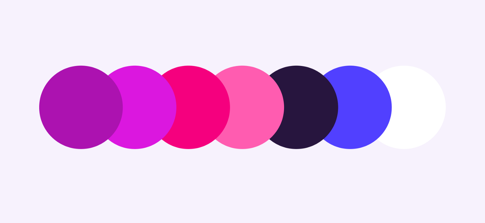

우연치 않게, 아티클들을 읽던 중 컬러시스템에 대한 새로운 접근을 발견하게 되어 정리하여 공유하고자 한다.  

# 컬러 시스템의 구조 알기

우선 이 전반적인 과정은 색의 Hex 값이 아닌, HSL에 기반하여 진행된다. 

## HEX값이란?
설명을 덧붙이자면 Hex는 16진법 기반으로 6글자로 색을 표현하는 방법이다. HEX의 구조는 \#RRGGBB 로 구성되어 있다. 여기서 RR은 빨간색, GG는 초록색, BB는 파란색을 나타낸다. 각 두 글자는 00에서 FF까지의 256가지 범주로 표현이 된다. 즉, 총 256^3 개의 색 종류가 구분될 수 있다. 

하지만 재미있는 점은 여기에 투명도의 개념이 더해지면 또 다른 색 조합이 구성될 수 있다.  즉 \#AARRGGBB 로 구성이 되는데, 이렇게 되면 256^3 개의 색 종류가 구분되고, 총 4,294,976,296 개의 색을 표현할 수 있게 된다.  

## HSL값이란?
{: width="100%" height="100%"}
HSL은 RGB 색 모델의 대안으로 나오게 된 Hue, Saturation, Lightness로 구성된 색표현 공간이다. HSL은 인간이 색을 만드는 속성을 인식하는 시각을 반영할 수 있도록 고안된 것이다. 예를 들어 **lightness**는 흰색 혹은 검정색을 얼마나 섞느냐를 표현한다고 볼 수 있다.채도가 가장 높은 색은 원통의 바깥면 쪽에 둘러 위치하게 된다.

[HSL 계산기](https://www.w3schools.com/colors/colors_hsl.asp)에서 HSL을 계산해 볼 수 있다.

# 컬러 시스템 설계하기
1. **HSL로 색 모델 변경**
-> 기본적으로 Hex 값으로 되어있으므로, HSL로 변경한다.
{: width="100%" height="100%"}  
2. **메인이 되는 색 선택**
-> 본 글에서는 분홍색 계열인 \#DB17DF를 선택하였다.
{: width="100%" height="100%"}  
3. **HSL 값에서 L 값을 기준으로 다양화**
-> L 값을 10씩 더하고 빼서 1에서 100 사이의 숫자들을 구성한다. (꼭 10이 아니어도 됨) 
{: width="100%" height="100%"}  
4. **기본 색을 10개 복사한다.**
{: width="100%" height="100%"}  
5. **3단계에서 구성한 10개의 숫자로 L 값 변경**
{: width="100%" height="100%"}  
6. **파트너 색 찾기**
-> 이제, 파트너 색을 찾을 차례이다. 이 경우엔 기존의 메인 색의 H 값에 30, 120, 150, 180, 210, 240, 혹은 300을 더해서 찾는다. 예를 들어, 이 글에서는 30을 더했다. 
{: width="100%" height="100%"} 
그 후, 4단계와 5단계를 다시 반복해서 아래와 같이 10가지 색 구성을 조합해낸다.
{: width="100%" height="100%"}  
7. **메인 색과 파트너 색의 구성 20가지에서 Primary와 Secondary 선택하기**
-> 이 때부터의 선택은 자유이다. 20가지의 색 중 4가지를 골라 디자인에 적절히 이용하면 된다. 
{: width="100%" height="100%"}  
8. **사이드 킥 색을 선택해라.**
-> 이 또한 자유롭게 선택할 수 있다. 배경과 액샌트와 글자 색을 선택한다. 많은 경우에 배경은 흰색으로 하고 텍스트는 어두운 색으로 하나, 본 예시에서는 반대로 선택하여 디자인을 구성하였다.
{: width="100%" height="100%"}  
아래는 이 전체의 과정을 기반으로 선택한 색 조합과 그를 기반으로 만든 가상의 앱 디자인이다.
{: width="100%" height="100%"}
{: width="100%" height="100%"}  

**02pm:** 본 글에서 값을 더한 다음 360이 넘을 경우에 대한 이야기를 하지 않았는데, 나의 경우엔 값을 더한 후 360이 넘으면 다시 360을 빼줬다. 

아래는 본 가이드에 따라 02pm이 구성한 색들이다.
첫 메인 색은 Hex 값 5C42FF를 기준으로 10가지를 구성하였고, H 값에 30을 더해 파트너 색을 정하였다. 이를 다시 10가지 Lightness로 나눈 다음 각각의 구성에서 2가지씩 메인 색과 보조 색을 선택하였다.
{: width="100%" height="100%"} 

마지막은 사이드킥 3가지 색을 합쳐 구성하였다.
{: width="100%" height="100%"}  

음. 나름 볼만 한 것 같다. 디자인에 적용하였을 때 어떨지는 해봐야 알 것 같다. 왜냐하면 개인적으로 색은 컴포넌트의 크기나 배치에 의해서 많은 영향을 받는다고 생각하기 때문이다.

>참고: 
>[Medium-Create a Color Scheme Around Any Color in 8 Easy Steps](https://uxplanet.org/create-a-color-scheme-around-any-color-in-8-easy-steps-a0229e1985c) 
>[shutterstock-What are HEX colors and how they work in design](https://www.shutterstock.com/blog/how-hex-colors-work) 
>
