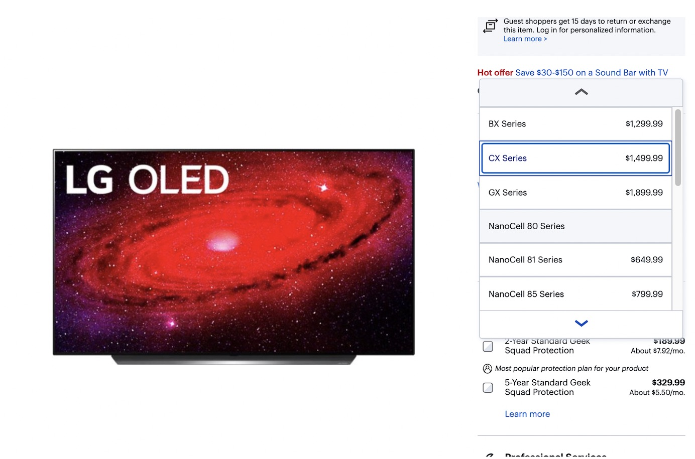
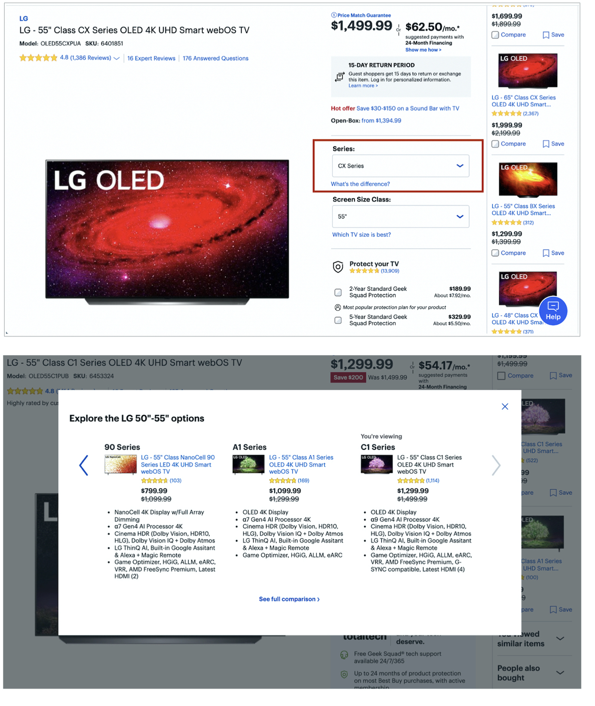
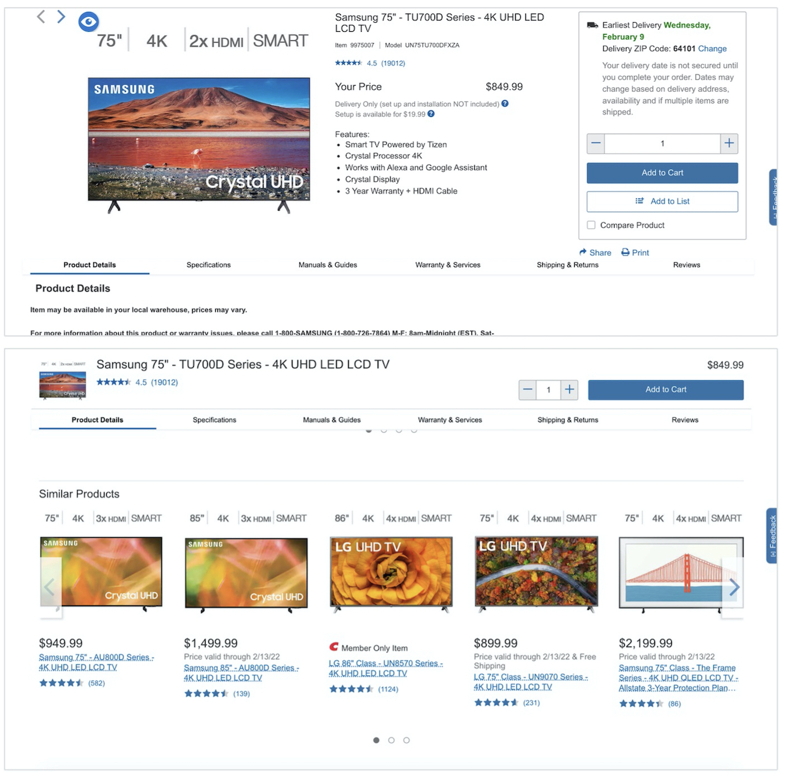

요약: 다양한 제품들은 다양한 목록들을 가진다(제품 옵션 값은 단일한 목록 아래에 만들어여져야 한다.)

Norman 그룹은 최근 연구에서 사용자들이 여러 옵션들이 제공되는 제품을 사기 힘들어 한다는 것을 알게되었다. (예: 다양한 사이즈, 색, 프린트, 재질)

이런 문제들은 이커머스 사이트에서 다양한 제품들에 맞춰 제품의 옵션을 맞지 않게 제공했을 때 혹은 그 반대로 다양한 제품에 맞춰 다양하게 제공했을 때 벌어졌다. 

이 둘의 차이는 무엇일까?

A 와 B 라는 다른 상품 두개를 이커머스 사이트에서 들여다보고 있다고 가정해보자. 만약 이 둘의 차이가 **하나의 옵션 값**만 차이가 있다면(예: 색, 사이즈, 패턴, 재질), 이 두 제품은 **같은 상품의 변형**이라고 보아도 괜찮다. 하지만 만약 이 두 제품의 상세정보가 다르다면, 이 두 제품은 **다른 제품**이라고 보아야 한다.

## Norman 그룹이 제공하는 가이드라인

Norman Group에서 이커머스 유저리서치에 기반하여 제공하는 가이드라인은 다음과 같다:

다른 제품은 다른 옵션을 가져야 한다. 이 때, 제품의 옵션은 단일한 목록 아래에 제공되어야 한다. (옵션들은 제품 상세 페이지에서 선택 값으로 제공되어야 한다.)

  

-   사람들은 변형 (variants)로 제공되는 아이템들을 비교하기 어렵다 (정말 다른 제품이 아니고서).
-   만약 다른 제품의 페이지에서 variation이 보여질 경우, 제품 옵션의 확장이 생깅 수 있다. 이런 과정은 사용자가 제품을 찾고 선택하는 과정을 지루하게 만들 수 있고, 그들이 원하는 옵션의 조합을 발경할 수 없게 될 수 있다.

이제 이 두가지 문제 모두를 살펴보고 그들이 만드는 장애물을 살펴보자.

1.  본질적으로 다른 옵션 선택을 위한 드롭다운
   예) Best Buy의 텔레비전 상품 상세 페이지는 옵션을 위해 드롭다운을 제공한다. 

?? For context, each TV series corresponds to an entirely different model of television, with different technology and features available.
{: width="100%" height="100%"}

사용자는 여기서 "시리즈"를 헷갈려했다. 시리즈를 바구면 페이지 정보와 제품명까지 바뀌게 된다. 하지만 featured image가 안 바껴서 시람들이 눈치를 채지 못했다.

제품과 variation을 구분하는 것은 중요하다. 잘못 구분하면 아래와 같은 문제가 발생한다.

  

2. 옵션 선택 드롭다운만 있으면, 사용자들은 옵션이 복잡할 때 정보에 기반한 선택을 하기 어렵다. : 예를 들어 시리즈를 바꾸면 아래의 정보들이 다 바껴야하므로 (tv 시리즈를 변경하는 것은 그들 사이의 차이가 큼, 거의 다른 제품이라고 봐도 무방, 사람들은 시리즈 옵션 안에 있는 것들이 뭔지도 모름 -> 특히 의미없는 이름이 더 그렇게 만든다. )

{: width="100%" height="100%"}

시리즈 옵션 아래에 차이가 뭔가요? 버튼이 있었으나 사용자는 이를 인지하지 못했다

사람들은 "시리즈 사이의 차이를 알기 위해 제3의 사이트를 갔어야 했어요. 예를 들어, BX와 CX의 차이는 뭔지 알기 위해.. 가격 차이가 있다는건 알겠으나 그래서 그 기능이 그 가격에 합당한건지...혹은 어떤게 나랑 관련있는 기능을 가격선 안에서 제공하는지..."

  
사실 best buy도 이런 비교를 가능하게 해주나, 사람들은 알아차리지 못했다.
  
대부분의 고객은 이미 검색을 해보고, 리스트에 자신의 쇼핑 기준(사이즈나 예산)에 맞도록 필터를 걸었다.
-> 제품 상세 페이지를 이유를 가지고 둘러봄. 하지만 추가적 맥락이 없이는 대안을 제공하기 어렵다: 특히 지금 보고있는게 자신의 조건에 맞지 않음에도...

  
어쩌면 사용자가 다른 모델을 쉽게 발견하도록 "시리즈" 옵션이 들어갔을 수도 있다. 하지만 이는 다른 방법으로도 가능했을 것이다. ex. related products, 제품 목록

제품의 발견가능성이 사용자를 제품 상세페이지에서 복잡한 옵션을 선택하게하는 사용성 역경에 비해 더 중요하진 않다.

{: width="100%" height="100%"}

코스트코 예시: 하나의 제품 페이지가 하나의 시리즈를 노출. 다른 시리즈는 아래에 노출. 이런 이유로 옵션 선택은 제품의 variation을 위해서만 사용되어야 한다. 하지만, 반대의 문제도 존재한다. variation 별로 제품이 나뉘었을 때.

## 제품 variation을 위한 하나의 목록

> 참고 
> [Nielsen Norman Group-Design Guidelines for Selling Products with Multiple Variants](https://www.nngroup.com/articles/products-with-multiple-variants/)