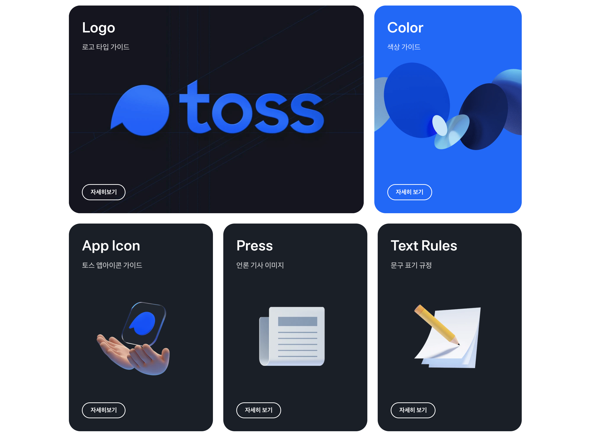
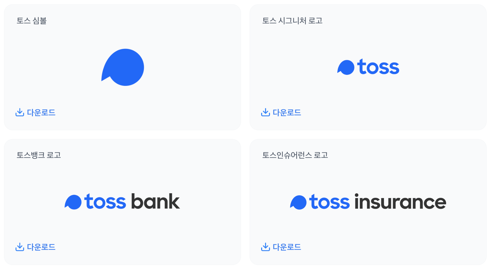
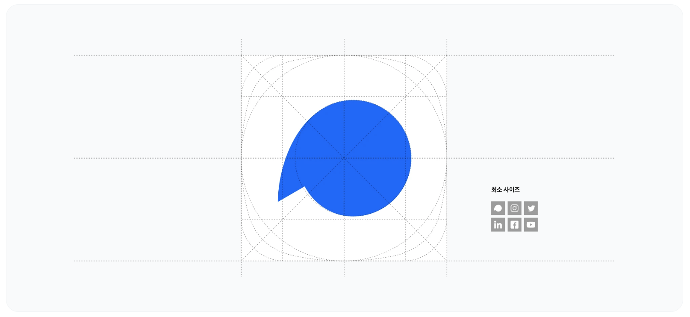
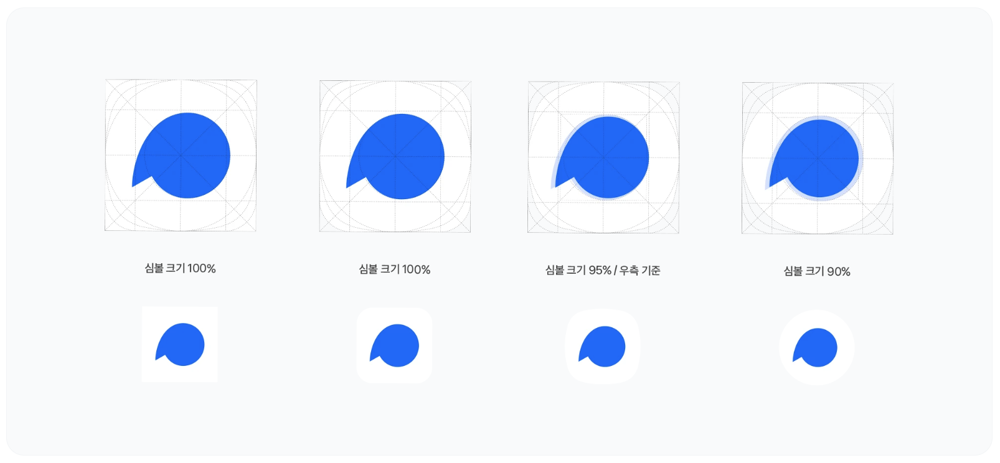
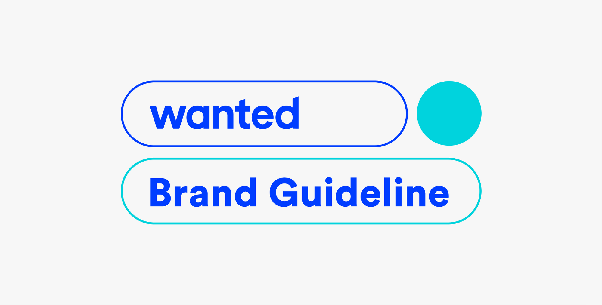
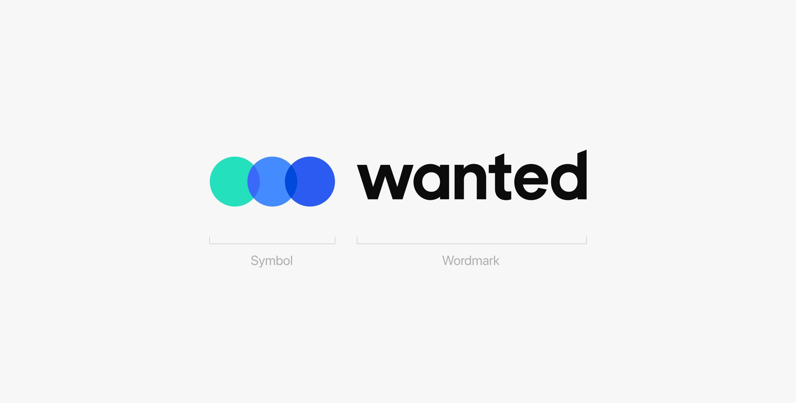

곧 이직을 하기 때문에, 인수인계를 잘하기 위해 그 동안 돌보지 못했던 디자인 문서들을 잘 돌봐주고 있다. 그 중에서 가장 정리가 필요했던 것은 브랜드 리소스들.

회사에 들어오고 나서 로고와 브랜드 리소스, 디자인 가이드라인을 다 새로 구축했는데 이게 Sketch 파일, 일러스트레이터 파일 등에 흩어져서 한 문서로 관리가 되고 있지 못했다.

정리하는 김에 [토스](https://brand.toss.im/)와 [원티드](https://wbc.oopy.io/)의 브랜딩 페이지를 참고하여 재사용이 원활하게 될 수 있도록 구조를 짜야겠다.

## 토스의 브랜드 리소스 관리
{: width="100%" height="100%"}

토스는 브랜드 리소스의 카테고리를 크게 로고 타입 가이드, 색상 가이드, 앱 아이콘 가이드, 언론 기사 이미지, 문구 표기 규정로 나누어 관리한다.

우리 회사의 브랜딩에서는 이 중에서 우리 회사에서 가장 우선적으로 다뤄져야 할, 로고 타입 가이드, 앱 아이콘, 언론 기사 이미지를 우선적으로 확인하고 적용하려고 한다.

### Logo Type
로고 타입 가이드를 상세히 살펴보면, 크게는 토스 심볼, 토스 시그니처 로고, 토스 브랜드별 로고로 나뉘어 제공된다.
{: width="100%" height="100%"}

그 아래로는 시그니처로고의 사용 가이드라인, 로고 형태 디자인 구조, 로고의 여백에 대한 가이드라인, 로고 변형 제한에 대한 내용들을 담고 있다. 그 외에는 파트너 사의 다양한 로고 형태에 따라 어떻게 조합할지에 대한 가이드라인이 있다.

### App Icon
토스의 심볼은 쉼표의 형태로 생겨서 과연 중앙에 위치하게 했을지, 시각보정을 적용했을지 궁금했는데, 적당히 큰 사이즈에서는 심볼을 중앙에 위치하게 하고, 크기가 작거나 Radius 값이 클 수록 중앙보다는 심볼의 오른쪽 면을 기준으로 로고의 위치를 잡았다.

{: width="100%" height="100%"}
{: width="100%" height="100%"}

### Press
우리 회사도 기사에 사용하는 이미지들이 있는데, 토스처럼 아예 리소스로 획일화하여 관리하면 재사용이 원활할 것 같다.

[토스 Press](https://brand.toss.im/press)는 기사에 들어가는 브랜드 로고의 이미지, 리더 이미지, 사내 이미지 등을 리소스로 관리하고 있다.

## 원티드의 브랜드 리소스 관리
{: width="100%" height="100%"}

원티드는 브랜드 리소스들을 로고, 회사 프로필, 자사 브랜드, 커뮤니케이션 가이드라인으로 분류하여 관리하고 있다. 로고는 아래처럼 심볼과 워터마크가 결합된 형태로 제공되고 있다.
{: width="100%" height="100%"}

> 참고 
> [Nielsen Norman Group-Design Guidelines for Selling Products with Multiple Variants](https://www.nngroup.com/articles/products-with-multiple-variants/)