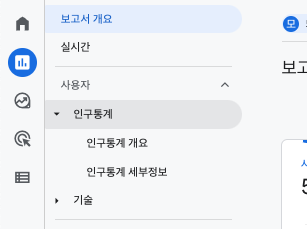
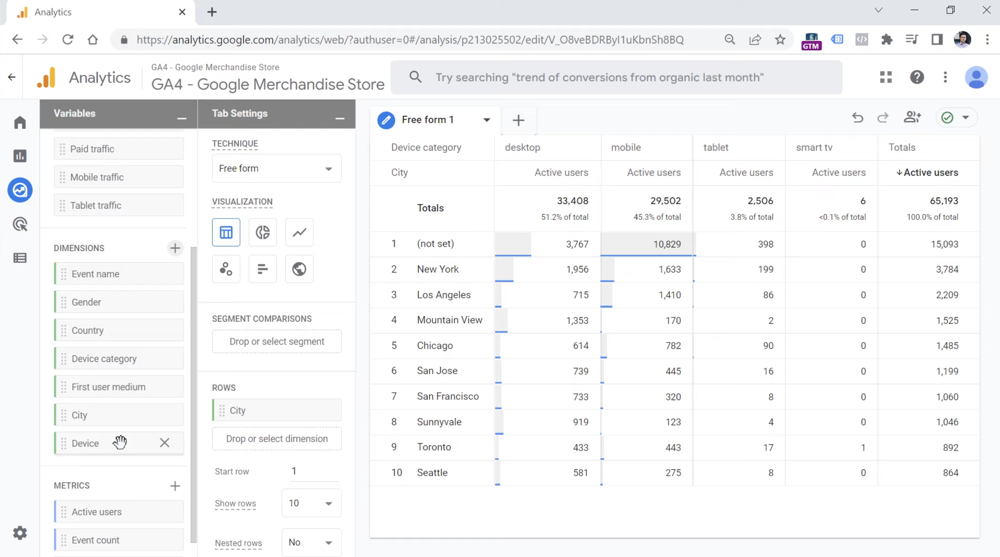

갑자기 생존형 Google analytics 4를 다시 시작하게 되었다. 새로 들어간 회사에 데이터 관련한 분도 안 계시고 리서처도 나 뿐이니.. 그래도 뭐 이렇게 생존형으로 해야하니 더 열심히 하게 될 것 같다고 스스로 세뇌하며 다시 공부하고자 한다.  
GA4의 보고서 기능은 컬렉션 - 주제 - 보고서의 구조로 되어있다. 예를 들어, 아래의 이미지에서 사용자가 '컬렉션'이고, 인구통계가 '주제', 인구통계 개요와 인구통계 세부정보가 '보고서'이다.

{: width="100%" height="100%"}

이런 요소들은 좌측 하단에 있는 '라이브러리' 기능을 활용하여, 사용자가 보고싶은 정보들로 컬렉션을 만들고 사용자가 보고 싶은 주제에 맞춰 데이터를 살표볼 수 있다.

## Exploration
탐색

{: width="100%" height="100%"}

> 참고 
> [데이터리안 블로그-GA4 보고서의 기초 (1) 보고서 구조와 종류](https://www.datarian.io/blog/ga4-overview-reports/)

