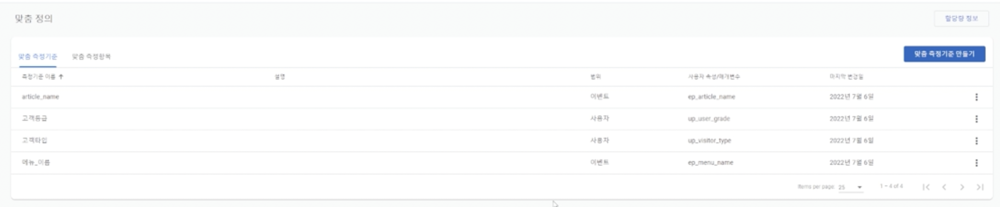
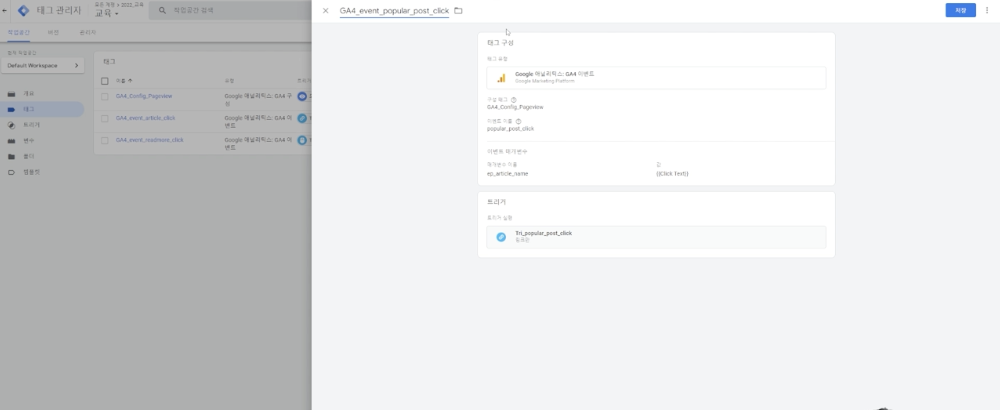
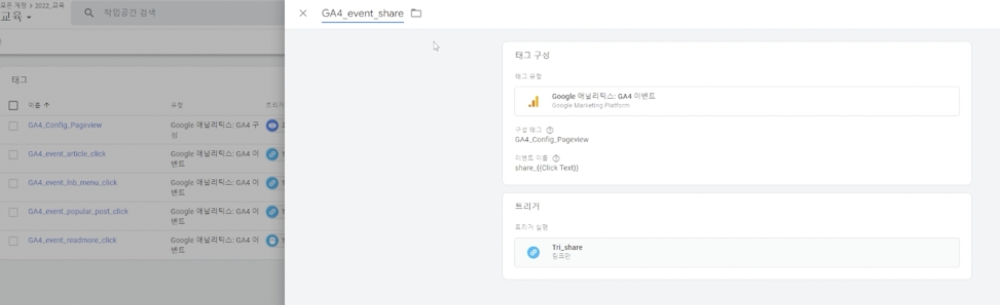

# {{page.title}}
Last modified: {{page.last_modified_date}}

## 사용자가 링크를 클릭했을 때 어떤 것을 클릭했는지 텍스트 읽어오기

{: width="100%" height="100%"}
{: width="100%" height="100%"}

- 이벤트 매개변수를 통해 클릭한 텍스트를 GA4로 내보낼 수 있다.
- 위의 파라미터에서 ep는 이벤트 파라미터
- 이것을 활용하여 어떤 GNB를 클릭해서 어떤 메뉴로 이동했는지 혹은 인기글을 클릭해서 어떤 인기글로 넘어갔는지 같은 것을 알 수 있다.
  
## 이벤트명에 클릭한 텍스트 포함하기
- GA4에서 이벤트명을 아래와 같이 설정해주면 클릭한 텍스트 값을 이벤트명에 포함하여 이벤트를 측정할 수 있다.

{: width="100%" height="100%"}