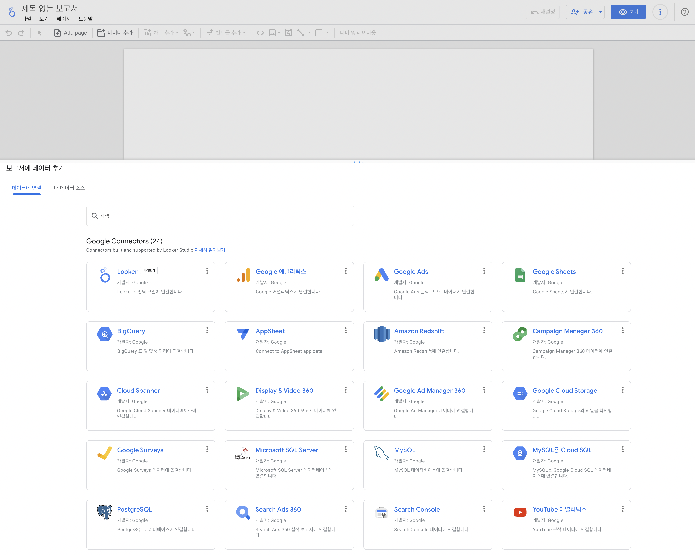
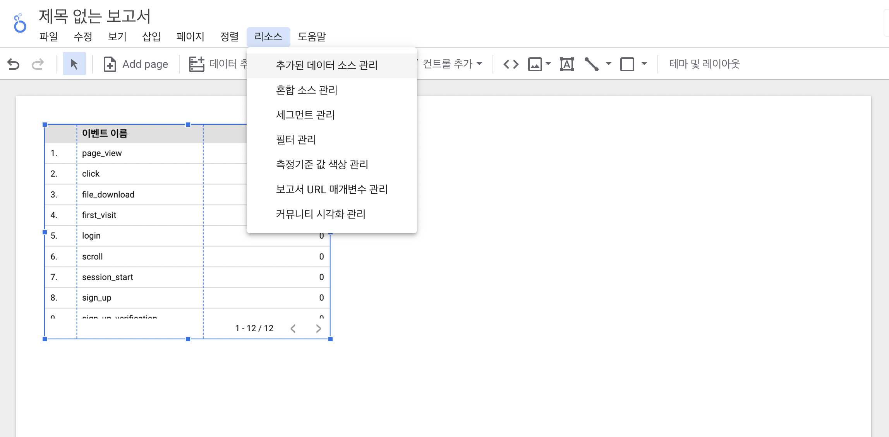
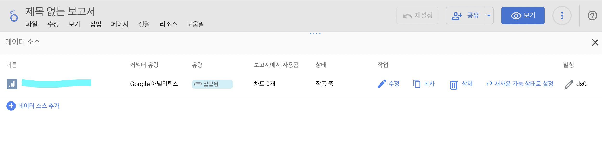

# {{page.title}}
Last modified: {{page.last_modified_date}}

Google Data Studio가 Looker Studio라는 서비스로 새로 탄생했다. 바뀐 점이 있는지는 차차 알아보려고 한다.

## Google Analytics 4와 Universal Analytics의 차이
Universal Analytics는 유료서비스인 360을 이용해서 Law data를 가공할 수 있었던 반면, GA4는 Looker Studio의 Data source를 활용하면 어느정도의 Law data를 다룰 수 있다고 들었다. 그 밖에도 Big query를 활용하면 더 많은 데이터의 활용이 가능하다. 하지만 빅쿼리는 저장공간에 따라 비용이 청구되기 때문에 관리를 잘 해야한다.

## Looker Studio에서 Google Analytics 불러오기
Looker Studio의 Report(보고서)는 쉽게 말하자면 파워포인트 같은 개념이고, 파워포인트에 그래프화해서 보여주기 위한 엑셀의 데이터들이 Looker Studio의 Data source이다.

하지만 그 둘 (원본과 보고서)을 연결하기 위해 사용하는 것이 Connector
{: width="100%" height="100%"}

목록들 중에 Google Analytics, Google Sheets, BigQuery를 사용한다.
새 보고서 > Google Analytics > 연결하고 싶은 계정 클릭

## Looker Studio에서 추가된 데이터 소스 관리하기
Looker Studio > 리소스 > 추가된 데이터 소스 관리하기 를 클릭하면 연결된 데이터를 관리할 수 있다.
{: width="100%" height="100%"}

그 안에 보면 이렇게 연결한 데이터 소스가 있는데, 기본적으로 이렇게 들어가있는 소스는 보고서와 데이터 소스 모두에서 활용이 가능하다. 하나의 연결된 자산으로 활용할 수 있도록 하는 기능이다.

{: width="100%" height="100%"}

재사용 가능 상태로 설정을 클릭하면 보고서와 데이터 소스에 따로 해당 계정을 활용할 수 있게 된다.