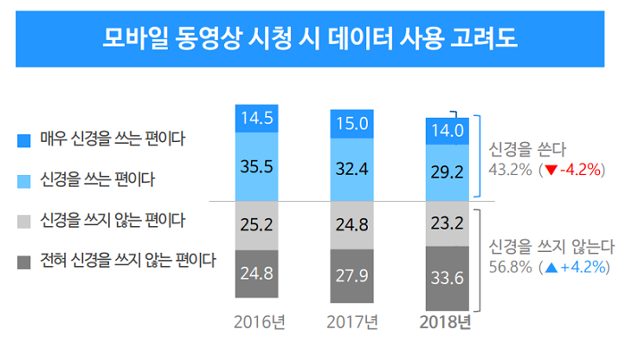

# {{page.title}}
Last modified: {{page.last_modified_date}}

## 설문조사 준비 순서

### 1. 조사 배경 & 조사 목적 정리하기
- 조사 배경: 설문조사를 해야겠다는 생각이 든 계기
- 조사 목적: 설문조사를 통해 얻고자 하는 것

>예시: 열린장판은 지금까지 건설사나 소도매점과 같은 전통적인 유통 채널에 국한해 장판을 판매했습니다. 그런데 이 방식은 판매 마진도 적고 소도매점 판매 데이터를 직접 분석할 수 없어 변화가 필요한 시기라고 판단했습니다. 이에 온라인 쇼핑몰을 만들고 싶은데 시장성이 있을지 초창기 전략은 어떻게 세워야 할 지 고민인 상황입니다. 업력은 길지만 일반 고객에게 직접 상품을 판매한 경험이 없어 소비자 심리도 궁금합니다.
> - 조사 배경: 새로운 온라인 유통 채널 확보를 위해 **직접 쇼핑몰을 운영하고 싶다.**
> - 조사 목적: 장판 전문 쇼핑몰의 **시장성을 판단할 수 있는 자료를 수집**하고 싶다.
 
 

## 가설을 세워 결과 미리 생각해보기
설문조사는 **알고 싶은 정보가 명확할수록 효율이 높은** 소비자 조사 방법 중 하나이다.
→ 여러 번 나눠서 하기 번거롭다고 모든 것을 한 번에 물어보면 좋지 않음.

즉, 하나의 주제 아래 일관된 흐름으로 질문지를 구성할수록 더욱 정확한 데이터를 얻을 수 있다.
→ 가장 궁금한 특정 가설을 하나 끄집어내서 이를 검증해 나가는 과정으로 진행하는 것이 효과적이다.

가설: **정확한 자료가 없어서 입증할 순 없지만 아마 이렇지 않을까** 라고 추측되는 것을 한 줄로 정리한 문장.

> 예시: “사람들이 인터넷으로 장판을 구매한다면 그 요인이 뭔지 전반적으로 궁금해요. 보통 가정집에서 장판 구매를 신경 쓰는 사람은 누구일지도 궁금해요. 가정 주부이지 않을까 추측만 하고 있어요. 왠지 드라마에 예쁜 집 나오면 봐두고 나중에 장판 갈아야 할 때 ‘김비서가 왜 이럴까에 나온 장판’을 검색해 본다던가.. (주절주절)”
> - 가설: "온라인 장판 전문 쇼핑몰의 잠재적 구매 요인은 드라마일 것이다."
> - 정리: '온라인 팡판 전문몰 론칭에 앞서(배경)', '잠재 고객의 구매 요인을 알고 싶어했고(목적)', '장판을 살 때 드라마에 나오는 예쁜 장판을 구매 고려 대상으로 크게 삼는지(가설)'를 먼저 조사하기
 
 

## 응답 대상자와 응답자 수 설정하기
응답 대상자 선정을 잘못할 경우 구매 의사가 없는 응답자가 포함될 수 있고, 따라서 원하는 결과를 얻을만한 소비자 데이터를 제대로 얻지 못 하게 된다.
→ 특히 응답자는 관심 없는 주제의 설문에 성실하게 답변하지 않는다.

직업과 연령대 같은 기본적인 프로필로 타깃팅할 수 있다.
→ '직접 장판을 구매해봤다'거나 '집에 장판을 DIY로 깔아본 사람'이 좀 더 정확한 타깃이라 볼 수 있지만, 충분히 많은 응답자를 모집하기 어려울 수 있다. 

## 신뢰 수준 & 표본 오차
신뢰 수준 & 표본 오차 예시: ‘표본오차 ±3.1%P(95% 신뢰수준)’
신뢰 수준 해석: 95%의 신뢰 수준은 같은 조사를 100번 진행할 때 95번은 같은 조사 결과가 나올 것이라는 의미이다.
표본 오차 해석: 모집단이 5,000명으로 이루어져있지만, 100명을 대상으로 조사를 했을 때 발생할 수 있는 실제 수치와의 차이가 ±3.1%P인 것

> 활용 예시: 1,000명 대상 표본오차 ±3.1%P(95% 신뢰수준)의 여론조사 결과가 A 후보 40%, B 후보가 30%라고 예를 들어보겠습니다. 이는 같은 조사를 100번 했을 때 95번은 A 후보가 36.9%~43.1%, B후보가 16.9%~23.1%의 지지율을 얻을 것이라는 뜻입니다. 신뢰수준과 오차범위를 고려하더라도 A 후보가 당선될 것임을 알 수 있죠.

오차를 최소화하기 위해 대단위 조사를 진행하는 경우가 많다. 예를 들어, 보통 국회의원 선거는 500명 이상, 광역단체장 선거는 800명 이상, 대통령 선거는 1,000명 이상으로 응답자 수를 설정한다.
 
 
## 경향성 읽기
소비자 조사도 선거조사처럼 정밀한 결과를 얻는 것이 중요하기도 하지만, 경향성을 읽는 것 또한 중요하다. 아래의 예시 이미지에서 보았을 때, 데이터가 사용되는 것을 신경쓰는 사람의 수가 3년 동안 점점 줄어들었는데, 이를 토대로 데이터 사용량을 고려해서 모바일 동영상 시청을 하지 않는 사람들이 점차 줄어들 것이라는 예측을 할 수 있을 것이다.

이에 오픈서베이 고객 중에서도 일반적인 마켓 조사나 인지도 조사를 할 때 **신뢰수준 95% 기준 표본 오차 5% 이내로 맞춰 400~500명 대상 설문**을 꾸준히 진행하는 경우도 많습니다.
(c.f., 탐색적 조사 같은 경우는 100명 혹은 200명 단위의 조사도 유용, B2B 소비자 조사의 경우는 특수한 경우라 응답자 수가 더 적을 수 있다.)
 
 
## 정확한 응답을 위한 주의사항
1. 조건에 부합하는 응답자를 찾을 때는 응답을 잘 찾았는지 확인할 수 있는 문항을 추가해 부정확한 응답을 최소화하기
2. DIY 설문에서 문항의 수는 50개를 넘기지 않도록 하여, 참여 중 앞의 답변을 까먹지 않도록 → 오픈서베이는 최대 50문항을 물어본다.
3. 선택을 하지 못하는 상황을 위한 옵션 잊지 않기 (예: 없음, 미해당, 기타 등...)
4. 질문 의도를 착각해서 엉뚱한 답변을 하거나 혹은 질문을 어렵게 구성해 다르게 이해하는 경우를 방지하도록 좀 더 쉽고 직관적으로 문항을 작성해야 한다.
5. 다소 민감할 수 있는 정보를 물을 때는 문항에 “실례지만 귀하의 소득은 어떻게 되시나요?”라는 식으로 최대한 정중한 태도로 묻는 게 좋다. 혹은 본 설문을 진행하기 전에 앞 문항에서 조사 내용에 대해 충분히 설명해주거나 ‘응답하고 싶지 않다’는 문항을 추가해주는 것도 필요하다.
 
 
## 문항 작성 가이드
중요한 포인트는 응답자는 물어본 것에 대해서만 응답한다는 것이다.
1. 질문은 완결된 문장으로 작성 + 정중한 말투
2. 응답 방법을 구체적으로 설명 (예: '쓰고 싶지 않은 이유'라는 말 대신 '가장 큰 이유'가 무엇인가요? 라고 할 수 있다. 그 외에도 중요한 순서대로 최대 3순위까지 선택해주세요 같은 말로 다중 선택이 가능하다는 것을 알릴 수 있다.)
3. 명확한 구조와 기준 제시 (횟수나 정도를 물을 때, '많이' 같은 워딩보다 '일주일에 1일' 같은 워딩 사용)
4. '기타'와 '없음' 보기는 필요한 문항에 적절히 사용
5. 편향된 응답이 나오지 않도록 질문에 가치판단 관련한 문구를 제시하지 않기 (예: '최근에 발생한 000 사건은 정말 안타까운 사건이었습니다. 위 사건과 관한 정보의 대응은 어떻게 생각하시나요?' 대신 '최근 발생한 000 사건과 관련한 정부의 대응은 어떻게 생각하시나요?')

> 참고
> [opensurvey - 처음 하는 설문조사 먼저 준비할 것 3가지 | 설문조사 기초 노하우 ①](https://blog.opensurvey.co.kr/research-tips/survey-basic-01/)
> [opensurvey - 응답 대상자와 응답자 수 설정하기 | 설문조사 기초 노하우 ②](https://blog.opensurvey.co.kr/research-tips/survey-basic-02/)