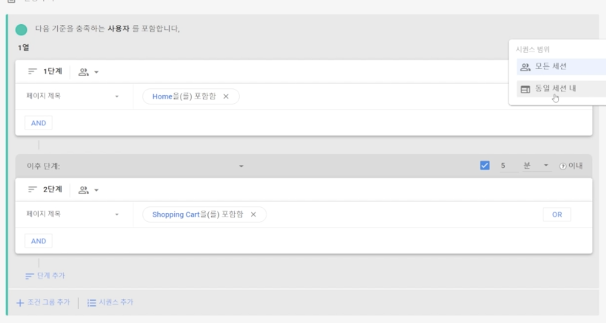

# {{page.title}}
Last modified: {{page.last_modified_date}}

## 정규표현식 관련 레퍼런스 참고
[Rubular](https://rubular.com/)을 사용하면 정규표현식을 미리 작성해서 테스트해 볼 수 있다.

## 세그먼트
세그먼트의 종류는 세가지 종류가 있다: "사용자", "세션", "이벤트"

### GA4 위계구조
이벤트 → 세션(이벤트를 그룹화한 것) → 사용자(쿠키, 유저아이디)

## Lookback Windows
Lookback windows = Attribution windows = Conversion windows
→ 우리 서비스로 유입된 고객이 광고를 클릭하기 전, 어떤 행동을 하고 있었는지를 알 수 있는 기준

### Lookback window의 3가지 종류
1. 7-Day Standard:
2. 24-Hour Fingerprinting Attribution: 
3. Facebook, Google, and Twitter Attribution Windows:

## 탐색 보고서에 시간(타이머) 추가하기
아래의 이미지처럼 세그먼트를 생성하는 페이지에서 '몇 분 안에 뭐뭐한 사용자' 같은 옵션을 추가할 수 있다.
{: width="100%" height="100%"}

[어쩐지 오늘은 - 데이터 로그 설계, 데이터 로깅, 이벤트 로그 설계, 데이터 QA의 모든 것](https://zzsza.github.io/data/2021/06/13/data-event-log-definition/)