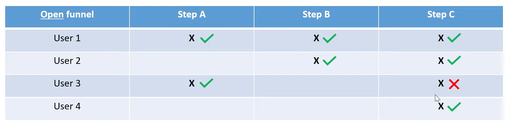
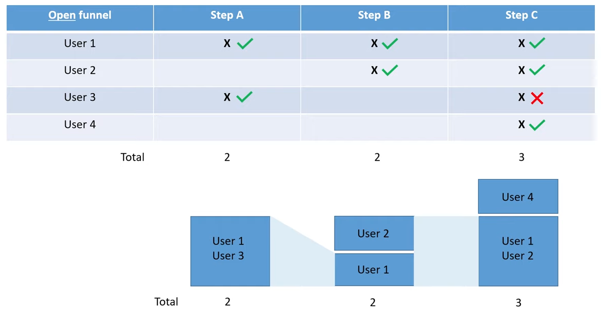
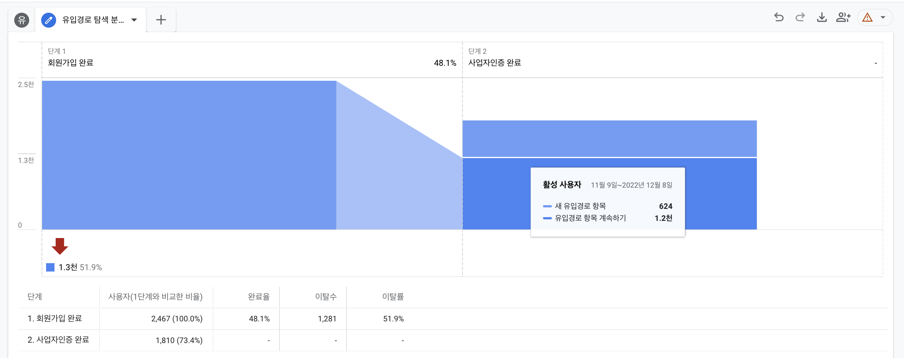

# {{page.title}}
Last modified: {{page.last_modified_date}}

{: width="100%" height="100%"}

{: width="100%" height="100%"}

{: width="100%" height="100%"}

{: width="100%" height="100%"}

> 참고:
> [Funnel exploration in Google Analytics 4 | Funnel reports in GA4 (2022)](https://www.youtube.com/watch?v=c_AhsKuNrWk)