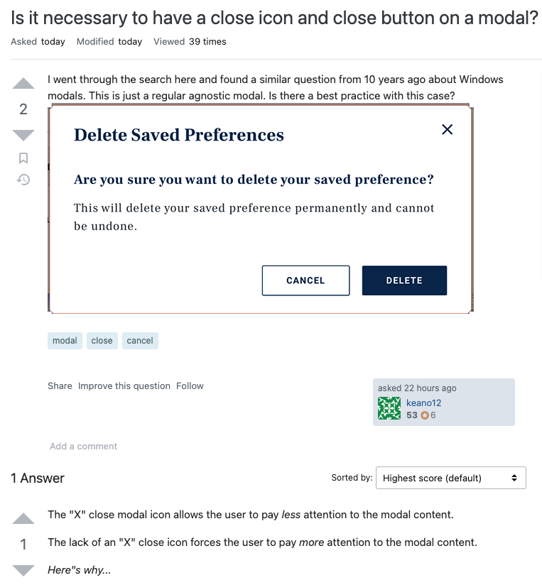

# {{page.title}}
Last modified: {{page.last_modified_date}}

## 모달을 사용자가 꼭 읽어야하는지에 따라 다르다
모달에 X 버튼을 제공한다면 사용자는 번거롭게 모달의 내용을 읽을 필요 없이 편하게 닫을 수 있다. 하지만, 만약에 모달이 사용자에게 중요한 내용을 포함하고 있다면 (개발자나 디자이너가 아니라) 사용자는 모달의 내용을 읽어야 하므로 X 버튼을 제공하지 않는 것이 좋다. 대신 Cancel 같은 모달 내의 버튼을 제공하여 내용을 읽어본 후 모달을 닫도록 하는 것이 좋다.
{: width="100%" height="100%"}

> 