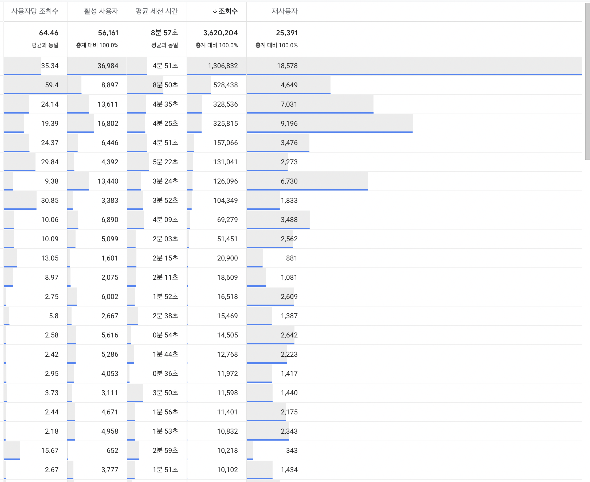
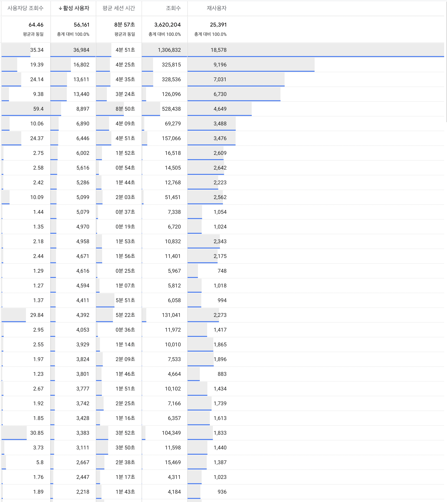
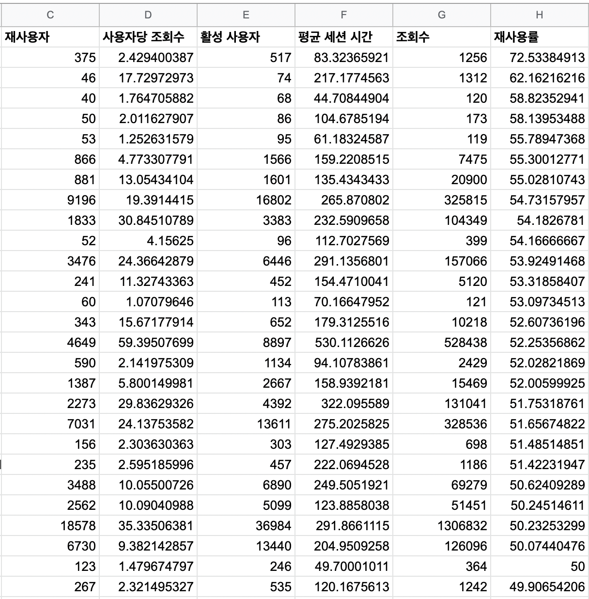
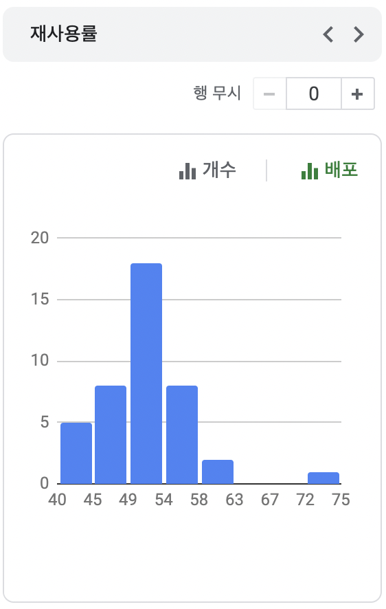
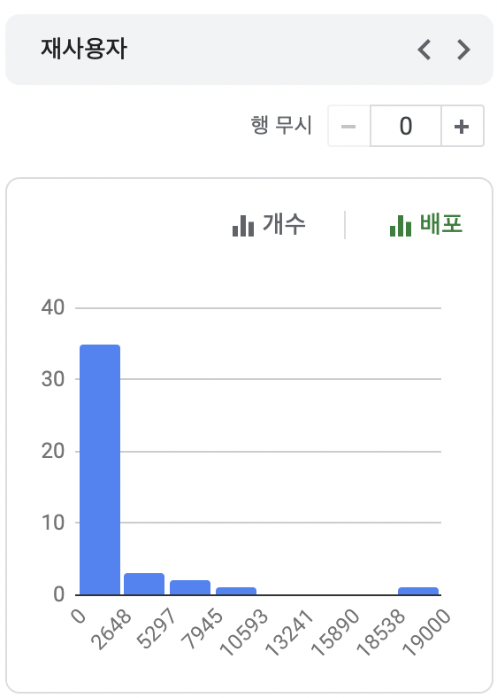
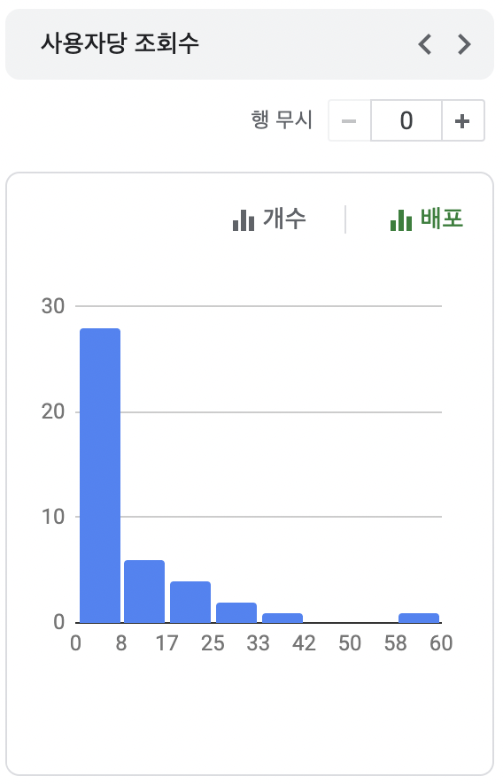
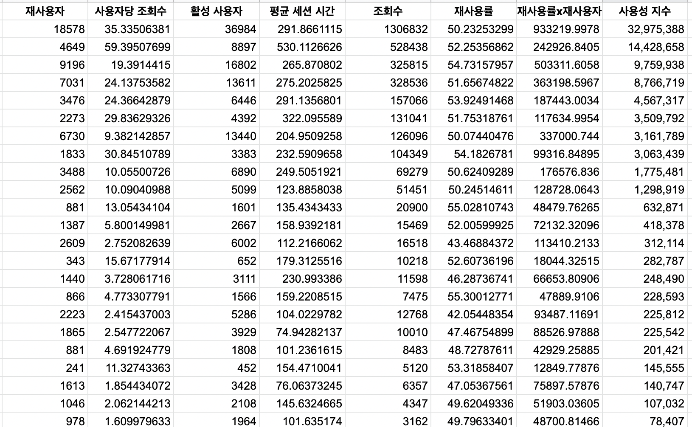

# {{page.title}}
Last modified: {{page.last_modified_date}}

새로 회사에 들어오고 몇 가지 프로젝트를 진행했지만, 이번 프로젝트는 그 규모가 좀 크다. 그래서 부담감도 들고 이끌어주는 선배도 없다보니 막막하기도 하다.

새로 진행하게 된 프로젝트는 '서비스 내 어드민 페이지 새 버전 기획'이다.

내가 담당한 프로덕트는 시간의 흐름에 따라 새로 추가된 기능들이 아~주~ 많은 레거시 가득의 프로덕트인데, 그래서 더 막막했던 것 같다. (레거시 가득의 예시를 들자면, 아무리 중요한 기능이라도 새로 추가된 기능은 40개가 넘는 GNB 구조에서 가장 하단에 위치한다. 아주 작은 예시일 뿐..) 타겟 고객층도 없는 상태에서 어떤 사용자를 최우선으로 생각할 것이며 혹시나 내가 중요한 기능을 없애고 MVP를 출시해서 기존 유저의 이탈이 발생하면 어떻게 하지? 라는 두려움도 있다.

위험부담을 최소화하기 위해 내가 사용하기로 한 전략은,
'기존 버전은 유지한 채 리뉴얼 버전을 출시하기'이다.

이는 많은 서비스들에서 대규모 업그레이드를 할 때 사용하는 방식이기도 한데, 예를 들어 네이버가 현재 구글처럼 검색창만 남기는 방식을 선택했을 때 꽤 오랫동안 기존 버전도 함께 사용할 수 있도록 했던 경우도 그러하다. 그 외에도 구글의 Google Ananlytics 4는 기존 버전인 Universal Analytics를 아직 함께 쓸 수 있다.

새 버전을 출시한 후에는 새 버전 위주로 기능들을 업데이트하여 기존 버전에 익숙한 사용자들도 점차 새 버전으로 이동해 올 수 있도록 하면 그나마 위험부담 없이 업그레이드를 할 수 있지 않을까 싶다.

## 어떤 기능이 가장 중요할까
어드민을 업그레이드하기 전, 어떤 기능이 가장 중요한 지를 파악할 필요가 있다. 서비스 내에서 가장 중요한 기능을 우선적으로 반영하여 새 버전을 출시할 것이기 때문이다. 그렇다면 중요함의 기준이 되는 것은 무엇일까? 나는 아래와 같이 그 기준을 정해보았다.

1. 비즈니스 모델에서 꼭 필요한 기능
2. 사용자가 많이 사용하는 기능

위의 2가지 경우 중, Google Analytics 4를 통해 '사용자가 많이 사용하는 기능'을 이번 주 동안 확인해보았다.

기존 어드민 페이지에서 GNB(Glabal Navigation Bar) 중 가장 중요한 기능은 어떻게 추려낼 수 있을까?

### 페이지뷰 기준으로 중요성 파악하기
단순하게 생각하면 페이지뷰가 많은 곳이 사람들이 많이 사용하는 페이지인거니까 중요한 기능이지 않을까?라고 생각하기 쉽다. 

하지만, 아래의 이미지를 보면 조회수를 기준으로 보았을 때 활성 사용자가 적음에도 상위로 올라와있는 페이지들을 볼 수 있다. 적은 사용자들이 진성 고객으로 잘 사용하는 기능인 것이다.

그렇다면 사용자 수를 기준으로 페이지별 중요도를 파악해보면 어떨까?

### 활성 사용자를 기준으로 중요성 파악하기
아래의 이미지는 활성 사용자 수를 기준으로 페이지 별 중요성을 확인한 것이다. 사용자 수가 많으면 유용한 기능이라고 할 수 있을까? 이렇게 볼 경우 사람들이 여러 번 쓰는 기능보다 많은 사람들이 쓰는 기능이 중요하게 보일 수 있다는 문제점이 있다. 

예를 들어, 아래의 이미지에서 5번째 페이지는 사용자당 59회를 사용하는데도 불구하고 5위의 순위가 되어버렸기 때문이다.

그렇다면, 재사용자가 많은 페이지가 중요한 페이지일까도 생각해보았으나, 재사용자의 수 또한 활성 사용자의 수에 비례하여 움직이기 마련이기 때문에, 나는 절대적인 수가 아닌 재사용률을 계산해보았다.

### 재사용률을 기준으로 중요성 파악하기
\*재사용률 = 재사용자/사용자x100
재사용률은 Google Analytics에서 확인할 수 없어서 Google sheets로 내보낸 다음 따로 계산을 하였다. 하지만 재사용률을 기준으로 확인을 한 결과 소수의 인원들이 정말 잘 사용하는 메뉴들이 상단으로 올라와서 활성 사용자 수가 반영이 되지 않는 오류가 있었다. 

그렇다면, 어떤 수치를 기준으로 화면의 중요성을 파악하고 그 기능을 우선적으로 반영하여 새 버전으로 업그레이드 할 수 있을까?

### 재사용률과 재사용자 수와 페이지뷰 모두 반영해보기
결국 내가 가려내고 싶은 기능은 많은 기존 사용자들이 자주 사용하는 기능이었다. 따라서 아래와 같은 지수를 따로 계산해보았다. 페이지별 평균 세션 시간은 기존 제품에서 몇 몇 기능들에 bottleneck이 있어, 제외하고 생각하였다.

페이지 사용률 지수 = 재사용률x재사용자x사용자당 조회 수 → 기하평균(두 숫자의 차이가 많으면 그게 결과로 반영이 됨)
n개를 다 더한 다음에 n으로 나누면  → 산술평균
but, cf., 조회수보다 활성사용자를 중요하게 생각하고 싶으면 가중기하평균 (weight)

수치를 계산하기 이전에, 바차트로 수치의 분포도를 확인해보았다.

재사용률

재사용자

사용자당 조회수

마지막으로 페이지별 사용률 지수를 계산하여 엇나가는 데이터가 없는지 확인을 해주었다.

그 결과 하나하나 수기로 확인한 결과 재사용자 수가 많은 중요한 페이지들이 순서대로 잘 정리가 된 듯 싶었다.
하지만, 사용자가 많이 사용하지 않아도 서비스를 이용하기 위해 필수적인 페이지가 있을 수 있으므로 그런 기능들은 차차 기존 어드민 페이지에서 옮겨올 수 있도록 할 예정이다.
