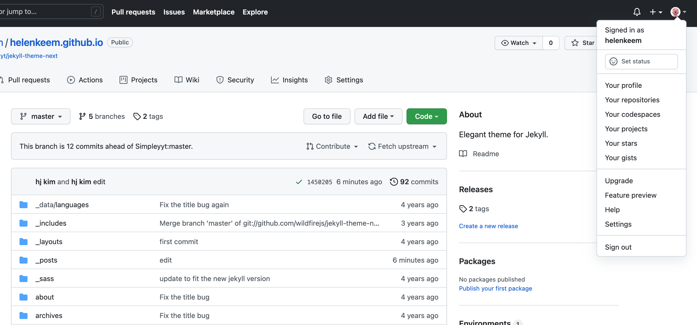
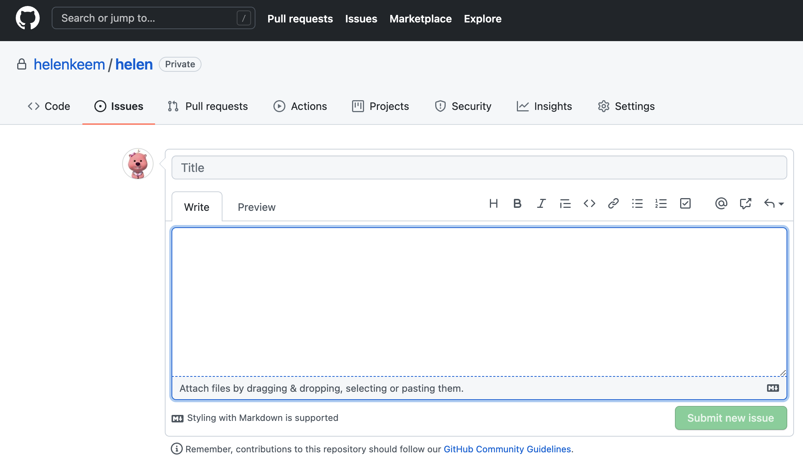
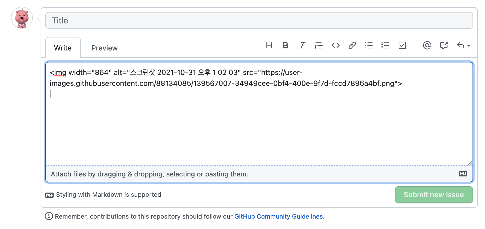

# {{page.title}}
<span style = "color: #A39FAD">Last modified: {{page.last_modified_date}}</span>

깃허브 블로그를 처음 만들어봤는데, 단순히 fork해서 만들었음에도 문제를 상당히 많이 겪었다.
우선 대부분의 타 블로그에서 설명하는 깃허브를 이용한 블로그 만들기는 개발언어를 좀 이해한 사람들 기준인 경우가 많았고,,
나는 깃허브의 ㄱ자도 모르고,,, 그렇기 때문에 난 아주 쉽게 블로그를 만들 수 있는 방법을 찾아냈다. 

이 [블로그](https://recoveryman.tistory.com/321?category=635733)를 참고해서 만들었는데 초보자 관점에서 아주 잘 설명되어있다!

여기서 내가 다르게 한 점은 나는 bash를 사용하지 않고 그냥 터미널로 작업했다.

그리고 추가로 다르게 한 점은 git push 후 password를 깃허브에서 발급받은 token을 사용했다.
아직 명확한 이유를 찾진 못했지만 왠지 보안상 비밀번호가 아닌 깃허브에서 발급받은 token을 사용하는 것 같았다.

## 깃허브 token 발급받는 방법

token 발급은 아래의 화면에서 Settings - Developer Settings - Personal access tokens에 가면 발급 받을 수 있다.
발급받으면 나온 토큰을 복사해서 push 할 때 password를 입력하는 창에 cmd + v 해주면 된다. 

{: width="100%" height="100%"}


## 깃허브 블로그 이미지 쉽게 올리는 방법 feat. 마크다운(Markdown) 문법

사실 이것 외에도 이미지를 어떻게 올려야할지에 대한 방법을 많이 찾아봤다. 왜냐하면 난 비개발자이기 때문에..

{: width="100%" height="100%"}


깃허브 블로그에 쉽게 이미지를 올리려면, 내 깃허브 repository 의 Issues 탭에서 New issue를 누른 후 아래 같은 화면에서 텍스트 본문 입력 창에 올리고 싶은 이미지를 드래그앤드롭하면 아래처럼 이미지의 링크를 얻을 수 있다.

{: width="100%" height="100%"}

여기서 저 https로 시작하고 .png로 끝나는걸 복사한 다음, 마크다운 문법에서 아래와 같은 형식으로 붙여넣기 해서 써주면 된다. 여기서 [ ] 안의 텍스트(내 것은 screenshot)는 이미지 제목이므로 자유롭게 설정하면 된다. 

```

```


하지만 여기서 내가 겪은 문제는 나는 Issues 탭이 안 보였었다. 그래서 혹시 내가 fork한거는 issues 탭이 없는건가 하고 private하게 만든 repository 로 가보니 Issues가 있었다. 

그럼, 이정도로 간단하게 첫 블로그 글은 마무리해볼까 한다! 
<br><br>
**추가 업로드**<br>
나는 사실 이 과정이 오히려 더 번거롭게 느껴졌다. 특히 나의 로컬에 저장되지 않으면 어딘가 찝찝한 느낌이 드는 것... 그래서 로컬에 있는 파일을 상대경로로 어떻게 가져오는지 찾아보며 여러 오류를 겪었고 최종적으로 맞는 방법을 아래에 정리해두었다. 계속 오류가 났던 이유는 내가 경로의 앞에 /을 누락한 것 때문이었다.

## Jekyll 깃허브 블로그에 상대경로로 이미지 업로드 하는 법

1. 상위폴더 접근 경로 설정 방법(e.g., 현재 post가 저장되는 폴더의 상위 폴더로 이동한 다음 folder 안의 folder2에 있는 image.png를 사용하고 싶을 때)
```
 '
```
2. 현재 글이 있는 폴더 안에 이미지가 있을 때
 ```
 '
```
3. 현재 글이 있는 폴더의 하위폴더(folder3)에 이미지가 있을 때
```
 '
```

여기서 주의할 점!!! 은 만약 파일명이나 폴더명이 영어가 아니고 한글일 경우 이미지가 불러오는 과정에 에러가 난다. 그래서 이미지가 안불러와지고 깨지게 됨. 고로 alt text(이미지를 설명하는 제목이 되는 대체 텍스트)는 한글로 적더라도 파일명은 영어로 해야 한다!