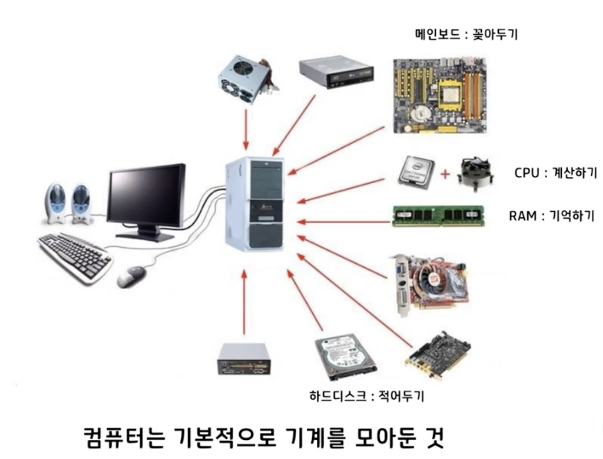
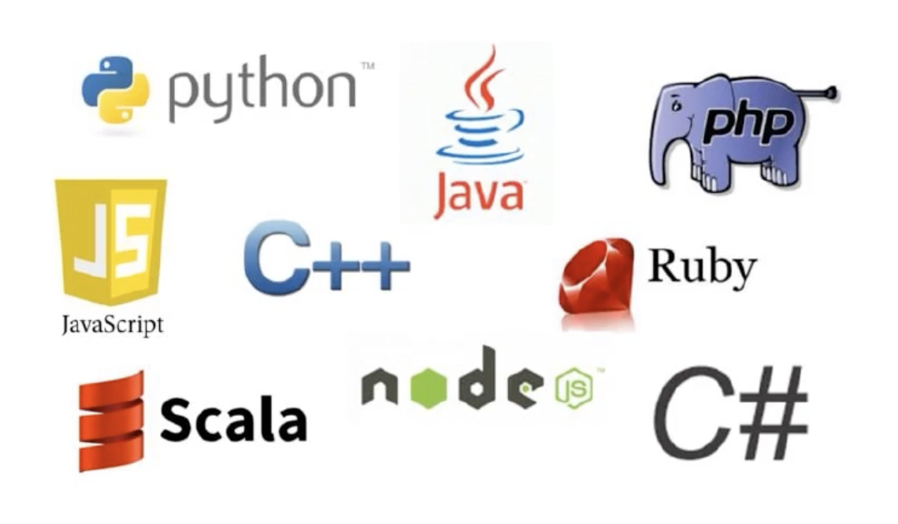
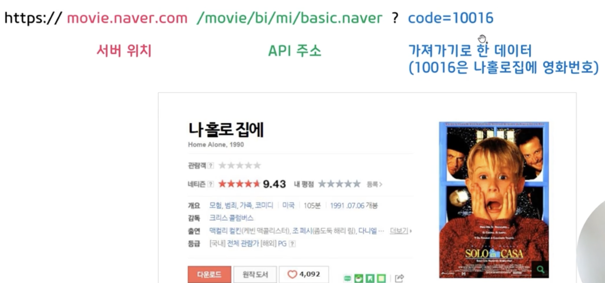
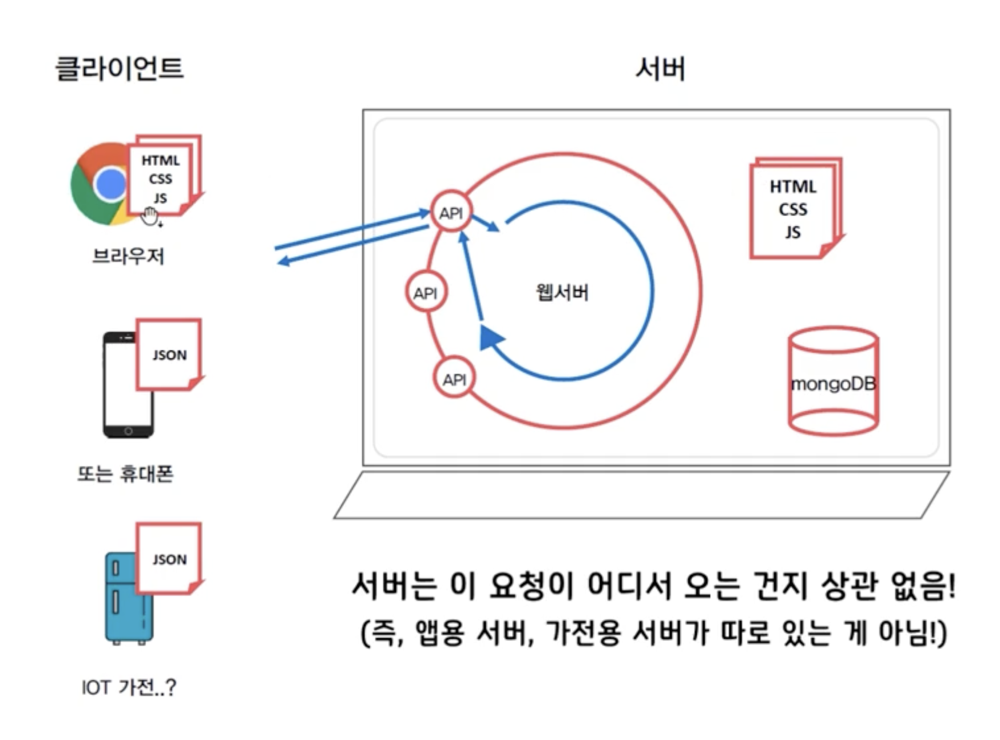

# {{page.title}}
Last modified: {{page.last_modified_date}}

## 컴퓨터와 인터넷

{: width="100%" height="100%"}

위와 같은 구조의 컴퓨터는 운영체제(OS)를 기반으로 움직임(소통의 기반)

OS에 명령을 내리는 것이 "코딩"

그 코딩에 어떤 말로 명령을 내릴지 하는 것이 "프로그래밍 언어" (아래 이미지)

{: width="100%" height="100%"}

그리고 이렇게 프로그래밍 언어로 짜서 매번 똑같이 움직이로독 만든 것이 "프로그램"
그래서 코딩을 프로그래밍이라고 칭하기도 한다.

### 컴퓨터끼리 대화를 주고 받으려면?

컴퓨터끼리 대화를 주고 받기 위해 사용되는 규칙이 http(웹)으로 뭐 이름을 먼저 말하고 무슨 프로그램 찾는지 말해... 이런 식으로 방식이 정해져 있다고 함
이 외에도 여러가지 방식이 있음

따라서 인터넷 주소에 앞에 붙이는 http가 내가 지금부터 웹통신을 할거야~~ 하는 것
그 밖에, https는 보완을 강화한 버전이다. 그 보완을 어떻게 강화했냐면 서로 암구호 표를 가져서 가운데서 못 듣게 한 것이다.

**02pm:** 예를 들자면, 우리가 구글맵에 후기 남길때 늠므 맛엽쎠여!! 여끼쩔때까찌마쎼여 하는 느낌...? 

이런 웹통신의 행위를 하는 것이 웹서버. 웹서버는 가만히 기다리고 있다가 00해줘~ 하고 요청이 오면 그때 행동하는 아이.

## 웹서비스의 동작 방식

예전에 자주 들리던 '서버가 터졌다!'라는 말에서 서버란?
가운데에서 데이터를 저장하고, 주는 일을 하고 있던 존재라서 사용자가 많아지면 힘든 것. 즉 내가 카톡으로 메세지를 보내면 서버가 내 친구한테 전달을 해주는 것이므로, 서버가 터지면 메세지 전달이 안 되는 것

서버는 사실 그냥 컴퓨터일 뿐.! 컴퓨터가 인간이라면 서버는 직업인 것.

브라우저는 내가 뭔가 입력하면 그 입력에 해당되는 서버에 요청을 하고 요소들를 실행하여 보여주는 역할을 할 뿐. 새로고침하면 그 요청을 다시 보내는 것.

여기서 요소들은 HTML, CSS, Javascript를 칭하는 것으로 그것들을 받아와서 보여주는 것. 

HTML은 텍스트와 그 텍스트의 구조들로 이루어진 뼈대 역할.
CSS는 이 구조들을 예쁘게 디자인을 적용하여 보여주는 것.
Javascript는 뭔가 움직이거나 버튼을 클릭하거나 했을 때 행동이 가능하도록 하는 것.

그렇다면 새로고침을 해야만 요소들을 바꿀 수 있는 것일까?
No! 콘서트 예매 사이트라고 치면, 자리가 나갈 때마다 새로고침 할 수 없으므로 데이터만 갈아끼울 수도 있음

이 데이터가 당연히 규칙이 필요할 것이므로 그 규칙을 JSON 방식 이라고 한다.
생긴 것은 **키: "Value"** 이렇게 생김.

JSON은 앱에서 많이 씀. 예를 들어 배달의 민족 앱의 구조는 다 정해져 있고, 마라탕 같은 단어를 검색하면 데이터만 갈아 끼워주는 것도 JSON으로 가능한 것
(하지만 웹은 다 새로 받아와야 함)

그렇다면 서버는 무슨 규칙으로 통신을 하는 것일까?!

## 서버-클라이언트 통신
예를 들어, 은행은 많은 사람들이 뭔가를 확인하러 가는 곳이니까 은행에서의 소통을 보자면.

Q. 은행에 가서, 내 통장 잔고를 확인하는 방법은?
1) 아무나에게 가서 물어본다
2) 대출 창구에 간다
3) 크게 소리친다
4) **번호표를 뽑고 입출급 창구에 가서 민증을 보여준다**

즉, 은행과 우리 사이에 규칙이 있는 것.
은행과 미리 약속해둔 곳에(예금 창구). 약속해둔 데이터를 들고가야(신분증). 잔고를 알려 줌(응답)

이걸 컴퓨터(배달의 민족 서버)에 적용하자면!!

A: 아이디를 가져와, 그럼 내가 주문 내역을 알려줄게.
B: 주소를 가져와, 그럼 내가 음식점을 알려줄게.
C: 주문번호를 가져와, 그럼 내가 배달현황을 알려줄게. 

같은 구조의 창구들로 구성된 것. 여기서 B가 **API**임!
API는 서버에서 미리 만들어둔 기능이자 클라이언트와 한 약속 같은 것

넘어가기 전에, 서버의 특징은 웹과 앱의 구분이 없다..!는 것을 알고 넘어가자!

### API의 구조
API 요청들이 정말 많을 것이므로 이런 것들을 문서화해 둔 것이 **API 명세서**
htts:// **우리은행 용산지점** / **입출금창구** ? 신분증 = **주민등록번호** 처럼 생김.
"서버 위치, API 주소, 가져가기로 한 데이터" 의 구조로 생겼음

{: width="100%" height="100%"}

이제 API라는 용어를 실무에서 어떻게 사용하는지 살펴보자면,

"000님 이거 신규 피쳐라 API 하나만 따주세요"
: 새로운 기능 창구(은행의)를 하나 만들어주세요. 그 쪽으로 요청할게요.

"API 개발은 끝났고, 클라이언트는 아직이에요"
: 창구는 다 만들었는데, 요청하는 쪽이 아직 작업 중.!

### OPEN API
공공데이터로 누구나 요청할 수 있게 열어 둔 API (원래는 누구나 부르지 못 함. 누구나 부를 수 있다면 배민 다 베껴 올 수 있으니....!)

{: width="100%" height="100%"}

서버 통신은 클라이언트와 서버로 이루어지는데, 브라우저나 핸드폰 같은 기기를 클라이언트라고 부르고 이 클라이언트가 서버에 데이터를 요청하는 것이다. 서버는 이 요청이 어디서 오든지 상관이 없다.

> 참고 
> [스파르타코딩클럽-1시간만에 끝내는 직장인 코딩 용어 해설](https://spartacodingclub.kr/online/coding101)
