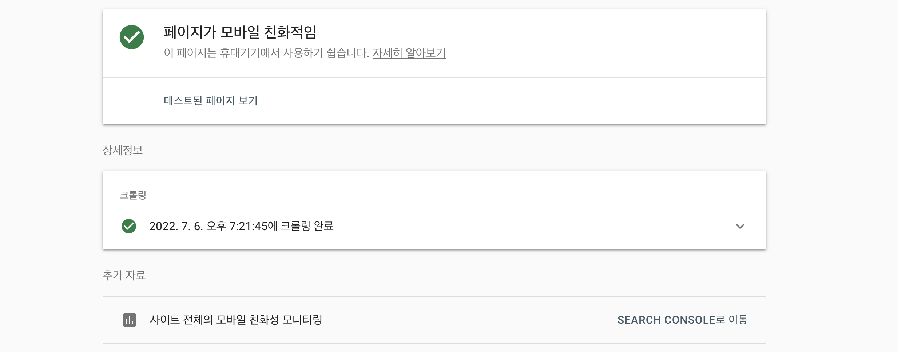
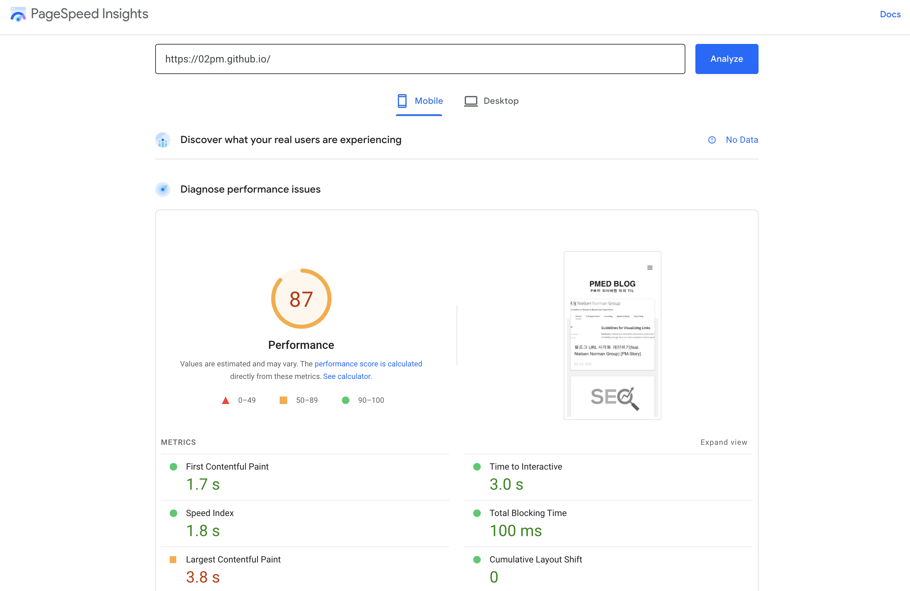
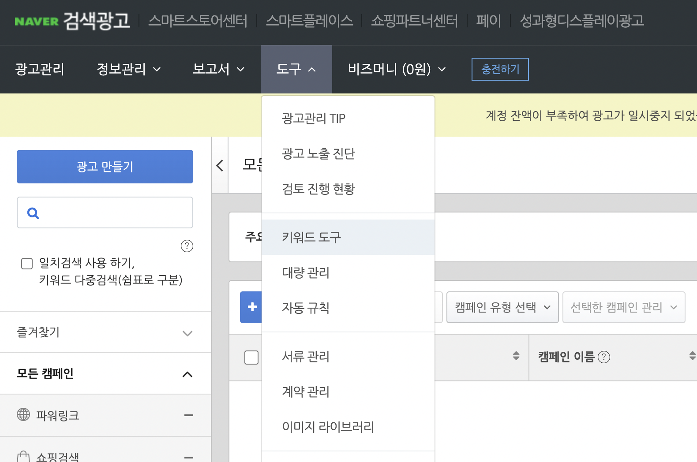
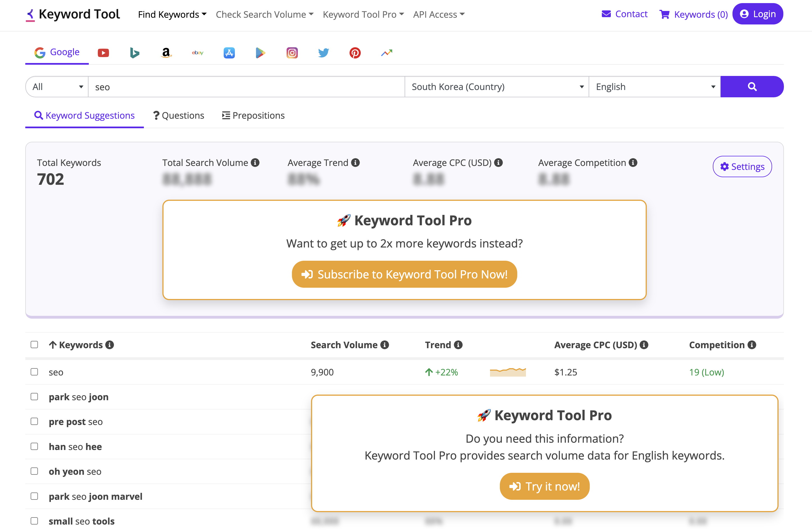

# {{page.title}}
Last modified: {{page.last_modified_date}}

내 블로그가 좀 더 노출이 되어야 블로깅을 하는 동기부여가 더 될 것 같다는 생각이 들었다. 그래서 SEO 개선을 위해 꾸준히 노력을 해야겠다. 그 과정 속에서 본 채널톡의 유튜브 콘텐츠가 SEO 과정을 쉽고 명확하게 소개해주는 것 같아서 블로그에 정리하게 되었다.

## SEO
SEO란 Search Engine Optimization이다. 한 마디로, 내 사이트가 검색했을 때 더 노출이 잘 되도록 사이트를 정돈하는 것!

### ZMOT
SEO는 ZMOT 때문에 아주 중요하다. 

원래는 FMOT로 First moment of truth에서 이 단어가 유래된 것인데, FMOT는 소비자가 매장에 가서 뭔가를 사려고 할 때 걸리는 시간을 (3초~7초) 칭한다.

그렇다면 ZMOT는 ?
ZMOT은 Zero moment of truth로 인터넷의 등장으로 First보다 앞 단계가 생긴 것을 뜻하는데, 즉 매장에 직접 가기 전에 일어나는 여러 가지의 경험들을 칭한다.

예시) 온라인 평가, 주변 친구들의 리뷰, 비교 사이트, 검색 엔진 등...

그렇다면 이 중에서 가장 중요한 것은? 단연 **검색 엔진**이 1등이다. 즉 검색 엔진 최적화만 시키면 아주 좋은 효율을 이끌어 낼 것.

검색 엔진의 종류: Google, Naver, Daum, YouTube 등...

### 구글의 SEO
구글에서 검색을 해보면, 상단에는 광고가 노출되고 아래로는 일반 알고리즘에 의한 글이 노출되는 것을 알 것이다.

신기하게도, 광고는 고작 2%의 클릭 비율을 보여주고 오히려 자연 유입(검색해서 노출된 것을 클릭하는)이 40%의 클릭 비율을 보여준다고 한다.

### 검색엔진 구성요소 세 가지
1. 크롤링: 크롤러라는 로봇이 인터넷을 돌아다니면서 보여줄 데이터들을 수집해서 갖고 있는 것인데, 그 과정에서 크롤러가 보기 쉬운 것일 수록 더 먼저 보여준다. 그러니 크롤러가 좋아할 만한 글을 작성하는 것이 좋음.
2. 인덱싱: 크롤러가 모은 문서를 데이터베이스에 저장하는 순서가 인덱싱
3. 랭킹: 콘텐츠를 만들면 검색엔진에 쳤을 때, 그 콘텐츠가 1위가 되게 만들고자 하는 것인데... 그 검색 결과가 어떻게 리스트업되는지 알 필요가 있다.

### SEO의 랭킹 관리, 그래서 제일 위에 내 콘텐츠를 어떻게 뜨게하는거지?
SERP: Search Engine Result Page로 검색했을 때, 첫 페이지를 말하는 것.
사람들은 검색했을 때 첫번째 페이지에서 모든 결과를 얻어내는 경우가 많음.

#### 내 콘텐츠를 어떻게 SERP에 노출되게 할까?
1. 사이트 보안
\: http로 시작하는 사이트보다 https로 시작하는 사이트가 보안이 강하다고 판단됨

2. 모바일 친화적인지
**02pm:** [모바일 친화성 테스트 도구](https://search.google.com/test/mobile-friendly?hl=ko)에 본인의 URL을 넣어서 확인할 수 있다. 내 블로그를 확인한 결과, 페이지가 모바일 친화적임 이라고 나오는데, 더 자세하게 해보기 위해 하단의 SEARCH CONSOLE를 이용해보았다. 결과는 하루 이틀 걸린다고 하는 것 같다.
{: width="100%" height="100%"}

3. 페이지 스피드가 빠른지
**02pm:** 페이지의 로딩 속도인데, 이미지 크기가 크거나 영상이 있을 경우에 로딩 속도가 느려질 수 있고 그 밖에도 콘텐츠를 구성하는 요소가 컴퓨터가 좋아하는 순서일 경우 로딩이 잘 됨. 그 밖에도 png보다 jpg를 좋아함. 이 또한 [Google PageSpeed Insights](https://pagespeed.web.dev/?utm_source=psi&utm_medium=redirect)에서 확인이 가능하다. 역시 예상했던 결과대로 내 블로그는 이미지 최적화를 하지 않아서 Performancerk 87 밖에 되지 않는다 ㅠ

{: width="100%" height="100%"}

4. 콘텐츠 퀄리티랑 길이
\: 너무 짧으면 퀄리티가 낮다고 판단되기도 한다.

#### 키워드를 잘 짜서 SEO를 겨냥한 콘텐츠를 만들기
그 시작의 반은 '키워드'이다. 특정 키워드를 검색했을 때, 그 키워드에서 1등을 하겠다! 같은 목적이 정해져 있다. 즉, 타겟 키워드를 명확하게 설정해야 한다. 그럼 어떤 키워드를 선택해야할까? 그 방법으로는 2가지가 있다. 

아래의 사이트들에서 사람들이 주로 어떤 키워드를 검색하는지 알아보고 사용하면 좋다.
1. [구글 키워드 플래너](https://ads.google.com/intl/ko_kr/getstarted/kwp/?subid=kr-en-ha-awa-bk-a-m00!o3~Cj0KCQjw5ZSWBhCVARIsALERCvyekBDNOcuB2uoMxzBACFr58jwIXy8r6hj5CsGe9iQuhya-B8LAMbMaAtUmEALw_wcB~115596787650~aud-570778808110:kwd-58879037234~12683009967~512271237811&gclid=Cj0KCQjw5ZSWBhCVARIsALERCvyekBDNOcuB2uoMxzBACFr58jwIXy8r6hj5CsGe9iQuhya-B8LAMbMaAtUmEALw_wcB&gclsrc=aw.ds)
2. [네이버 광고 센터](https://searchad.naver.com/)
**02pm:** 네이버는 로그인을 해야 확인할 수 있다. 자신의 네이버 아이디로 로그인한 다음 회원가입을 해야한다. 근데 나는 네이버 연동 회원가입에서 계속 오류났다. 로그인 한 후 아래와 같은 단계로 진입하여 키워드를 검색해 볼 수 있다.
{: width="100%" height="100%"}

3. [Keyworl Tool](https://keywordtool.io/)
{: width="100%" height="100%"}
\: 키워드가 얼마나 따내기 어려운 것인지 알아볼 수 있다. 각 국가별로 특정 키워드가 한달동안 몇 번(Volume) 검색 됐는지, 그리고 얼마나 경쟁이 심한(Competition) 키워드인지를 알 수 있다. 비교적 경쟁률이 약한데 키워드 볼륨이 큰 것들은 선점하기가 쉽다! 하지만 이런 키워드 찾기 어려움. 연관 검색어 리스트들을 의도 키워드로 이용해서 점점 올라가는 방법을 하는 것이 좋음. 예를 들어, 여자 가디건을 검색 했을 때, 내 페이지가 위에 노출되고 싶으면 여자 가디건 코디, 여자 가디건 브랜드 같은 키워드를 먼저 먹는 방법이 더 쉽다.

**02pm:** 근데, 많은 기능들이 유료다! 주요 기능은 무료로 사용할 수 있는 것 같다. 가장 싼 요금제가 월 89$로 저렴하지는 않은 것 같다.

#### 사람들이 우리 사이트를 어떤 키워드를 통해서 들어왔을까?
이는 [구글 서치 콘솔](https://search.google.com/search-console/about)을 통해 알 수 있다. 구글 서치 콘솔을 사용하면 우리 사이트에 특정 기간동안 들어온 고객들이 어떤 검색어로 들어왔는지, 그 검색어마다 몇 명인지를 다 확인할 수 있다. 이 키워드가 경쟁력이 있구나! 하고 판단할 수 있다.

#### 그럼 우리 경쟁사는 어떤 키워드를 통해 사람들이 유입되는거지?!
이는 [Ahrefs](https://ahrefs.com/) 같은 사이트로 확인이 가능하다. 여기서 특정 URL을 검색하면 해당 url에 키워드가 몇 개가 사용됐고 각각 키워드 별로 SERP에 몇 위였는지가 다 보인다.
**02pm:** 여기도 회원가입 하고 유료로 사용해야 하는 것 같아서 포기.

### 콘텐츠의 태그를 잘 작성하여 SEO 겨냥하기
1. 타이틀 태그: 콘텐츠의 제목이 SERP에 나오게 하도록
→ 내가 선점하고 싶은 키워드가 들어가면 당연 좋음
→ 영문은 50~60자, 국문은 25~30자가 합리적
2. 메타 태그: 메타 태그는 사실 크롤러가 크롤링하는 것에는 아예 영향을 안 미치나 클릭률에 영향을 미치기 때문에 중요. (글 제목이 있으면 아래 설명이 적히는 description 부분)
3. 헤드 태그: 콘텐츠를 작성할 때 가장 중요한 것으로, 각각 Heading마다 키워드가 의도적으로 들어가있는 것이 좋음.
→ Heading 1은 키워드 1개, Heading 2는 3~5개, Heading 3는 많아도 상관 없음.

이런 태그들을 쉽게 관리하려면, [Ghost](https://ghost.org/) 같은 솔루션을 사용해도 된다. 하지만 02pm 블로그는 이미 markdown 형색으로 관리하기 때문에 딱히 사용하지 않아도 되지만, 나중에 언젠간 쓸모가 있을 듯?!

이 외에도 내 블로그에서 기존에 [SEO를 다룰 수 있는 툴에 대해 소개한 글](https://02pm.github.io/pm_story/2022/01/09/SEO-Tools.html)이 있었는데, 그 글을 참고하는 것도 좋은 방법일 것 같다.

>참고: [채널톡 유튜브 - # 구글 SEO 최적화하는 3가지 방법🤟 (검색엔진최적화) 광고비 없이 상위노출 해보자! #1](https://youtu.be/5evFsqf7NHE)