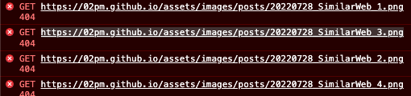
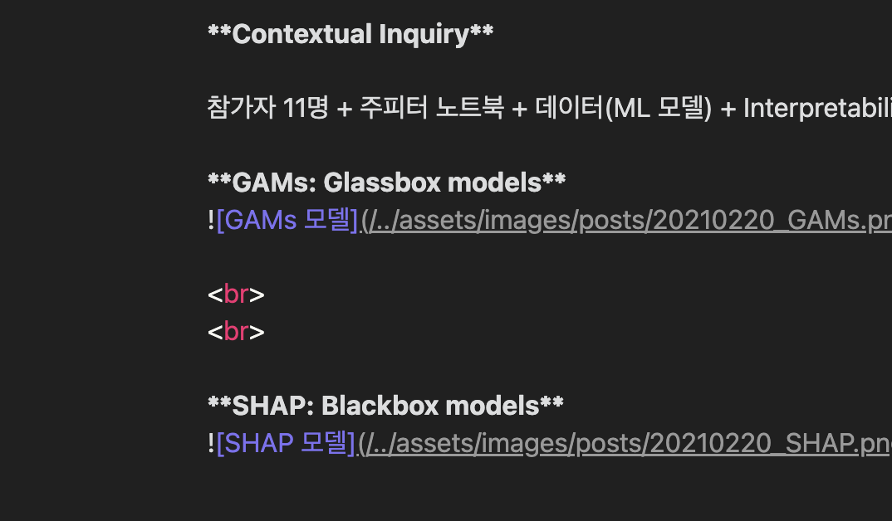
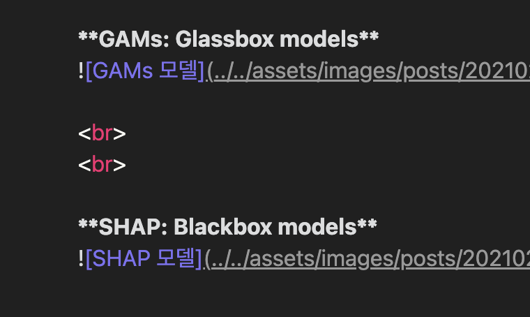

# {{page.title}}
<span style = "color: #A39FAD">Last modified: {{page.last_modified_date}}</span>

이번에 깃허브 jekyll 테마를 바꿨다. 이유는, 글이 점점 많아지면서 카테고리 분류가 필요했기 때문이다. 기존의 블로그 형식은 태그가 있지만, 그게 실질적으로 글들을 필터해서 보여줄 수 없었다. 사실 이번에 사용한 블로그 테마는 사용법이 정말 쉬웠다. 그냥 깃허브 repository를 만들고 config 파일을 만들고 docs 폴더에 글들을 넣으면 됐다. 여기까진 정말 쉬웠다. 

하지만 역시나. 이미지가 몇개는 제대로 뜨고 몇개는 제대로 안뜨는 것이었다. 대체 왤까?! 참으로 신기한 일이었다. 왜냐하면 분명 경로를 같게 설정했고 해당 폴더에 이미지들이 들어있는 것을 확인했기 때문이다.

이유는 간단했다. 내가 처음 블로그를 만들 때도 이미지가 안 떠서 여기저기 찾아보다 아래와 같은 경로로 이미지를 설정해줬었는데,

````markdown
{: width="100%" height="100%"}
````

문제는 위의 경로에서 저 제일 앞의 / 가 절대경로, 즉 프로젝트의 가장 높은 디렉토리의 경로를 가리키게 된다는 것이다. 그래서 경로가 아래처럼 되어 404 오류가 난 것이다.

{: width="100%" height="100%"}

그래서! 이 전 블로그 기준으로 절대경로였기 때문에, 지금 새 repository로 경로가 이어지지 않았던 것.

그래서 개발자 도구를 켜서 Network에서 확인 후, 경로를 현재 폴더에 맞춰 다시 설정해줬더니 이제 이미지가 잘 뜨게 되었다! 
{: width="100%" height="100%"}


마지막으로, 경로 변경 전과 후의 이미지를 첨부하며 글을 마무리짓겠다.
{: width="100%" height="100%"}
{: width="100%" height="100%"}


> 참고<br>
> [Velog-yoosion030](https://velog.io/@yoosion030/github-page-%ED%8C%8C%EC%9D%BC%EA%B2%BD%EB%A1%9C)