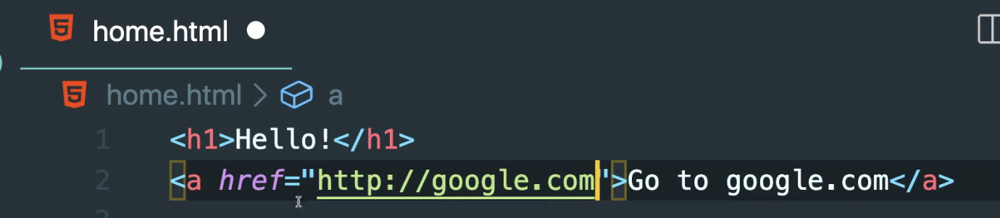

# {{page.title}}
<span style = "color: #A39FAD">Last modified: {{page.last_modified_date}}</span>

프로덕트디자이너로서 특히 웹을 하다보면 이게 어떻게 해야 추후에 활용가능한 컴포넌트로 작동할 수 있을지에 대하여 많이 고민을 하곤 한다. 특히 레이아웃 부분. 근데 그러다보면 어쩔 수 없이 html, css, javascript에 대한 갈증이 생기기 마련이다.

원래 html, css, python은 정말 기초 수준으로 알고 있었지만 니콜라스 님이 진행하시는 코코아톡 클린코딩을 하면 백엔드 부분까지 수박 겉핥기로 알 수 있다고 하여, 노마드코더의 코코아톡 클린코딩 강의를 신청하였다.

내가 니콜라스 님의 강의를 보지도 않고 신청한 이유는 이미 유튜브로 니콜라스 님이 얼마나 핵심만 잘 간추리는 분인지 알았기 때문이다. 다른 html, css, python 강의들을 보면 vs code가 무엇인지··· 이거 외에 다른 종류는 뭘 쓸 수 있는지.. 같은 정말 뿌리 이야기까지 해주는 것들이 많다. 하지만 니콜라스 님은 역시! 이런 부분 생략! 가장 중요한 부분만 재미있게 들을 수 있을 것 같다.
<br>
<br>
<br>
블로그에 내용들을 정리하며 강의를 들어보겠다. 참고로 내가 헷갈렸거나 몰랐던 부분만 정리할 것이기 때문에 모든 내용을 알고 싶은 분이라면 강의를 들으시길 추! 천! 드립니다.

코코아톡 클론코딩 강의는 구글 chrome 브라우저와 vs code 를 기반으로 진행이 된다 (github desktop도 필요). 마침 내 최애 두 가지라 굳!

[mdn에서 html의 모든 태그와 속성 확인하기](https://developer.mozilla.org/ko/docs/Web/HTML) 

# html
- mark up은 콘텐츠를 말한다.
- html, css, javascrip 중 자바스크립트만 프로그래밍 언어(웹용)다.
- a 태그 처럼 부가적인 정보(href)가 들어갈 때, 그 부가적인 정보는 attribute라고 한다(아래 이미지 상의 href="https://google.com" 같은 정보).
{: width="100%" height="100%"}
- 일부 attribute는 모든 tag에 사용이 가능하지만, 일부 attribute(ex. scr)는 일부 tag에서만 사용이 가능하다.
- a 태그에  ``` target="_blank" ```를 사용하면 새 탭으로 창이 열린다.
- 이미지는 self-closing tag이다. 예: ``````
- 이미지 경로는 html 파일이 있는 폴더 안의 폴더에 있다면 ``` )``` 의 형태로 작성되어야 한다. html 파일과 같은 폴더 내에 있다면 `````` 로 적으면 된다.
- html 문서는 ```<!DOCTYPE html>```로 시작하고 그 다음은 ```
<html> </html>``` 안에 구성한다.
- html 태그의 속성으로 lang를 써줘야 웹이 어떤 언어를 기반으로 작성되었는지 알 수 있다<br>예시: ```<html lang="ko">```

## <head></head>
- head 안의 것들은 보이지 않는 것들.
- title 태그는 구글에 검색했을 때 노출되는 제목이기도 하며, 웹사이트가 열리고나면 상단 탭에 노출되는 페이지 제목이기도 함.
- meta 태그는 부가적 정보를 입력하는 것.
- 예시로 보여준 웹사이트에서는 meta 태그는 두 개의 attribute 종류가 있는데, <b>content</b>와 <b>name</b>이 있었다.<br>사용 예시: ```<meta name="description" content="This is my website" />```
- 다른 meta tag는 <b>charset</b>로 text를 어떻게 그릴 지 정하는 것. 예를 들어, 한국어냐 이모티콘이 들어가냐 이런 것.<br>사용 예시: ```<meta charset="utf-8">``` 같은 것 
- 파비콘은 ```<link rel="shortcut icon" sizes="16x16 32x32 64x64" href="이미지링크"```로 설정할 수 있다.
<br>
<br>
<br>
- html, css, javascript 관련 구글 검색을 할 때 검색어에 mdn(mozila developer network)을 붙여서 mdn 결과를 보면 더 좋음(w3school은 보지 말라고 하셨고 mdn이 좋은 이유는 그 태그를 클릭하면 해당 태그의 attribute를 한 번에 확인할 수 있다.)


## <body></body>
- id는 모든 태그에 사용할 수 있는 attribute로 그 태그를 html 문서 안에서 재사용하기 위해 이름을 지정해준다고 생각하면 된다. id는 고유해야 한다. 다른 태그에 사용한 id를 중복사용하면 안된다.<br>
  예) 

  ```
  <body>
   <form>
      <label for="profile">profile photo</label>
      <input id="profile" type="file" accept=".pdf" />
      <input required placeholder="성" type="text" />
    </form>
   </body>
   ```

<br>
- span 태그: 짧은 text를 위한 태그

## <div></div>
- 의미가 없는 태그 중 하나로 박스 같은 개념으로 division을 뜻한다.
- 다른 태그들을 담아줄 수 있는 박스 개념이고 박스들은 위아래로 나열되는 것이 자동 옵션. 박스 안에 담을 경우 옆으로 붙지 않는다.
- body 아래 있는 header, main, footer 모두 div로 대체할 수 있지만 의미를 파악할 수 있도록(semantic하게) header, main, footer를 사용하길 추천

### tag 동시 변경
- 드래그로 열린 태그 (ex. ```<li>```)를 선택한 다음 cmd 를 누르면 닫힌 태그(ex. ```</li>```도 한 번에 선택되고 둘 다를 한번에 변경할 수 있음

### form 태그
- input 창과 관련된 태그
- input은 self-close tag
<br>
<br>
> 참고<br>
> [노마드코더-코코아톡 클론 크딩](https://nomadcoders.co/kokoa-clone)