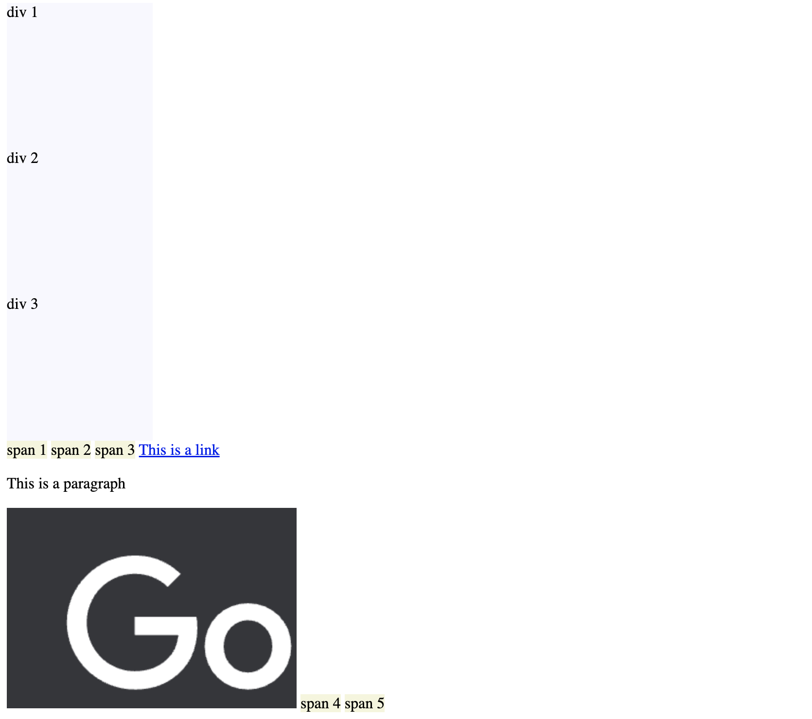

# {{page.title}}
<span style = "color: #A39FAD">Last modified: {{page.last_modified_date}}</span>


추석 연휴 동안 html, css, css 심화까지는 끝내볼까 한다. 

# css
- html 파일 안에 css 코드를 넣기도 하지만, 대부분 css 파일은 따로 관리한다.
- html 파일 안에 css 코드를 넣기: style 태그를 사용<br>
   예시:

```
	<style>
		h2 {
		color: blue;
		font-size: 40px;
		}
	</style>
```

- html 파일과 css 코드를 따로 관리하기: html 파일이 있는 폴더 안에 stylesheets.css 파일을 만든 다음 그 안에 작업을 하고, html 파일의 head 태그 안에 ```<link href="styles.css" rel="stylesheet" />``` 를 추가한다.
<br>
<br>
- css는 html의 어떤 태그를 딱 짚어서 얘는 어떻게 생긴거야! 라고 말을 해주는 것인데, 그걸 지칭하는 css의 요소를 <b>selector</b>이라고 부른다.
- 만약 html 안의 selector와 css 문서 안의 selector가 같은 것을 다르게 디자인한다면?<br>css는 위에서 아래로 적용되기 때문에(cascading) 맨 마지막에 있는 코드가 적용됨.
  <br>
  <br>


##  block과 inline
- block의 inline화: style에서 display을 사용하여 inline으로 변경할 수 있다.
- inline은 높이와 너비를 가질 수 없다. 콘텐츠가 있어야 한다. 반대로 block은 높이와 너비가 있다 (박스 같은 것).
- block은 자동으로 margin 값이 설정된다 (```margin: 0;``` 으로 수정할 수 있다.
- css를 하며 중요하게 인지하고 있어야하는 점은 block인 태그도 있고 inline인 태그도 있다는 것이다. 아래의 이미지에서 확인할 수 있듯이 div, p 태그는 block인 반면, span, img, a 태그는 inline이다.
  {: width="100%" height="100%"}

- <b>inline</b>은 글자(span), 링크(a), 이미지(img) 같은 작은 조각이다. 하지만 대부분의 태그는 block이다. 


### border
: 종류가 다양하지만 굳이 다 쓰지 않음. 일반 스타일만 사용함
border: 2px solid black;
- \*는 모든 것에 값을 적용할 때 사용할 수 있음


## span
- span: 패딩, 마진 값 적용 가능 하지만, inline이라서 높이와 너비가 없음 -> 위 아래에 마진 값이 있을 수 없음. 적용하고 싶다면 block으로 바꿔줘야함


## classes
- id는 중복이 불가능 하기 때문에 여러 요소에 같은 속성을 적용해주려면 tomato1, tomato2, tomato3의 id를 따로 설정해주고 아래처럼 css style을 적용해줘야 한다.

```
<span id="tomato1"></span>
<span id="tomato2">hello</span>
<span id="tomato3">hello</span>

#tomato1,
#tomato2,
#tomato3 {
		background-color: tomato;
		}
```

- 하지만 이런 방식은 효율이 떨어지기 때문에, 이를 해결하기 위한 구조가 class다.
- 위의 구조에서 id대신 class를 사용해주면 된다. 하지만 class는 style에서 아래처럼 "."을 사용하여 불러와야 한다. (id는 \#을 사용하고 class는 .을 사용한다.)

```
#css style
.tomato {
	background-color: tomato;
}

#html
<span class="tomato">hello</span>
<span class="tomato">hello</span>
<span class="tomato">hello</span>

```

- <b>class의 장점은 여러 class를 가질 수 있다는 것이다.</b> 예를 들어, 아래의 형태로 사용이 가능하다.

```
<span class="tomato potato cucumber">hello</span>
```

- 즉, 이것을 잘 활용하면 아래처럼 모든 버튼에 동일한 속성을 적용하기 수월해진다.

```
#css style
.btn {
	padding: 5px 10px;
	border-radius: 8px;
}

.red {
	background-color: red;
}

.blue {
	background-color: blue;
	color: white;
}

#html
<body>
	<span class="btn red">hello</span>
	<span class="btn blue">hello</span>
	<span class="btn red">hello</span>
	<span class="btn blue">hello</span>
</body>
```


## Inline-block
- div는 block이지만 inline-block으로 바꿀 시, block으로써 폭, 높이를 가질 수 있고 동시에 inline처럼 옆으로 나열될 수 있다.

```
div {
	display: inline-block;
	width: 50px;
	height: 50px;
	background-color: teal;
}
```

- 하지만, inline-block은 문제가 많은 구조다. 예를 들어, 요소들 사이에 자동으로 여백이 생기고 개발자 도구에서 그 여백을  찾기도 힘듬. 
- Inline-block은 responsive web의 구조가 아님.


